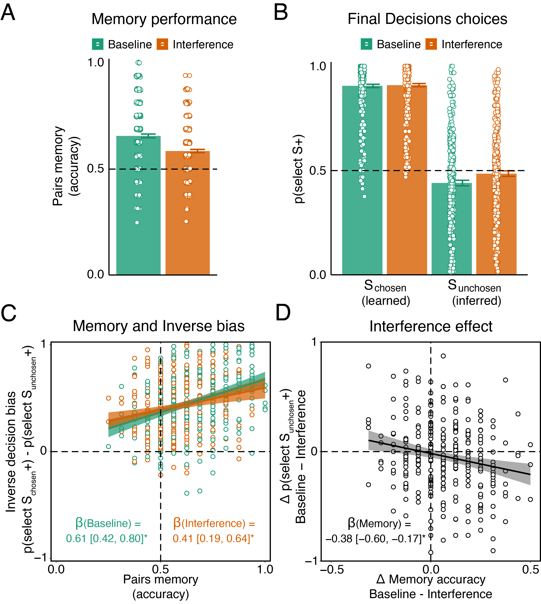

This is an analysis code for a study testing the role of memory in the inverse decision bias.
The code loads preprocessed data from MTurk experiments, and analyses their results. 
Our analysis includes Bayesian regression models, some of which take several hours to run. 
Accordingly, here we only load the models which we already ran, but if you wish 
to run the models, you may define the parameter run_models to be equal to 1.  
In most of our models, we breakdown interaction terms and look at coefficients of interest 
as a function of different variables. In such cases, we present both the original model coefficients 
and the rearranged model coefficients. For more details, see Analysis section in the manuscript. 


 

```{css echo=FALSE}
/* Define a margin before h2 and h3 elements */
h2, h3, h4  {
  margin-top: 2em;
}

``` 

## Setup and load data

```{r setup, echo=T, results='hide', message=FALSE, warning=FALSE}

rm(list=ls(all=TRUE)) 

knitr::opts_chunk$set(echo = TRUE, message=FALSE, warning=FALSE)

# If packages are not installed, install. Then, load libraries. 
list_of_packages <- c("ggplot2", "cowplot",  "tidyr", "dplyr", "rstanarm", "kableExtra", "stringr", "mosaic")
new_packages <- list_of_packages[!(list_of_packages %in% installed.packages()[,"Package"])]
if(length(new_packages)) install.packages(new_packages)
lapply(list_of_packages, require, character.only = TRUE)

# Load functions
source("Tools/plotting.R")

# Figure parameters
fig_size = c(10,10)
fig_type = "svg"  # "eps" # or png
n_sem <- 1
Save_plots <- 1
point_size <- 4.5
point_stroke <- 0.6
line_size <- 1
color_pallete <- "Dark2"

# Bayesian model params
options(mc.cores = parallel::detectCores())
params <- list()
params$iterations <- 4000
params$chains <- 6
params$warmup <- 2000
params$adapt_delta <- 0.99

# Do you want to run the models or load them?
run_models = 0;

# Load data 
load_data <- function(phase_types, exps){
  all_dfs = list()
  for (phase in 1:length(phase_types)){
    data = c()
    for (exp in 1:length(exps)){
      curr_data <- c()
      if (phase_types[phase]=="all_data_all_subs"){
        curr_data <- read.csv(sprintf("../Data/%s/Summary_data/all_subs/all_data.csv",exps[exp]))
      } else if (file.exists(sprintf("../Data/%s/Summary_data/non_outlier_subs/%s.csv",exps[exp],phase_types[phase]))) {
        curr_data <- read.csv(sprintf("../Data/%s/Summary_data/non_outlier_subs/%s.csv",exps[exp],phase_types[phase]))
      }
      if (phase_types[phase] == "debrief"){
        curr_data$art_time_spent <- as.numeric(curr_data$art_time_spent)
      }
      data <- bind_rows(data,curr_data)
    }
    all_dfs[[phase]] <- data
  }
  names(all_dfs) <- phase_types
  
  return(all_dfs)
}
phase_types = c("ratings","deliberation", "Interference", "reward_learning",
                "final_decisions","memory", "outcome_evaluation","debrief",
                "all_data","all_interaction_data","all_data_all_subs")
exps = c("Pilot","Exp1")
dfs <- load_data(phase_types, exps)

```

## Demographics 

```{r, demographics}

# age and gender
demographics <- dfs$debrief %>%
  group_by(Exp) %>%
  dplyr::summarise(n = n(),
                   mean_age = mean(age, na.rm=1),
                   sd_age = sd(age, na.rm=1),
                   n_females = sum(gender=="Female"),
                   n_males = sum(gender=="Male"),
                   n_other = sum(gender=="Other")) %>%
  mutate(age = sprintf("%.2f \u00b1 %.2f", mean_age, sd_age),
         gender = sprintf("%.0f females, %.0f males, %.0f other", n_females, n_males, n_other)) %>%
  dplyr::select(Exp, age, gender)

# check how long the experiment took 

subs <- unique(dfs$final_decisions$PID)
duration <- data.frame(Exp=NaN, PID=NaN, duration=NaN)
for (s in 1:length(subs)){
  curr_data <- dfs$all_data_all_subs %>% subset(PID == subs[s])
  duration[s,"duration"] = (curr_data$time_elapsed[curr_data$category=="debreif_end"] - curr_data$time_elapsed[curr_data$trial_index==0])/60000
  duration[s,"PID"] = subs[s]
  duration[s,"Exp"] = dfs$ratings$Exp[dfs$ratings$PID==subs[s]][1]
}

duration %>% group_by(Exp) %>% 
  dplyr::summarise(mean_duration = mean(duration, na.rm=1),
                   se_duration = sd(duration, na.rm=1)/sqrt(n())) %>%
  mutate(duration = sprintf("%.2f \u00b1 %.2f", mean_duration, se_duration)) %>%
  dplyr::select(Exp, duration)
  
# outliers
non_outliers <- unique(dfs$ratings$PID)
dfs$all_data_all_subs <- dfs$all_data_all_subs %>%
  mutate(is_outlier = ifelse(PID %in% non_outliers, 0, 1))
         
outliers <- dfs$all_data_all_subs %>% 
  group_by(Exp) %>%
  dplyr::summarize(n_all = length(unique(PID)),
                   n = length(unique(PID[is_outlier==0]))) %>%
  mutate(outliers = n_all - n) %>%
  dplyr::select(Exp, n, outliers)

# bonus earned
bonus <- dfs$all_data_all_subs %>%
  group_by(Exp, PID) %>%
  dplyr::summarise(total_bonus = sum(total_reward_tally, na.rm=1),
                   deliberation_bonus = sum(deliberation_reward_tally, na.rm=1)) %>%
  group_by(Exp) %>%
  dplyr::summarise(total_bonus_mean = mean(total_bonus),
                   total_bonus_se = sd(total_bonus),
                   `deliberation bonus` = mean(deliberation_bonus)) %>%
  mutate(`total bonus` = sprintf("%.2f \u00b1 %.2f", total_bonus_mean, total_bonus_se)) %>%
  dplyr::select(Exp, `total bonus`, `deliberation bonus`)

# bind all details
demographics_total <- merge(merge(demographics, outliers, by="Exp"), bonus, by="Exp") %>%
  mutate(Exp = case_when(Exp=="Pilot" ~ "Pilot",
                         Exp=="Exp1" ~ "Experiment 1")) %>%
  mutate(Exp = factor(Exp, levels = c("Pilot", "Experiment 1"))) %>%
  arrange(Exp) 

demographics_total %>% 
  kbl(caption = "Demographic information") %>%
  kable_paper("hover", full_width = F, html_font = "Helvetica", position = "left")

```

## Analysis of Experiment 1

### Manipulation check - Memory performance

Here we test whether the memory manipulation was successful at modulating associative memory of the Deliberation pairs.
To this end, we assess memory accuracy in the Surprise Memory phase for Baseline vs Interference pairs

```{r, memory performance}

# ==============================
# Pairs memory across conditions
# ==============================

pairs_acc <- dfs$memory %>%
  mutate(Condition = ifelse(condition==1, "Interference", "Baseline")) %>%
  group_by(Exp, PID, Condition) %>%
  dplyr::summarise(pairs_acc = mean(pairs_acc, na.rm=1),
                   zscored_rt = mean(zscored_rt_pairs, na.rm=1),
                   rt = mean(rt_pairs/3600, na.rm=1))

pairs_acc_group <- pairs_acc %>%
  group_by(Exp, Condition) %>%
  dplyr::summarise(mean_acc = mean(pairs_acc, na.rm=1),
                   se_acc = sd(pairs_acc, na.rm=1)/sqrt(n()),
                   mean_rt = mean(zscored_rt, na.rm=1),
                   se_rt = sd(zscored_rt, na.rm=1)/sqrt(n())) %>%
  mutate(Accuracy = sprintf("%.2f \u00b1 %.2f", mean_acc, se_acc),
         `Normalized RTs` = sprintf("%.2f \u00b1 %.2f", mean_rt, se_rt)) %>%
  rename(Experiment = Exp) %>%
  dplyr::select(Experiment, Condition, Accuracy, `Normalized RTs`)

# print
pairs_acc_group %>%
  kbl(caption = "Behavioral means") %>%
  kable_paper("hover", full_width = F, html_font = "Helvetica", position = "left")

# ===========================
# Test differences in a model 
# ===========================

if (run_models==1){
  
  dfs$memory <- dfs$memory %>%
    mutate(condition_centered = ifelse(condition==1, 1, -1))
  
  # run model
  M_memory_Exp1 <- stan_glmer(data = subset(dfs$memory, Exp=="Exp1"), 
                                   pairs_acc ~ condition_centered + (condition_centered | PID),
                                   family = binomial(link="logit"), 
                                   adapt_delta = params$adapt_delta, 
                                   iter = params$iterations, 
                                   chains = params$chains, 
                                   warmup = params$warmup,
                                   seed = 12345)
  
  save(list = "M_memory_Exp1",
       file = "../Data/Exp1/Models/M_memory_Exp1.RData")
  
  # pilot
  M_memory_Pilot <- stan_glmer(data = subset(dfs$memory, Exp=="Pilot"), 
                                   pairs_acc ~ condition_centered + (condition_centered | PID),
                                   family = binomial(link="logit"), 
                                   adapt_delta = params$adapt_delta, 
                                   iter = params$iterations, 
                                   chains = params$chains, 
                                   warmup = params$warmup,
                                   seed = 12345)
  
  save(list = "M_memory_Pilot",
       file = "../Data/Pilot/Models/M_memory_Pilot.RData")
  
} else {
  load("../Data/Pilot/Models/M_memory_Pilot.RData")
  load("../Data/Exp1/Models/M_memory_Exp1.RData")
}

# Present model coefs
create_summary_coefs <- function(M, Exp){
  
  sum_coefs <- c()
  
  draws_M <- as.data.frame(M)
  summary_coefs <- draws_M %>%
    gather(coef, value, colnames(draws_M)[!str_detect(colnames(draws_M), "PID")]) %>%
    group_by(coef) %>%
    dplyr::summarize(HDI95_low = posterior_interval(as.matrix(value), prob=0.95)[1],
                     HDI95_high = posterior_interval(as.matrix(value), prob=0.95)[2],
                     median = median(value)) %>%
    mutate(sig = ifelse((median>0 & HDI95_low>0 & HDI95_high>0) | (median<0 & HDI95_low<0 & HDI95_high<0),"*",""),
           value = sprintf("%.2f [%.2f, %.2f]%s",median, HDI95_low, HDI95_high, sig)) %>%
    dplyr::select(coef, value) %>%
    mutate(Exp = Exp) %>%
    rename(Coefficient = coef, `Median and 95% HDI` = value, Experiment = Exp) %>%
    dplyr::select(Experiment, Coefficient, `Median and 95% HDI`)

  sum_coefs[[sprintf("M_draws_%s",Exp)]] <- draws_M
  sum_coefs[[sprintf("summary_coefs_%s",Exp)]] <- summary_coefs

  return(sum_coefs)
}

sum_coefs_memory_Exp1 <- create_summary_coefs(M_memory_Exp1, "Exp1")
sum_coefs_memory_Pilot <- create_summary_coefs(M_memory_Pilot, "Pilot")

# print table of coefs
bind_rows(sum_coefs_memory_Exp1$summary_coefs_Exp1,sum_coefs_memory_Pilot$summary_coefs_Pilot) %>%
  kbl(caption = "Model coefficients") %>%
  kable_paper("hover", full_width = F, html_font = "Helvetica", position = "left")

# ==========================
# Test differences in dprime 
# ==========================

# compute dprime

library("psycho")

memory_sdt <- dfs$memory %>%
  group_by(Exp, PID, condition) %>%
  dplyr::summarise(hits = sum(old_pair == 1 & pairs_acc == 1),
                   cr = sum(old_pair == 0 & pairs_acc == 1),
                   misses = sum(old_pair == 1 & pairs_acc == 0),
                   fa = sum(old_pair == 0 & pairs_acc == 0))
indices <- psycho::dprime(memory_sdt$hits, memory_sdt$fa, memory_sdt$misses, memory_sdt$cr)

memory_sdt <- cbind(memory_sdt, indices) %>%
  gather(key = "type", value ="value", hits:c)

memory_sdt_sum <- memory_sdt %>%
  group_by(Exp, type, condition) %>%
  dplyr::summarise(mean = mean(value),
                   se = sd(value)/sqrt(n())) %>%
  subset(type %in% c("dprime", "fa", "hits")) %>%
  mutate(Condition = ifelse(condition==1, "Interference", "Baseline"))

memory_sdt_sum_group <- memory_sdt_sum %>%
  group_by(Exp, type, Condition) %>%
  mutate(`Mean and SE` = sprintf("%.2f \u00b1 %.2f", mean, se)) %>%
  rename(Experiment = Exp, Type = type) %>%
  dplyr::select(Experiment, Type, Condition, `Mean and SE`)

# print
memory_sdt_sum_group %>%
  kbl(caption = "Signal Detection Theory Behavioral Results") %>%
  kable_paper("hover", full_width = F, html_font = "Helvetica", position = "left")

# run Bayesian linear regression model

if (run_models==1){
  
  dprime_df <- memory_sdt %>% 
    subset(type == "dprime") %>%
    rename(dprime = value) %>%
    mutate(condition_centered = ifelse(condition==1, 1, -1))
  
  M_dprime_Exp1 <- stan_glm(data = subset(dprime_df, Exp=="Exp1"), 
                               dprime ~ condition_centered,
                               family = gaussian(), 
                               adapt_delta = params$adapt_delta, 
                               iter = params$iterations, 
                               chains = params$chains, 
                               warmup = params$warmup,
                               seed = 12345)
  
  save(list = "M_dprime_Exp1",
       file = "../Data/Exp1/Models/M_dprime_Exp1.RData")
  
  M_dprime_Pilot <- stan_glm(data = subset(dprime_df, Exp=="Pilot"), 
                               dprime ~ condition_centered,
                               family = gaussian(), 
                               adapt_delta = params$adapt_delta, 
                               iter = params$iterations, 
                               chains = params$chains, 
                               warmup = params$warmup,
                               seed = 12345)
  
  save(list = "M_dprime_Pilot",
       file = "../Data/Pilot/Models/M_dprime_Pilot.RData")
  
} else {
  load("../Data/Pilot/Models/M_dprime_Pilot.RData")
  load("../Data/Exp1/Models/M_dprime_Exp1.RData")
}

sum_coefs_dprime_Exp1 <- create_summary_coefs(M_dprime_Exp1, "Exp1")
sum_coefs_dprime_Pilot <- create_summary_coefs(M_dprime_Pilot, "Pilot")

# print table of coefs
bind_rows(sum_coefs_dprime_Exp1$summary_coefs_Exp1,sum_coefs_dprime_Pilot$summary_coefs_Pilot) %>%
  kbl(caption = "dprime model coefficients") %>%
  kable_paper("hover", full_width = F, html_font = "Helvetica", position = "left")

# hits 

if (run_models==1){
  
  hits_df <- memory_sdt %>% 
    subset(type == "hits") %>%
    rename(hits = value) %>%
    mutate(condition_centered = ifelse(condition==1, 1, -1))
  
  # run model
  M_hits_Exp1 <- stan_glm(data = subset(hits_df, Exp=="Exp1"), 
                               hits ~ condition_centered,
                               family = gaussian(), 
                               adapt_delta = params$adapt_delta, 
                               iter = params$iterations, 
                               chains = params$chains, 
                               warmup = params$warmup,
                               seed = 12345)
  
  save(list = "M_hits_Exp1",
       file = "../Data/Exp1/Models/M_hits_Exp1.RData")
  
  # pilot
  M_hits_Pilot <- stan_glm(data = subset(hits_df, Exp=="Pilot"), 
                               hits ~ condition_centered,
                               family = gaussian(), 
                               adapt_delta = params$adapt_delta, 
                               iter = params$iterations, 
                               chains = params$chains, 
                               warmup = params$warmup,
                               seed = 12345)
  
  save(list = "M_hits_Pilot",
       file = "../Data/Pilot/Models/M_hits_Pilot.RData")
  
} else {
  load("../Data/Pilot/Models/M_hits_Pilot.RData")
  load("../Data/Exp1/Models/M_hits_Exp1.RData")
}

sum_coefs_hits_Exp1 <- create_summary_coefs(M_hits_Exp1, "Exp1")
sum_coefs_hits_Pilot <- create_summary_coefs(M_hits_Pilot, "Pilot")

# print table of coefs
bind_rows(sum_coefs_hits_Exp1$summary_coefs_Exp1,sum_coefs_hits_Pilot$summary_coefs_Pilot) %>%
  kbl(caption = "hits model coefficients")  %>%
  kable_paper("hover", full_width = F, html_font = "Helvetica", position = "left")


# false alarms 

if (run_models==1){
  
  fa_df <- memory_sdt %>% 
    subset(type == "fa") %>%
    rename(fa = value) %>%
    mutate(condition_centered = ifelse(condition==1, 1, -1))
  
  
  # run model
  M_fa_Exp1 <- stan_glm(data = subset(fa_df, Exp=="Exp1"), 
                               fa ~ condition_centered,
                               family = gaussian(), 
                               adapt_delta = params$adapt_delta, 
                               iter = params$iterations, 
                               chains = params$chains, 
                               warmup = params$warmup,
                               seed = 12345)
  
  save(list = "M_fa_Exp1",
       file = "../Data/Exp1/Models/M_fa_Exp1.RData")
  
  # pilot
  M_fa_Pilot <- stan_glm(data = subset(fa_df, Exp=="Pilot"), 
                               fa ~ condition_centered,
                               family = gaussian(), 
                               adapt_delta = params$adapt_delta, 
                               iter = params$iterations, 
                               chains = params$chains, 
                               warmup = params$warmup,
                               seed = 12345)
  
  save(list = "M_fa_Pilot",
       file = "../Data/Pilot/Models/M_fa_Pilot.RData")
  
} else {
  load("../Data/Pilot/Models/M_fa_Pilot.RData")
  load("../Data/Exp1/Models/M_fa_Exp1.RData")
}

sum_coefs_fa_Exp1 <- create_summary_coefs(M_fa_Exp1, "Exp1")
sum_coefs_fa_Pilot <- create_summary_coefs(M_fa_Pilot, "Pilot")

# print table of coefs
bind_rows(sum_coefs_fa_Exp1$summary_coefs_Exp1,sum_coefs_fa_Pilot$summary_coefs_Pilot) %>%
  kbl(caption = "false alarms model coefficients") %>%
  kable_paper("hover", full_width = F, html_font = "Helvetica", position = "left")


```

### Choices in Final Decisions phase 
  
Here we analyze the tendency to select a rewarded item in the Final Decisions phase as a function of choice (Chosen vs. Unchosen pairs) and condition (Baseline vs. Interference).  
We then run a multilevel Bayesian logistic regression estimating the tendency to select a rewarded item as a function of choice (choice_center), condition (condition_center), the difference in normalized liking ratings between rewarded and unrewarded items (zscored_delta_ratings), and all possible interactions.  
Behavioral means and coefficient values can be found in the Supplementary Tables.


```{r, choices in final decisions}

# ================================
# Choices in Final Decisions phase 
# ================================

# compute mean probabiltiy to choose gain - for chosen and unchosen alone
p_gain <- dfs$final_decisions %>% 
  subset(!is.na(rt)) %>%
  mutate(choice = ifelse(chosen_trial==1, "Chosen", "Unchosen"),
         condition = ifelse(condition==1, "Interference", "Baseline")) %>%
  group_by(Exp, PID, choice, condition) %>% 
  dplyr::summarize(p_gain = mean(higher_outcome_chosen, na.rm=1)) 

p_gain_group <- p_gain %>%
  group_by(Exp, choice, condition) %>%
  dplyr::summarize(mean = mean(p_gain, na.rm=1), 
                   se = sd(p_gain, na.rm=1)/sqrt(n())) %>%
  mutate(`p(select rewarded)` = sprintf("%.2f \u00b1 %.2f", mean, se)) %>%
  dplyr::select(Exp, choice, condition, `p(select rewarded)`)

# ======================================
# Model choices as a function of ratings  
# ======================================

if (run_models==1){
  
  # Create relevant columns for modeling 
  dfs$final_decisions <- dfs$final_decisions %>% 
    mutate(condition_center = ifelse(condition==0, -1, 1),
           choice_center = ifelse(chosen_trial==0, -1, 1))
  
  # Remove Non responses
  dfs$final_decisions <- subset(dfs$final_decisions, !is.nan(rt))
  
  # Run choice model and save it
  M_choice_delta_val_Exp1 <- stan_glmer(data = subset(dfs$final_decisions, Exp=="Exp1"), 
                                   higher_outcome_chosen ~ 
                                     condition_center*choice_center*zscored_delta_ratings + 
                                     (condition_center*choice_center*zscored_delta_ratings | PID),
                                   family = binomial(link="logit"), 
                                   adapt_delta = params$adapt_delta, 
                                   iter = params$iterations, 
                                   chains = params$chains, 
                                   warmup = params$warmup,
                                   seed = 12345)
  
  save(list = "M_choice_delta_val_Exp1",
       file = "../Data/Exp1/Models/M_choice_delta_val_Exp1.RData")
  
  # Pilot
  M_choice_delta_val_Pilot <- stan_glmer(data = subset(dfs$final_decisions, Exp=="Pilot"), 
                                        higher_outcome_chosen ~ 
                                          condition_center*choice_center*zscored_delta_ratings + 
                                          (condition_center*choice_center*zscored_delta_ratings | PID),
                                        family = binomial(link="logit"), 
                                        adapt_delta = params$adapt_delta, 
                                        iter = params$iterations, 
                                        chains = params$chains, 
                                        warmup = params$warmup,
                                        seed = 12345)
  
  save(list = "M_choice_delta_val_Pilot",
       file = "../Data/Pilot/Models/M_choice_delta_val_Pilot.RData")
  
} else {
  load("../Data/Exp1/Models/M_choice_delta_val_Exp1.RData")
  load("../Data/Pilot/Models/M_choice_delta_val_Pilot.RData")
}

create_summary_coefs_choice_model <- function(M, Exp){
  
  sum_coefs <- c()
  
  M_draws <- as.data.frame(M) %>%
  mutate(intercept_chosen_Interference = `(Intercept)` + choice_center + condition_center + `condition_center:choice_center`,
         intercept_chosen_Baseline = `(Intercept)` + choice_center - condition_center - `condition_center:choice_center`,
         intercept_chosen_diff = intercept_chosen_Interference - intercept_chosen_Baseline,
         slope_chosen_Interference = zscored_delta_ratings + `choice_center:zscored_delta_ratings` + `condition_center:zscored_delta_ratings` + `condition_center:choice_center:zscored_delta_ratings`,
         slope_chosen_Baseline = zscored_delta_ratings + `choice_center:zscored_delta_ratings` - `condition_center:zscored_delta_ratings` - `condition_center:choice_center:zscored_delta_ratings`,
         slope_chosen_diff = slope_chosen_Interference - slope_chosen_Baseline,
         intercept_unchosen_Interference = `(Intercept)` - choice_center + condition_center - `condition_center:choice_center`,
         intercept_unchosen_Baseline = `(Intercept)` - choice_center - condition_center + `condition_center:choice_center`,
         intercept_unchosen_diff = intercept_unchosen_Interference - intercept_unchosen_Baseline,
         slope_unchosen_Interference = zscored_delta_ratings - `choice_center:zscored_delta_ratings` + `condition_center:zscored_delta_ratings` - `condition_center:choice_center:zscored_delta_ratings`,
         slope_unchosen_Baseline = zscored_delta_ratings - `choice_center:zscored_delta_ratings` - `condition_center:zscored_delta_ratings` + `condition_center:choice_center:zscored_delta_ratings`,
         slope_unchosen_diff = slope_unchosen_Interference - slope_unchosen_Baseline)
  
  summary_coefs <- as.data.frame(M_draws) %>%
    gather(coef, value, colnames(M_draws)[!str_detect(colnames(M_draws), "PID")]) %>%
    group_by(coef) %>%
    dplyr::summarize(HDI95_low = posterior_interval(as.matrix(value), prob=0.95)[1],
                     HDI95_high = posterior_interval(as.matrix(value), prob=0.95)[2],
                     median = median(value)) %>%
    mutate(sig = ifelse((median>0 & HDI95_low>0 & HDI95_high>0) | (median<0 & HDI95_low<0 & HDI95_high<0),"*",""),
           value = sprintf("%.2f [%.2f, %.2f]%s",median, HDI95_low, HDI95_high, sig)) %>%
    dplyr::select(coef, value) %>%
    mutate(Exp = Exp)

  sum_coefs[[sprintf("M_choice_delta_val_draws_%s",Exp)]] <- M_draws
  sum_coefs[[sprintf("summary_coefs_choice_delta_val_%s",Exp)]] <- summary_coefs

  return(sum_coefs)
}

sum_coefs_Exp1 <- create_summary_coefs_choice_model(M_choice_delta_val_Exp1, "Exp1")
sum_coefs_Pilot <- create_summary_coefs_choice_model(M_choice_delta_val_Pilot, "Pilot")


```

### RT analysis in Final Decisions phase

In this analysis we assess whether RTs relate to choices in the Final Decisions phase. We follow previous research showing that approach toward reward is faster than avoidance from loss, and so we expect participants to be faster when they choose the more valuable painting.  
We expect to observe this effect in unchosen pairs for Baseline items and not for Interference items.  
Because there are not enough no-gain choices in the chosen pairs, we will only include the unchosen trials in this analysis.  
Following Lo and Andrews (2015), we assess the coefficients of a Bayesian GLMM using a Gamma distribution to predict raw RT as a function of choice (whether the selected item was rewarded or not, higher_outcome_chosen_centered) and condition (condition_center). We rearrange the model coefficients to get an estimate of the effect of choice on RT for the two conditions seperately (the slope term).  
Behavioral means and coefficient values can be found in the Supplementary Tables.

  
```{r, rt in final decisions}

# =============================
# RT avreages in all pair types 
# =============================

RT_FD <- subset(dfs$final_decisions, !is.na(rt)) %>%
  mutate(Choice = ifelse(chosen_trial==1, "Chosen pairs", "Unchosen pairs"),
         Condition = ifelse(condition==1, "Interference", "Baseline"),
         `Chosen item` = ifelse(higher_outcome_chosen==1, "S+", "S0")) %>%
  group_by(Exp, PID, Choice, Condition, `Chosen item`) %>%
  dplyr::summarise(zscored_rt = mean(zscored_rt, na.rm=1),
                   rt = mean(rt, na.rm=1)) 

# show group means 
RT_FD_group <- RT_FD %>%
  group_by(Exp, Choice, Condition, `Chosen item`) %>%
  dplyr::summarise(mean_rt = mean(rt, na.rm=1),
                   se_rt = sd(rt)/sqrt(n()),
                   mean_zrt = mean(zscored_rt, na.rm=1),
                   se_zrt = sd(zscored_rt)/sqrt(n())) %>%
  mutate(RT = sprintf("%.2f \u00b1 %.2f", mean_rt, se_rt),
         `Normalized RT` = sprintf("%.2f \u00b1 %.2f", mean_zrt, se_zrt)) %>%
  dplyr::select(Exp, Choice, Condition, `Chosen item`, RT, `Normalized RT`) 

RT_FD_group %>%
  kbl(caption = "Behavioral means") %>%
  kable_paper("hover", full_width = F, html_font = "Helvetica", position = "left")


# ===================================================
# Generalized linear mixed model - Gamma distribution 
# ===================================================

library(brms)
# install.packages("remotes")
# remotes::install_github("stan-dev/cmdstanr")

rt_data <- dfs$final_decisions %>%
    subset(rt > 0) %>%
    mutate(condition_center = ifelse(condition==0, -1, 1),
           higher_outcome_chosen_centered = ifelse(higher_outcome_chosen==1,1,-1))

if (run_models==1){
  
  # run model and use function to rearrange the coefficients
  M_RT_gamma_Exp1 <- brm(data=subset(rt_data, !is.na(left_chosen) & chosen_trial==0 & Exp=="Exp1"),
                             rt ~ condition_center*higher_outcome_chosen_centered +
                               (condition_center*higher_outcome_chosen_centered | PID),
                             family = Gamma(link="log"),
                             prior = c(prior(normal(0,2),class="Intercept"),
                                       prior(normal(0,2),class="b"),
                                       prior(gamma(0.01,0.01),class="shape")),
                             cores = 4,
                             seed = 12345,
                             chains = params$chains,
                             iter = params$iterations)
  
  
  save(list = "M_RT_gamma_Exp1",
       file = "../Data/Exp1/Models/M_RT_gamma_Exp1.RData")
  
  M_RT_gamma_Pilot <- brm(data=subset(rt_data, !is.na(left_chosen) & chosen_trial==0 & Exp=="Pilot"),
                           rt ~ condition_center*higher_outcome_chosen_centered +
                             (condition_center*higher_outcome_chosen_centered | PID),
                           family = Gamma(link="log"),
                           prior = c(prior(normal(0,2),class="Intercept"),
                                     prior(normal(0,2),class="b"),
                                     prior(gamma(0.01,0.01),class="shape")),
                           cores = 4,
                           seed = 12345,
                           chains = params$chains,
                           iter = params$iterations)
  
  
  save(list = "M_RT_gamma_Pilot",
       file = "../Data/Pilot/Models/M_RT_gamma_Pilot.RData")
  
} else {
  load("../Data/Exp1/Models/M_RT_gamma_Exp1.RData")
  load("../Data/Pilot/Models/M_RT_gamma_Pilot.RData")
}

create_summary_coefs_rt_choice_model <- function(M, Exp){
  
  sum_coefs <- c()
  
  M_draws <- as.data.frame(M) %>%
    mutate(intercept_Interference = `b_Intercept` + `b_condition_center`,
           slope_Interference = `b_higher_outcome_chosen_centered` + `b_condition_center:higher_outcome_chosen_centered`,
           intercept_Baseline = `b_Intercept` - `b_condition_center`,
           slope_Baseline = `b_higher_outcome_chosen_centered` - `b_condition_center:higher_outcome_chosen_centered`,
           intercept_diff = intercept_Interference - intercept_Baseline,
           slope_diff = slope_Interference - slope_Baseline)
  
  summary_coefs <- as.data.frame(M_draws) %>%
    gather(coef, value, colnames(M_draws)[!str_detect(colnames(M_draws), "PID")]) %>%
    group_by(coef) %>%
    dplyr::summarize(HDI95_low = posterior_interval(as.matrix(value), prob=0.95)[1],
                     HDI95_high = posterior_interval(as.matrix(value), prob=0.95)[2],
                     median = median(value)) %>%
    mutate(sig = ifelse((median>0 & HDI95_low>0 & HDI95_high>0) | (median<0 & HDI95_low<0 & HDI95_high<0),"*",""),
           value = sprintf("%.2f [%.3f, %.3f]%s",median, HDI95_low, HDI95_high, sig)) %>%
    dplyr::select(coef, value) %>%
    mutate(Exp = Exp) %>%
    rename(Coefficient = coef, `Median and 95% HDI` = value, Experiment = Exp) %>%
    dplyr::select(Experiment, Coefficient, `Median and 95% HDI`)

  sum_coefs[[sprintf("draws_%s",Exp)]] <- M_draws
  sum_coefs[[sprintf("summary_coefs%s",Exp)]] <- summary_coefs

  return(sum_coefs)
}

sum_coefs_rt_Exp1 <- create_summary_coefs_rt_choice_model(M_RT_gamma_Exp1, "Exp1")
sum_coefs_rt_Pilot <- create_summary_coefs_rt_choice_model(M_RT_gamma_Pilot, "Pilot")

print_model_coefs <- function(model_coefs, actual_coefs, sep_col_names, change_title){
  
  actual_coefs_list <- model_coefs[model_coefs$Coefficient %in% actual_coefs,]
  reaaranged_coefs_list <- model_coefs[!model_coefs$Coefficient %in% actual_coefs,] %>%
  separate(Coefficient, sep_col_names, sep="_") %>%
  mutate_all(str_to_title) 
  
  print_list <- list()
  print_list[[1]] <- actual_coefs_list %>%
    kbl(caption = "Model coefficients") %>%
    kable_paper("hover", full_width = F, html_font = "Helvetica", position = "left")

  print_list[[2]] <- reaaranged_coefs_list %>%
    kbl(caption = "Rearranged model coefficients") %>%
    kable_paper("hover", full_width = F, html_font = "Helvetica", position = "left")
  
  return(print_list)

}
print_list_rt <- print_model_coefs(bind_rows(sum_coefs_rt_Exp1$summary_coefsExp1,sum_coefs_rt_Pilot$summary_coefsPilot), c("b_Intercept","b_condition_center","b_higher_outcome_chosen_centered", "b_condition_center:higher_outcome_chosen_centered","lp__","lprior","shape"), c("Coefficient","Condition"))

print_list_rt[[1]]
print_list_rt[[2]]


```

### Relationship between associative memory and inverse bias
  
Here we present a Bayesian linear regression predicting inverse bias as a function of memory accuracy and condition. We reaaramge the model coefficients to get separate estimates for the effect of memory on inverse bias for the two conditions.  
  

```{r, memory and inverse bias}

# ==============================
# Pairs memory across conditions
# ==============================

pairs_acc <- dfs$memory %>%
  mutate(Condition = ifelse(condition==1, "Interference", "Baseline")) %>%
  group_by(Exp, PID, Condition) %>%
  dplyr::summarise(pairs_acc = mean(pairs_acc, na.rm=1),
                   zscored_rt = mean(zscored_rt_pairs, na.rm=1))

# =======================
# Memory and Inverse bias 
# =======================

# Compute measures of interest
memory_bias <- dfs$final_decisions %>%
  mutate(Choice = ifelse(chosen_trial==1, "Chosen", "Unchosen"),
         Condition = ifelse(condition==1, "Interference", "Baseline")) %>%
  group_by(Exp, PID, Choice, Condition) %>%
  subset(!is.na(rt)) %>%
  dplyr::summarize(p_gain = mean(higher_outcome_chosen, na.rm=1)) %>%
  spread(Choice,p_gain) %>%
  mutate(inverse_bias = Chosen - Unchosen) %>%
  merge(pairs_acc, by=c("Exp","PID","Condition"))

# Model inverse decision bias and pairs memory
if (run_models==1){
  
  memory_bias <- memory_bias %>%
    mutate(condition_centered = ifelse(Condition=="Interference", 1, -1))
  
  # run model
  M_memory_bias_Exp1 <- stan_glm(data=subset(memory_bias, Exp=="Exp1"),
                              inverse_bias ~ pairs_acc*condition_centered,
                              family = gaussian(),
                              adapt_delta = params$adapt_delta,
                              iter = params$iterations,
                              chains = params$chains,
                              warmup = params$warmup,
                              seed = 12345)
  
  save(list = "M_memory_bias_Exp1",
       file = "../Data/Exp1/Models/M_memory_bias_Exp1.RData")
  
  # pilot
  M_memory_bias_Pilot <- stan_glm(data=subset(memory_bias, Exp=="Pilot"),
                              inverse_bias ~ pairs_acc*condition_centered,
                              family = gaussian(),
                              adapt_delta = params$adapt_delta,
                              iter = params$iterations,
                              chains = params$chains,
                              warmup = params$warmup,
                              seed = 12345)
  
  save(list = "M_memory_bias_Pilot",
       file = "../Data/Pilot/Models/M_memory_bias_Pilot.RData")
  
} else {
  load("../Data/Pilot/Models/M_memory_bias_Pilot.RData")
  load("../Data/Exp1/Models/M_memory_bias_Exp1.RData")
}

# Present model coefs
create_summary_coefs_memory_bias <- function(M, Exp){
  
  sum_coefs <- c()
  
  M_draws <- as.data.frame(M) %>%
    mutate(intercept_Interference = `(Intercept)` + condition_centered,
           slope_Interference = pairs_acc + `pairs_acc:condition_centered`,
           intercept_Baseline = `(Intercept)` - condition_centered,
           slope_Baseline = pairs_acc - `pairs_acc:condition_centered`,
           slope_diff = slope_Interference - slope_Baseline)
  
  summary_coefs <- as.data.frame(M_draws) %>%
    gather(coef, value, colnames(M_draws)[!str_detect(colnames(M_draws), "PID")]) %>%
    group_by(coef) %>%
    dplyr::summarize(HDI95_low = posterior_interval(as.matrix(value), prob=0.95)[1],
                     HDI95_high = posterior_interval(as.matrix(value), prob=0.95)[2],
                     median = median(value)) %>%
    mutate(sig = ifelse((median>0 & HDI95_low>0 & HDI95_high>0) | (median<0 & HDI95_low<0 & HDI95_high<0),"*",""),
           value = sprintf("%.2f [%.2f, %.2f]%s",median, HDI95_low, HDI95_high, sig)) %>%
    dplyr::select(coef, value) %>%
    mutate(Exp = Exp) %>%
    rename(Coefficient = coef, `Median and 95% HDI` = value, Experiment = Exp) %>%
    dplyr::select(Experiment, Coefficient, `Median and 95% HDI`)

  sum_coefs[[sprintf("M_memory_bias_draws_%s",Exp)]] <- M_draws
  sum_coefs[[sprintf("summary_coefs_memory_bias_%s",Exp)]] <- summary_coefs

  return(sum_coefs)
}

sum_coefs_memory_bias_Exp1 <- create_summary_coefs_memory_bias(M_memory_bias_Exp1, "Exp1")
sum_coefs_memory_bias_Pilot <- create_summary_coefs_memory_bias(M_memory_bias_Pilot, "Pilot")

# print model coefs
print_list_memory_bias <- print_model_coefs(bind_rows(sum_coefs_memory_bias_Exp1$summary_coefs_memory_bias_Exp1,sum_coefs_memory_bias_Pilot$summary_coefs_memory_bias_Pilot), c("(Intercept)","condition_centered","pairs_acc","pairs_acc:condition_centered", "sigma"), c("Coefficient","Condition"))

print_list_memory_bias[[1]]
print_list_memory_bias[[2]]

# ===============================================
# Analysis of difference scores of unchosen pairs
# ===============================================

difference_scores_unchosen <- dfs$final_decisions %>%
  subset(!is.na(rt)) %>%
  group_by(Exp, PID, condition) %>%
  dplyr::summarise(unchosen_pgain = mean(higher_outcome_chosen[chosen_trial==0], na.rm=1)) %>%
  spread(condition, unchosen_pgain) %>%
  mutate(unchosen_pgain_score = `0` - `1`) %>%
  dplyr::select(-c(`0`,`1`)) %>%
  merge(dfs$memory %>% group_by(Exp, PID, condition) %>% dplyr::summarise(pairs_acc = mean(pairs_acc, na.rm=1)) %>% spread(condition, pairs_acc) %>% mutate(pairs_acc_score = `0` - `1`) %>% dplyr::select(-c(`0`,`1`)), by=c("Exp", "PID"))

if (run_models==1){
  
  # Run choice model and save it
  M_difference_scores_unchosen_Exp1 <- stan_glm(data = difference_scores_unchosen %>% subset(Exp=="Exp1"), 
                                   unchosen_pgain_score ~ pairs_acc_score,
                                   family = gaussian(), 
                                   adapt_delta = params$adapt_delta, 
                                   iter = params$iterations, 
                                   chains = params$chains, 
                                   warmup = params$warmup,
                                   seed = 12345)
  
  save(list = "M_difference_scores_unchosen_Exp1",
       file = "../Data/Exp1/Models/M_difference_scores_unchosen_Exp1.RData")
  
  # Run choice model and save it
   M_difference_scores_unchosen_Pilot <- stan_glm(data = difference_scores_unchosen %>% subset(Exp=="Pilot"), 
                                   unchosen_pgain_score ~ pairs_acc_score,
                                   family = gaussian(), 
                                   adapt_delta = params$adapt_delta, 
                                   iter = params$iterations, 
                                   chains = params$chains, 
                                   warmup = params$warmup,
                                   seed = 12345)
  
  save(list = "M_difference_scores_unchosen_Pilot",
       file = "../Data/Pilot/Models/M_difference_scores_unchosen_Pilot.RData")
  
} else {
  load("../Data/Exp1/Models/M_difference_scores_unchosen_Exp1.RData")
  load("../Data/Pilot/Models/M_difference_scores_unchosen_Pilot.RData")
}

sum_coefs_difference_scores_unchosen_Exp1 <- create_summary_coefs(M_difference_scores_unchosen_Exp1, "Exp1")
sum_coefs_difference_scores_unchosen_Pilot <- create_summary_coefs(M_difference_scores_unchosen_Pilot, "Pilot")

# print table of coefs
bind_rows(sum_coefs_difference_scores_unchosen_Exp1$summary_coefs_Exp1,sum_coefs_difference_scores_unchosen_Pilot$summary_coefs_Pilot) %>%
  kbl(caption = "Model coefficients - unchosen pairs difference scores") %>%
  kable_paper("hover", full_width = F, html_font = "Helvetica", position = "left")

# ============================================================================
# Analysis of difference scores using inverse decision bias (parentheses note)
# ============================================================================

difference_scores <- dfs$final_decisions %>%
  subset(!is.na(rt)) %>%
  group_by(Exp, PID, condition) %>%
  dplyr::summarise(inverse_bias = mean(higher_outcome_chosen[chosen_trial==1], na.rm=1) - mean(higher_outcome_chosen[chosen_trial==0], na.rm=1)) %>%
  spread(condition, inverse_bias) %>%
  mutate(inverse_bias_score = `0` - `1`) %>%
  dplyr::select(-c(`0`,`1`)) %>%
  merge(dfs$memory %>% group_by(Exp, PID, condition) %>% dplyr::summarise(pairs_acc = mean(pairs_acc, na.rm=1)) %>% spread(condition, pairs_acc) %>% mutate(pairs_acc_score = `0` - `1`) %>% dplyr::select(-c(`0`,`1`)), by=c("Exp", "PID"))

if (run_models==1){
  
  # Run choice model and save it
  M_difference_scores_Exp1 <- stan_glm(data = difference_scores %>% subset(Exp=="Exp1"), 
                                   inverse_bias_score ~ pairs_acc_score,
                                   family = gaussian(), 
                                   adapt_delta = params$adapt_delta, 
                                   iter = params$iterations, 
                                   chains = params$chains, 
                                   warmup = params$warmup,
                                   seed = 12345)
  
  save(list = "M_difference_scores_Exp1",
       file = "../Data/Exp1/Models/M_difference_scores_Exp1.RData")
  
  # Run choice model and save it
   M_difference_scores_Pilot <- stan_glm(data = difference_scores %>% subset(Exp=="Pilot"), 
                                   inverse_bias_score ~ pairs_acc_score,
                                   family = gaussian(), 
                                   adapt_delta = params$adapt_delta, 
                                   iter = params$iterations, 
                                   chains = params$chains, 
                                   warmup = params$warmup,
                                   seed = 12345)
  
  save(list = "M_difference_scores_Pilot",
       file = "../Data/Pilot/Models/M_difference_scores_Pilot.RData")
  
} else {
  load("../Data/Exp1/Models/M_difference_scores_Exp1.RData")
  load("../Data/Pilot/Models/M_difference_scores_Pilot.RData")
}

sum_coefs_difference_scores_Exp1 <- create_summary_coefs(M_difference_scores_Exp1, "Exp1")
sum_coefs_difference_scores_Pilot <- create_summary_coefs(M_difference_scores_Pilot, "Pilot")

# print table of coefs
bind_rows(sum_coefs_difference_scores_Exp1$summary_coefs_Exp1,sum_coefs_difference_scores_Pilot$summary_coefs_Pilot) %>%
  kbl(caption = "Model coefficients - difference scores including inverse decision bias") %>%
  kable_paper("hover", full_width = F, html_font = "Helvetica", position = "left")

```

## Figure 2

```{r, figure2}

# ==================================
# Panel a: means for memory accuracy
# ==================================

pairs_acc$Condition <- factor(pairs_acc$Condition,levels = c("Baseline", "Interference"))

p1 <- ggplot(subset(pairs_acc, Exp=="Exp1"), aes(x=Condition,y=pairs_acc,group=Condition)) +
  stat_summary_bin(aes(y=pairs_acc, fill=Condition), fun="mean", geom="bar", binwidth=0.2, position=position_dodge(width=1)) +
  geom_point(aes(color=Condition), position=position_jitterdodge(dodge.width=1, jitter.width=0.2, jitter.height=0.005), 
                   fill="white", shape=21, stroke=point_stroke-0.3, size=point_size-2) +
  #scale_color_manual(values="black") + 
  stat_summary(aes(color=Condition),fun.data=mean_se, fun.args = list(mult=n_sem), geom="errorbar", width=0.3, size=0.9, 
               position=position_nudge(0.2)) + # "turquoise4"
  geom_hline(yintercept=0.5, size=line_size, linetype="dashed") + 
  scale_y_continuous(expand=c(0,0), breaks=c(0,0.5,1), limits=c(0,1.02)) + 
  theme + 
  theme(legend.position="top",
        axis.title.x=element_blank(),  
        aspect.ratio=2/1,
        plot.title = element_text(margin=margin(0,0,30,0))) +
  labs(y="Pairs memory\n(accuracy)", title="Memory performance") +
  scale_fill_brewer(palette=color_pallete) + 
  scale_color_brewer(palette=color_pallete)

# ==========================
# Panel b: means for p(gain)
# ==========================

bias <- subset(dfs$final_decisions, Exp=="Exp1") %>%
  mutate(Choice = ifelse(chosen_trial==1, "Chosen", "Unchosen"),
         Condition = ifelse(condition==1, "Interference", "Baseline")) %>%
  subset(!is.na(rt)) %>%
  group_by(PID, Choice, Condition) %>%
  dplyr::summarize(p_gain = mean(higher_outcome_chosen, na.rm=1)) %>%
  mutate(Condition = factor(Condition,levels = c("Baseline", "Interference")))

p2 <- ggplot(bias, aes(x=Choice,y=p_gain,group=Condition)) +
  stat_summary_bin(aes(y=p_gain, fill=Condition), fun="mean", geom="bar", binwidth=0.2, position=position_dodge(width=1)) +
  geom_point(aes(color=Condition), position=position_jitterdodge(dodge.width=1, jitter.width=0.1), 
                   fill="white", shape=21, stroke=point_stroke-0.3, size=point_size-2) +
  #scale_color_manual(values="black") + 
  stat_summary(aes(color=Condition),fun.data=mean_se, fun.args = list(mult=n_sem), geom="errorbar", width=0.3, size=0.9, position=position_dodge(1)) + # "turquoise4"
  geom_hline(yintercept=0.5, size=line_size, linetype="dashed") + 
  scale_y_continuous(expand=c(0,0), breaks=c(0,0.5,1), limits=c(0,1.02)) + 
  theme + 
  theme(axis.title.x=element_blank(),  
        aspect.ratio=13/12,
        plot.title = element_text(margin=margin(0,0,30,0))) +
  labs(y="p(select S+)", title="Final Decisions Choices") +
  scale_x_discrete(breaks = c("Chosen","Unchosen"), limits=c("Chosen","Unchosen"),
                   labels = c("Chosen" = expression(S[chosen]*" (learned)"),
                              "Unchosen" = expression(S[unchosen]*" (inferred)"))) +
  scale_fill_brewer(palette=color_pallete) + 
  scale_color_brewer(palette=color_pallete)

# ================================
# Panel c: memory and inverse bias
# ================================

memory_bias_Exp1 <- subset(memory_bias, Exp=="Exp1") %>%
  mutate(condition = factor(Condition, levels = c("Baseline", "Interference")))

# plot inverse bias and pairs memory

n_fake_samples = 1000
min_x = min(memory_bias_Exp1$pairs_acc)
max_x = max(memory_bias_Exp1$pairs_acc)
model_draws = sum_coefs_memory_bias_Exp1$M_memory_bias_draws_Exp1
conditions = c("Interference","Baseline")
conditions_col_names = c("condition")
is_logistic = 0
predicted_draws_memory_bias <- create_posterior_draws_lines(n_fake_samples, min_x, max_x, model_draws, conditions, conditions_col_names, is_logistic)
predicted_draws_memory_bias <- predicted_draws_memory_bias %>%
  mutate(inverse_bias = median,
         pairs_acc = x) %>%
  mutate(condition = factor(condition, levels = c("Baseline", "Interference")))

# model text
memory_bias_model_text <- subset(sum_coefs_memory_bias_Exp1$summary_coefs_memory_bias_Exp1, grepl("intercept_",Coefficient) | grepl("slope_",Coefficient)) %>%
  separate(Coefficient, c("Coefficient","condition"), "_") %>%
  mutate(text = sprintf("\u03b2(%s) = \n%s", Coefficient, `Median and 95% HDI`)) %>%
  mutate(x = ifelse(Coefficient=="slope" & condition == "Interference", 0.75, 0.25),
         y = ifelse(Coefficient=="slope" & condition == "Baseline", -0.7, -0.7)) %>%
  subset(Coefficient=="slope") %>%
  subset(condition!="diff")

p3 <- ggplot(memory_bias_Exp1, aes(y=inverse_bias,x=pairs_acc, color=condition)) +
  geom_point(size=point_size-1, fill="white", shape=21, stroke=point_stroke) + 
  theme + 
  point_plot_theme +
  geom_ribbon(data = predicted_draws_memory_bias, 
              aes(ymin=lower, ymax=upper, fill=condition), color=NA) + 
  geom_line(data=predicted_draws_memory_bias, aes(y=median, color=condition), size=line_size*1.5) +  
  geom_hline(yintercept=0, size=line_size, linetype="dashed") + 
  geom_vline(xintercept=0.5, size=line_size,  linetype="dashed") +
  scale_y_continuous(expand=c(0,0),  breaks=c(-1,0,1), limits=c(-1.025,1.025)) + 
  scale_x_continuous(expand=c(0,0), breaks=c(0, 0.5, 1), limits=c(-0.025, 1.025)) +
  theme(legend.position="none", plot.title = element_text(margin=margin(0,0,30,0))) + 
  labs(y=expression(atop("Inverse decision bias","p(select "*S[chosen]*"+) - p(select "*S[unchosen]*"+)")),
       x="Pairs memory\n(accuracy)", 
       title="Memory and Inverse bias") +
  geom_text(data=memory_bias_model_text,  mapping=aes(x=x, y=y, label=text, color=condition), size=8) +
  scale_fill_brewer(palette=color_pallete) + 
  scale_color_brewer(palette=color_pallete)


# ================================
# Panel c: difference scores
# ================================

difference_scores_unchosen_Exp1 <- subset(difference_scores_unchosen, Exp=="Exp1")

# plot inverse bias and pairs memory

n_fake_samples = 1000
min_x = min(difference_scores_unchosen_Exp1$pairs_acc_score)
max_x = max(difference_scores_unchosen_Exp1$pairs_acc_score)
model_draws = sum_coefs_difference_scores_unchosen_Exp1$M_draws_Exp1 %>%
  mutate(intercept_memory = `(Intercept)`,
         slope_memory = pairs_acc_score)
conditions = c("memory")
conditions_col_names = c()
is_logistic = 0
predicted_draws_difference_scores_unchosen <- create_posterior_draws_lines(n_fake_samples, min_x, max_x, model_draws, conditions, conditions_col_names, is_logistic)
predicted_draws_difference_scores_unchosen <- predicted_draws_difference_scores_unchosen %>%
  mutate(unchosen_pgain_score = median,
         pairs_acc_score = x) 

# model text
difference_scores_unchosen_text <- sum_coefs_difference_scores_unchosen_Exp1$summary_coefs_Exp1 %>%
  subset(Coefficient == "pairs_acc_score") %>%
  mutate(text = sprintf("\u03b2(Memory) = \n%s", `Median and 95% HDI`)) %>%
  mutate(x = -0.2,
         y = -0.8) %>%
  subset(Coefficient == "pairs_acc_score") 

p4 <- ggplot(difference_scores_unchosen_Exp1, aes(y=unchosen_pgain_score,x=pairs_acc_score)) +
  geom_point(size=point_size-1, fill="white", shape=21, stroke=point_stroke) + 
  theme + 
  point_plot_theme +
  geom_ribbon(data = predicted_draws_difference_scores_unchosen, 
              aes(ymin=lower, ymax=upper), color="light grey") + 
  geom_line(data=predicted_draws_difference_scores_unchosen, aes(y=median), size=line_size*1.5) +  
  geom_hline(yintercept=0, size=line_size, linetype="dashed") + 
  geom_vline(xintercept=0, size=line_size,  linetype="dashed") +
  scale_y_continuous(expand=c(0,0),  breaks=c(-1,0,1), limits=c(-1,1)) + 
  scale_x_continuous(expand=c(0,0), breaks=c(-0.5, 0, 0.5), limits=c(-0.55,0.55)) +
  theme(legend.position="none", plot.title = element_text(margin=margin(0,0,30,0))) + 
  labs(y=expression(atop("p(select "*S[unchosen]*"+)","Baseline - Interference")),
       x="Memory accuracy\nBaseline - Interference", 
       title="The effect of interference") +
  geom_text(data=difference_scores_unchosen_text,  mapping=aes(x=x, y=y, label=text), size=8) +
  scale_fill_brewer(palette=color_pallete) + 
  scale_color_brewer(palette=color_pallete)


# p <- plot_grid(p1,p2,p3,p4,
#                ncol=2,nrow=2,
#                #axis="bt",
#                #align="v",
#                labels=c("a","b","c","d"),
#                label_size = 30,
#                label_fontfamily = "Helvetica",
#                rel_heights = c(1,1,1,1),
#                rel_widths = c(0.5,1,1,1))


pa <- plot_grid(p1,p2,
               ncol=2,nrow=1,
               axis="bt",
               align="v",
               labels=c("a","b"),
               label_size = 30,
               label_fontfamily = "Helvetica",
               rel_heights = c(0.7,1),
               rel_widths = c(0.5,0.8))

pb <- plot_grid(p3,p4,
               ncol=2,nrow=1,
               axis="bt",
               align="v",
               labels=c("c","d"),
               label_size = 30,
               label_fontfamily = "Helvetica",
               rel_heights = c(1,1),
               rel_widths = c(1,1))

if (Save_plots == 1) {ggsave(filename=sprintf("Plots/%s.%s","Figure2a","eps"),
                             plot=pa,
                             width=fig_size[1],
                             height=fig_size[2]-4)}

if (Save_plots == 1) {ggsave(filename=sprintf("Plots/%s.%s","Figure2b","eps"),
                             plot=pb,
                             width=fig_size[1]+5,
                             height=fig_size[2]+1)}


```



## Model fitting 

### Arrange data for fitting 

```{r}

# ==============================================================================
# create deliberation matrix 
# ==============================================================================

deliberation_csv <- dfs$deliberation %>%
  mutate(reward_type = ifelse(reward_type==1,1,0),
         rating_chosen = ifelse(left_chosen==1, rating_left, rating_right),
         rating_unchosen = ifelse(left_chosen==0, rating_left, rating_right),
         zscored_rating_chosen = ifelse(left_chosen==1, zcored_rating_left, zcored_rating_right),
         zscored_rating_unchosen = ifelse(left_chosen==0, zcored_rating_left, zcored_rating_right)) %>%
  subset(block==3) %>%
  dplyr::select(Exp, PID, condition, reward_type, chosen_obj, unchosen_obj, rating_chosen, rating_unchosen, zscored_rating_chosen, zscored_rating_unchosen)

# add reward amount 
reward_learning <- dfs$reward_learning %>%
  dplyr::select(PID, stimulus_id, reward_amount) %>%
  rename(chosen_obj = stimulus_id,
         reward = reward_amount) %>%
  distinct()

deliberation_csv <- deliberation_csv %>%
  merge(reward_learning, by=c("PID", "chosen_obj")) %>%
  mutate(memory_score_chosen = NaN,
         memory_score_unchosen = NaN)

# add memory score 
memory_left <- dfs$memory %>% 
  dplyr::select(PID, stimulus_left, pairs_acc) %>%
  dplyr::rename(obj = stimulus_left)
memory_right <- dfs$memory %>% 
  dplyr::select(PID, stimulus_right, pairs_acc) %>%
  dplyr::rename(obj = stimulus_right)

memory_score <- bind_rows(memory_left, memory_right) %>%
  group_by(PID, obj) %>%
  dplyr::summarise(memory_score = sum(pairs_acc)/2) 

# add memory score to deliberation matrix
for (i in 1:nrow(deliberation_csv)){
  deliberation_csv$memory_score_chosen[i] = memory_score$memory_score[memory_score$PID == deliberation_csv$PID[i] & memory_score$obj == deliberation_csv$chosen_obj[i]]
  deliberation_csv$memory_score_unchosen[i] = memory_score$memory_score[memory_score$PID == deliberation_csv$PID[i] & memory_score$obj == deliberation_csv$unchosen_obj[i]]
}

deliberation_csv <- deliberation_csv %>%
  arrange(Exp, PID)

# ==============================================================================
# create final decisions matrix 
# ==============================================================================

final_decisions_csv = dfs$final_decisions %>%
  dplyr::select(Exp, PID, block, trial, condition, chosen_trial, left_chosen, gain_left, stimulus_left, stimulus_right, rating_left, rating_right, zcored_rating_left, zcored_rating_right, chosen_obj, unchosen_obj, higher_outcome_chosen) %>%
  dplyr::rename(zrating_left = zcored_rating_left,
                zrating_right = zcored_rating_right,
                gain_item_chosen = higher_outcome_chosen) %>%
  mutate(choice_type = ifelse(chosen_trial==1, "chosen_pair", "unchosen_pair"),
         condition = ifelse(condition==1, "interference", "baseline"),
         no_response_trial = ifelse(is.na(left_chosen), 1, 0)) 

final_decisions_csv <- final_decisions_csv %>%
  arrange(Exp, PID)

# save 
write.csv(deliberation_csv, file = "../Policy_gradient_model/data/deliberation_choices.csv")
write.csv(final_decisions_csv, file = "../Policy_gradient_model/data/final_decisions_choices.csv")
  
```


### Difference between models 

```{r}

# load data (created in a separate matlab code after fitting)

model_preds <- read.csv("../Policy_gradient_model/data/fd_predictions.csv")

# ==========================================================
# Analyse difference between conditions in predicted p(gain)
# ==========================================================

p_gain_models_conds <- model_preds %>%
  rename(variable = gain_prob_variable, fixed = gain_prob_fixed, perfect = gain_prob_perfect) %>%
  tidyr::gather(model, predicted_p_gain, variable:perfect) %>%
  mutate(p_gain_choice = ifelse(gain_item_chosen==1, predicted_p_gain, 1-predicted_p_gain)) %>%
  group_by(PID, model, choice_type, condition) %>%
  dplyr::summarise(predicted_pgain = mean(p_gain_choice, na.rm=1)) 

print("Variable-memory model")
t.test(predicted_pgain ~ condition, data = subset(p_gain_models_conds, model=="variable" & choice_type == "unchosen_pair"), paired=TRUE)

print("Fixed-memory model")
t.test(predicted_pgain ~ condition, data = subset(p_gain_models_conds, model=="fixed" & choice_type == "unchosen_pair"), paired=TRUE)

print("Perfect-memory model")
t.test(predicted_pgain ~ condition, data = subset(p_gain_models_conds, model=="perfect" & choice_type == "unchosen_pair"), paired=TRUE)

```

### Figure 3

```{r}

# ==================================================================
# Plot difference in predicted p(gain) for chosen and unchosen pairs 
# ==================================================================

p_gain_choice <- model_preds %>%
  group_by(PID, choice_type, condition) %>%
  dplyr::summarise(pgain = mean(gain_item_chosen, na.rm=1)) %>%
  tidyr::spread(condition, pgain) %>%
  mutate(pgain_diff = baseline - interference,
         model = "data") %>%
  dplyr::select(-c(interference, baseline)) 

p_gain_models <- model_preds %>%
  rename(variable = gain_prob_variable, fixed = gain_prob_fixed, perfect = gain_prob_perfect) %>%
  tidyr::gather(model, predicted_p_gain, variable:perfect) %>%
  mutate(p_gain_choice = ifelse(gain_item_chosen==1, predicted_p_gain, 1-predicted_p_gain)) %>%
  group_by(PID, model, choice_type, condition) %>%
  dplyr::summarise(predicted_pgain = mean(p_gain_choice, na.rm=1)) %>%
  tidyr::spread(condition, predicted_pgain) %>%
  mutate(pgain_diff = baseline - interference) %>%
  dplyr::select(-c(interference, baseline)) %>%
  bind_rows(p_gain_choice) %>%
  mutate(model = factor(model, levels=c("data", "variable", "fixed", "perfect"))) %>%
  mutate(choice_type = ifelse(choice_type=="chosen_pair", "Chosen", "Unchosen"))

# plot the data separately from the model
p1 <- ggplot(subset(p_gain_models, model!="data"), aes(x=choice_type,y=pgain_diff)) +
  stat_summary_bin(aes(y=pgain_diff, fill=model), fun="mean", geom="bar", binwidth=0.2, position=position_dodge(width=1)) +
  # geom_point(aes(color=model), position=position_jitterdodge(dodge.width=1, jitter.width=0.1),
  #                  fill="white", shape=21, stroke=point_stroke-0.3, size=0.5, alpha=0.5) +
  stat_summary(aes(color=model),fun.data=mean_se, fun.args = list(mult=n_sem), geom="errorbar", width=0.3, size=0.9, position=position_dodge(1)) + # "turquoise4"
  labs(title = "Model predictions") +
  geom_hline(yintercept=0, size=line_size, linetype="dashed") + 
  theme + 
  theme(strip.text.x = element_text(size = 21),
        axis.title = element_text(size = 21), 
        axis.text = element_text(size = 19, color = "black"), 
        axis.title.x=element_blank(),  
        axis.title.y=element_blank(),  
        aspect.ratio=5/3,
        plot.title = element_text(margin=margin(0,0,30,0)), 
        legend.position="none") +
  scale_fill_manual(values=c("#999999","#999999","#999999")) + 
  scale_color_manual(values=c("#999999","#999999","#999999")) + 
  facet_wrap(.~model)

p2 <- ggplot(subset(p_gain_models, model=="data"), aes(x=choice_type,y=pgain_diff)) +
  stat_summary_bin(aes(y=pgain_diff, fill=model), fun="mean", geom="bar", binwidth=0.2, position=position_dodge(width=1)) +
  # geom_point(aes(color=model), position=position_jitterdodge(dodge.width=1, jitter.width=0.1),
  #                  fill="white", shape=21, stroke=point_stroke-0.3, size=0.5, alpha=0.5) +
  stat_summary(aes(color=model),fun.data=mean_se, fun.args = list(mult=n_sem), geom="errorbar", width=0.3, size=0.9, position=position_dodge(1)) + # "turquoise4"
  labs(y="\u0394 p(select S+)\nBaseline - Interference",
       title = "Data") +
  #scale_y_continuous(expand=c(0,0)) + 
  geom_hline(yintercept=0, size=line_size, linetype="dashed") + 
  theme + 
  theme(strip.text.x = element_text(size = 21),
        axis.title = element_text(size = 21), 
        axis.text = element_text(size = 19, color = "black"), 
        axis.title.x=element_blank(),  
        aspect.ratio=5/3,
        plot.title = element_text(margin=margin(0,0,30,0)), 
        legend.position="none") +
  scale_fill_manual(values=c("#E69F00")) + 
  scale_color_manual(values=c("#E69F00")) 


p <- plot_grid(p2,p1,
               ncol=2,nrow=1,
               axis="bt",
               align="v",
               labels=c("a","b"),
               label_size = 30,
               label_fontfamily = "Helvetica",
               rel_heights = c(1,1),
               rel_widths = c(0.46,1))


if (Save_plots == 1) {ggsave(filename=sprintf("Plots/%s.%s","Figure3","eps"),
                             plot=p,
                             width=fig_size[1]+3,
                             height=fig_size[2]-4)}


```


## Supplementary Material analyses

### Supplementary Figures

#### Supplementary Figure 1

```{r, supp figure 2}

outcome_estimation_fig <- subset(dfs$outcome_evaluation, Exp=="Exp1") %>%
  mutate(Choice = ifelse(stim_type=="chosen", "Chosen", ifelse(stim_type=="unchosen","Unchosen","Novel")),
         Outcome = ifelse(outcome==1, "S+", "S0"),
         Condition = ifelse(condition==1, "Interference", "Baseline")) %>% 
  group_by(PID, Condition, Choice, Outcome) %>%
  dplyr::summarise(gain_eval = mean(outcome_eval_gain, na.rm=1))

p <- ggplot(outcome_estimation_fig %>%
               mutate(Condition = factor(Condition, levels = c("Baseline", "Interference")),
                      Choice = factor(Choice, levels = c("Chosen", "Unchosen", "Novel"))), 
             aes(x=Outcome,y=gain_eval,group=Condition)) +
  stat_summary_bin(aes(y=gain_eval, fill=Condition), fun="mean", geom="bar", binwidth=0.2, position=position_dodge(width=1), alpha=0.7) +
  # geom_point(aes(color=Condition), position=position_jitterdodge(dodge.width=1, jitter.width=0.1), 
  #                  fill="white", shape=21, stroke=point_stroke, size=point_size-2) +
  #scale_color_manual(values="black") + 
  stat_summary(aes(color=Condition),fun.data=mean_se, fun.args = list(mult=n_sem), geom="errorbar", width=0.3, size=0.9, position=position_dodge(1)) + # "turquoise4"
  geom_hline(yintercept=0.5, size=line_size, linetype="dashed") + 
  scale_y_continuous(expand=c(0,0), breaks=c(0,0.5,1), limits=c(0,1)) + 
  theme + 
  theme(axis.title.x=element_blank(),  
        aspect.ratio=3/2,
        plot.title = element_text(margin=margin(0,0,30,0)),
        strip.text = element_text(size=25),
        legend.text=element_text(size=20)) +
  labs(y="p(estimate item as S+)", title="Outcome Estimation") +
  #scale_x_discrete(breaks = c("Chosen","Unchosen","Novel"), limits=c("Chosen","Unchosen","Novel")) +
  scale_fill_brewer(palette=color_pallete) + 
  scale_color_brewer(palette=color_pallete) +
  facet_wrap(.~Choice)

if (Save_plots == 1) {ggsave(filename=sprintf("Plots/%s.%s","Supp_Figure1",fig_type), 
                             plot=p, 
                             width=fig_size[1]+3,
                             height=fig_size[2]-2)}


```


### Supplementary Text

#### Supplementart Text 1 - Potential alternative explanations 

```{r}

# ==============================================================================
# Temporal Lag
# ==============================================================================

subs <- unique(dfs$final_decisions$PID)

deliberation_lags <- dfs$deliberation %>% 
  subset(block==1) %>%
  mutate(temporal_lag = ifelse(trial %in% c(0:7),"first_lag", "second_lag")) %>%
  dplyr::select(Exp, PID, temporal_lag, chosen_obj, unchosen_obj)

memory_lags <- dfs$memory %>% 
  subset(old_pair == 1) %>%
  mutate(temporal_lag = NaN)
for (t in 1:nrow(memory_lags)){
  memory_lags$temporal_lag[t] <- deliberation_lags[(deliberation_lags$PID == memory_lags$PID[t]) & (deliberation_lags$chosen_obj %in% memory_lags$chosen_obj[t] | deliberation_lags$unchosen_obj %in% memory_lags$chosen_obj[t]),"temporal_lag"]
  
}

pairs_acc_lag <- memory_lags %>% 
  group_by(Exp, PID, temporal_lag) %>%
  dplyr::summarize(pairs_acc = mean(pairs_acc, na.rm=1))

# ttest
print("testing the difference in memory between temporal lag conditions - Exp1")
t.test(as.numeric(unlist(pairs_acc_lag[pairs_acc_lag$Exp=="Exp1" & pairs_acc_lag$temporal_lag=="first_lag", "pairs_acc"])), 
       as.numeric(unlist(pairs_acc_lag[pairs_acc_lag$Exp=="Exp1" & pairs_acc_lag$temporal_lag=="second_lag", "pairs_acc"])),
       paired=TRUE)

print("testing the difference in memory between temporal lag conditions - Pilot")
t.test(as.numeric(unlist(pairs_acc_lag[pairs_acc_lag$Exp=="Pilot" & pairs_acc_lag$temporal_lag=="first_lag", "pairs_acc"])), 
       as.numeric(unlist(pairs_acc_lag[pairs_acc_lag$Exp=="Pilot" & pairs_acc_lag$temporal_lag=="second_lag", "pairs_acc"])),
       paired=TRUE)


# ==============================================================================
# Reward Value
# ==============================================================================

# check whether memory is modulated by reward amount 

# add reward value to the memory analysis 
reward_value <- dfs$reward_learning %>%
  subset(block == 1) %>%
  group_by(Exp, PID, stimulus_id) %>%
  dplyr::summarise(reward_amount = mean(reward_amount, na.rm=1)) %>%
  rename(chosen_object = stimulus_id)

memory_reward <- dfs$memory %>%
  mutate(Condition = ifelse(condition==1, "Interference", "Baseline")) %>%
  subset(old_pair == 1) %>%
  merge(reward_value, by=c("Exp","PID", "chosen_object")) %>%
  mutate(gain = ifelse(reward_amount == 0, -1, 1),
         condition_centered = ifelse(condition==1, 1, -1)) 

# check whether pairs memory is better for gains vs no-gain items 
memory_reward_group <- memory_reward %>% 
  group_by(Exp, PID, condition, gain) %>% 
  dplyr::summarise(pairs_acc = mean(pairs_acc)) %>% 
  group_by(Exp, condition, gain) %>% 
  dplyr::summarise(mean_pairs_acc = mean(pairs_acc), se_pairs_acc=sd(pairs_acc)/sqrt(n())) %>% 
  mutate(`Mean and SE` = sprintf("%.2f \u00b1 %.2f", mean_pairs_acc, se_pairs_acc),
         Condition = ifelse(condition==1, "Interference", "Baseline"),
         `Reward type` = ifelse(gain==1, "S+", "S0")) %>%
  rename(Experiment = Exp) %>%
  dplyr::select(Experiment, Condition, `Reward type`, `Mean and SE`)


memory_reward_group %>%
  kbl(caption = "Memory performance as a function of reward type and condition") %>%
  kable_paper("hover", full_width = F, html_font = "Helvetica", position = "left")

print("mixed effects model predicting memory accuracy as a function of reward type and condition")

# test this formaly
M_memory_gain_Exp1 <- glmer(data = memory_reward %>% subset(Exp=="Exp1"), 
                                   pairs_acc ~ condition*gain + (condition*gain | PID),
                                   family = binomial(link="logit"))

summary(M_memory_gain_Exp1)

# now look at gains only - do we find that gain value predicts pairs memory? 

print("mixed effects model predicting memory accuracy as a function of reward amount")

M_memory_reward_amount_Exp1 <- glmer(data = memory_reward %>% subset(Exp=="Exp1" & gain==1), 
                                   pairs_acc ~ reward_amount + (reward_amount | PID),
                                   family = binomial(link="logit"))

summary(M_memory_reward_amount_Exp1)

# check whether inverse bias is modulated by reward amount 

reward_deliberation <- dfs$deliberation %>%
  subset(block==3) %>%
  rename(chosen_object = chosen_obj, unchosen_object = unchosen_obj) %>%
  merge(reward_value, by=c("Exp", "PID", "chosen_object"))

reward_fd <- dfs$final_decisions %>%
  mutate(reward_amount_left = NaN,
         reward_amount_right = NaN,
         reward_amount_gain = NaN)

for (i in 1:nrow(reward_fd)){
  if (reward_fd[i, "chosen_trial"] == 1){
    reward_fd[i, "reward_amount_left"] <- reward_deliberation[reward_deliberation$PID == reward_fd[i, "PID"] & reward_deliberation$chosen_object == reward_fd[i, "stimulus_left"], "reward_amount"]
    reward_fd[i, "reward_amount_right"] <- reward_deliberation[reward_deliberation$PID == reward_fd[i, "PID"] & reward_deliberation$chosen_object == reward_fd[i, "stimulus_right"], "reward_amount"]
  } else {
    reward_fd[i, "reward_amount_left"] <- reward_deliberation[reward_deliberation$PID == reward_fd[i, "PID"] & reward_deliberation$unchosen_object == reward_fd[i, "stimulus_left"], "reward_amount"]
    reward_fd[i, "reward_amount_right"] <- reward_deliberation[reward_deliberation$PID == reward_fd[i, "PID"] & reward_deliberation$unchosen_object == reward_fd[i, "stimulus_right"], "reward_amount"]
  }
}
reward_fd <- reward_fd %>% 
  mutate(reward_amount_gain = ifelse(gain_left==1, reward_amount_left, reward_amount_right),
         condition_center = ifelse(condition==0, -1, 1),
         choice_center = ifelse(chosen_trial==0, -1, 1)) %>%
  subset(!is.nan(rt))

# zscore reward amount
library("mosaic")
reward_fd <- reward_fd %>%
  mutate(reward_amount_gain_zscore = zscore(reward_amount_gain))

M_choice_reward_Exp1 <- glmer(data = subset(reward_fd, Exp=="Exp1" & chosen_trial==0), 
                                   higher_outcome_chosen ~ 
                                     condition_center*reward_amount_gain_zscore +
                                     (condition_center*reward_amount_gain_zscore | PID),
                                   family = binomial(link="logit"))

print("mixed effects model predicting p(gain) as a function of reward amount of the gain item - Exp1")

summary(M_choice_reward_Exp1)

M_choice_reward_Pilot <- glmer(data = subset(reward_fd, Exp=="Pilot" & chosen_trial==0), 
                                   higher_outcome_chosen ~ 
                                     condition_center*reward_amount_gain +
                                     (condition_center*reward_amount_gain | PID),
                                   family = binomial(link="logit"))

print("mixed effects model predicting p(gain) as a function of reward amount of the gain item - Pilot")

summary(M_choice_reward_Pilot)

# ==============================================================================
# Consistency within and across auctions 
# ==============================================================================

# ------------------------------------------------------------------------------
# consistency of choices in the first auction 
# ------------------------------------------------------------------------------

p_gain_unchosen <- dfs$final_decisions %>%
  subset(chosen_trial==0 & !is.na(rt)) %>%
  group_by(Exp, PID, condition) %>%
  dplyr::summarise(pgain_unchosen = mean(higher_outcome_chosen))

mem <- dfs$memory %>%
  group_by(Exp, PID, condition) %>%
  dplyr::summarise(pairs_acc = mean(pairs_acc))

consistency_first_auction <- dfs$deliberation %>%
  group_by(Exp, PID, stimulus_left, condition) %>%
  dplyr::summarise(distinct = n_distinct(chosen_obj)) %>%
  mutate(consistency = abs(distinct - 4)) %>%
  dplyr::select(-distinct)

first_auc <- dfs$deliberation %>%
  merge(consistency_first_auction, by=c("Exp","PID","condition","stimulus_left"))

consistency_second_auction <- dfs$Interference %>%
  group_by(Exp, PID, condition, stimulus_left) %>%
  dplyr::summarise(distinct = n_distinct(chosen_obj)) %>%
  mutate(consistency = abs(distinct - 4)) %>%
  dplyr::select(-distinct)

second_auc <- dfs$Interference %>%
  merge(consistency_second_auction, by=c("Exp","PID","condition","stimulus_left"))

consistency_subs_1 <- consistency_first_auction %>% 
  group_by(Exp, PID, condition) %>%
  dplyr::summarise(consistency = mean(consistency, na.rm=1)) %>%
  mutate(auction = "first")

consistency_subs <- consistency_second_auction %>% 
  group_by(Exp, PID, condition) %>%
  dplyr::summarise(consistency = mean(consistency, na.rm=1)) %>%
  mutate(auction = "second") %>%
  rbind(consistency_subs_1) %>%
  merge(p_gain_unchosen, by=c("Exp", "PID", "condition")) %>%
  merge(mem, by=c("Exp", "PID", "condition")) %>%
  mutate(auction_logical = ifelse(auction == "first", 1, 0))

print("consistency of choices in first and second auctions")

consistency_subs %>% 
  group_by(Exp, auction) %>%
  dplyr::summarise(mean = mean(consistency), se = sd(consistency)/sqrt(n()))

# test whether consistency in the first auction predicted better pairs memory 

print("linear regression predicting pairs memory as a function of consistency and condition - Exp1 ")

consistency_memory_auc1_Exp1 <- lm(data = consistency_subs %>% subset(auction == "first" & Exp == "Exp1"), 
                              pairs_acc ~ consistency*condition)
summary(consistency_memory_auc1_Exp1)

print("linear regression predicting pairs memory as a function of consistency and condition - Pilot ")

consistency_memory_auc1_Pilot <- lm(data = consistency_subs %>% subset(auction == "first" & Exp == "Pilot"), 
                              pairs_acc ~ consistency*condition)
summary(consistency_memory_auc1_Pilot)

# test whether consistency in the first auction predicted stronger inverse bias

print("linear regression predicting p(gain) for unchosen pairs as a function of consistency and condition - Exp1 ")

consistency_pgain_auc1_Exp1 <- lm(data = consistency_subs %>% subset(auction == "first" & Exp == "Exp1"), 
                              pgain_unchosen ~ consistency*condition)
summary(consistency_pgain_auc1_Exp1)

print("linear regression predicting p(gain) for unchosen pairs as a function of consistency and condition - Pilot ")

consistency_pgain_auc1_Pilot <- lm(data = consistency_subs %>% subset(auction == "first" & Exp == "Pilot"), 
                              pgain_unchosen ~ consistency*condition)
summary(consistency_pgain_auc1_Pilot)


# test consistency across the two auctions, i.e., the tendency to reject novel 
# items in interference trials

inverse_bias <- dfs$final_decisions %>%
  subset(!is.na(rt)) %>%
  group_by(Exp, PID, condition) %>%
  dplyr::summarise(pgain_unchosen= mean(higher_outcome_chosen[chosen_trial==0], na.rm=1),
                   inverse_bias = mean(higher_outcome_chosen[chosen_trial==1], na.rm=1) - mean(higher_outcome_chosen[chosen_trial==0], na.rm=1)) 

novel_choices <- dfs$Interference %>%
  subset(block==3 & condition==1) %>%
  mutate(novel_chosen = ifelse(novel_left == left_chosen, 1, 0)) %>%
  group_by(Exp, PID) %>%
  dplyr::summarise(novel_choice_prob = mean(novel_chosen, na.rm=1)) %>%
  merge(inverse_bias, by = c("Exp", "PID"))

print("test consistency across the two auctions, i.e., the tendency to reject novel items in interference trials")
novel_choices %>% 
  subset(!is.na(novel_choice_prob)) %>%
  group_by(Exp) %>%
  dplyr::summarise(mean = mean(novel_choice_prob), se = sd(novel_choice_prob)/sqrt(n()))

# ggplot(novel_choices %>% subset(Exp=="Exp1"), aes(y=pgain_unchosen,x=novel_choice_prob, color=as.factor(condition))) +
#   geom_point(size=point_size-1, fill="white", shape=21, stroke=point_stroke) + 
#   theme + 
#   point_plot_theme +
#   geom_smooth(method="lm")

print("linear regression predicting p(gain) in unchosen pairs as a function of the tendency to select novel items in interference trials - Exp1")

novel_pgain_auc1_Exp1 <- lm(data = novel_choices %>% subset(Exp=="Exp1" & condition==1), 
                            pgain_unchosen ~ novel_choice_prob)
summary(novel_pgain_auc1_Exp1)

print("linear regression predicting p(gain) in unchosen pairs as a function of the tendency to select novel items in interference trials - Pilot")

novel_pgain_auc1_Pilot <- lm(data = novel_choices %>% subset(Exp=="Pilot" & condition==1), 
                             pgain_unchosen ~ novel_choice_prob)
summary(novel_pgain_auc1_Pilot)

# check correlation between prob novel choices and pairs memory 

pairs_acc <- dfs$memory %>%
  subset(condition==1) %>%
  group_by(Exp, PID) %>%
  dplyr::summarise(pairs_acc = mean(pairs_acc)) 

novel_choices_memory <- dfs$Interference %>%
  subset(block==3 & condition==1) %>%
  mutate(novel_chosen = ifelse(novel_left == left_chosen, 1, 0)) %>%
  group_by(Exp, PID) %>%
  dplyr::summarise(novel_choice_prob = mean(novel_chosen, na.rm=1)) %>%
  merge(pairs_acc, by = c("Exp", "PID"))

print("relationship between the tendency to select novel items and pairs memory")

novel_choices_memory %>% 
  subset(!is.na(novel_choice_prob)) %>%
  group_by(Exp) %>%
  dplyr::summarise(mean = mean(novel_choice_prob), se = sd(novel_choice_prob)/sqrt(n()))

# ggplot(novel_choices_memory, aes(y=novel_choice_prob,x=pairs_acc)) +
#   geom_point(size=point_size-2, fill="white", shape=21, stroke=point_stroke) + 
#   theme + 
#   point_plot_theme +
#   geom_smooth(method="lm") +
#   facet_wrap(.~Exp)

print("linear regression pairs memory as a function of the tendency to select novel items in interference trials - Exp1")

novel_memory_auc1_Exp1 <- lm(data = novel_choices_memory %>% subset(Exp=="Exp1"), 
                                   pairs_acc ~ novel_choice_prob)
summary(novel_memory_auc1_Exp1)

print("linear regression pairs memory as a function of the tendency to select novel items in interference trials - Pilot")

novel_memory_auc1_Pilot <- lm(data = novel_choices_memory %>% subset(Exp=="Pilot"), 
                                   pairs_acc ~ novel_choice_prob)
summary(novel_memory_auc1_Pilot)


```


#### Supplementary Text 2 - Analysis of Outcome Estimation phase

Here we present the tendency to estimate items as rewarded ones as a fucntion of choice (chosen, unchosen, novel items) and actual given reward (rewarded & unrewarded, for unchosen items, this is the outcome of their chosen counterpart).  
Summary statistics of outcome estimations and rearranged model coefficients can be found in the Supplementary tables below.

```{r, analysis of outcome estimation}

# =======================================
# Estimations in Outcome Estimation phase 
# =======================================

outcome_estimation <- subset(dfs$outcome_evaluation, Exp=="Exp1") %>%
  mutate(Choice = ifelse(stim_type=="chosen", "Chosen", ifelse(stim_type=="unchosen","Unchosen","Novel")),
         Outcome = ifelse(outcome==1, "Rewarded", "Unrewarded"),
         Condition = ifelse(condition==1, "Interference", "Baseline")) %>% 
  group_by(PID, Condition, Choice, Outcome) %>%
  dplyr::summarise(gain_eval = mean(outcome_eval_gain, na.rm=1),
                   eval_acc = mean(outcome_eval_acc, na.rm=1),
                   eval_rt = mean(outcome_eval_rt, na.rm=1)) 

outcome_est_group <- outcome_estimation %>%
  group_by(Choice, Outcome, Condition) %>%
  dplyr::summarise(mean = mean(gain_eval, na.rm=1),
                   se = sd(gain_eval, na.rm=1)/sqrt(n())) %>%
  mutate(`p(estimate as rewarded)` = sprintf("%.2f \u00b1 %.2f",mean, se)) %>%
  dplyr::select(Choice,Outcome,Condition,`p(estimate as rewarded)`)

# ===============================================
# Model estimations as a function of outcome type 
# ===============================================

if (run_models==1){
  dfs$outcome_evaluation <- mutate(dfs$outcome_evaluation,
                                   chosen_obj_centered = ifelse(is_chosen==0,-1,1),
                                   condition_centered = ifelse(condition==1, 1, -1))
  
  # M_outcome_estimation <- stan_glmer(data=subset(dfs$outcome_evaluation, is_novel==0), 
  #                                    outcome_eval_gain ~ chosen_obj_centered * condition_centered * outcome + 
  #                                      (chosen_obj_centered * condition_centered * outcome | PID),
  #                                    family = binomial(link="logit"), 
  #                                    adapt_delta = params$adapt_delta, 
  #                                    iter = params$iterations, 
  #                                    chains = params$chains, 
  #                                    warmup = params$warmup)
  # save(M_outcome_estimation, file = "../Data/Exp1/Models/M_outcome_estimation.RData")
  
  # include novel type in the model
  dfs$outcome_evaluation <- mutate(dfs$outcome_evaluation,
                                   stim_type_centered = ifelse(stim_type=="chosen",-1,ifelse(stim_type=="unchosen",1, 0)))
  
  M_outcome_estimation_novel_included <- stan_glmer(data=dfs$outcome_evaluation, 
                                     outcome_eval_gain ~ stim_type_centered * condition_centered * outcome + 
                                       (stim_type_centered * condition_centered * outcome | PID),
                                     family = binomial(link="logit"), 
                                     adapt_delta = params$adapt_delta, 
                                     iter = params$iterations, 
                                     chains = params$chains, 
                                     warmup = params$warmup)
  save(M_outcome_estimation_novel_included, file = "../Data/Exp1/Models/M_outcome_estimation_novel_included.RData")
  
} else {
  load("../Data/Exp1/Models/M_outcome_estimation_novel_included.RData")
  #load("../Data/Exp1/Models/M_outcome_estimation.RData")
}

model_posterior <- as.data.frame(M_outcome_estimation_novel_included)
outcome_est_group_fits <- model_posterior[,!str_detect(colnames(model_posterior),"PID")] %>%
  mutate(Interference_chosen_rewarded = `(Intercept)` - stim_type_centered + outcome + condition_centered - 
           `stim_type_centered:condition_centered` - `stim_type_centered:outcome` + `condition_centered:outcome` -
           `stim_type_centered:condition_centered:outcome`,
         Interference_chosen_unrewarded = `(Intercept)` - stim_type_centered - outcome + condition_centered - 
           `stim_type_centered:condition_centered` + `stim_type_centered:outcome` - `condition_centered:outcome` + 
           `stim_type_centered:condition_centered:outcome`,
         Interference_novel_unrewarded = `(Intercept)` - outcome + condition_centered - `condition_centered:outcome`,
         Interference_novel_rewarded = `(Intercept)` + outcome + condition_centered + `condition_centered:outcome`,
         Interference_unchosen_rewarded = `(Intercept)` + stim_type_centered + outcome + condition_centered + 
           `stim_type_centered:condition_centered` + `stim_type_centered:outcome` + `condition_centered:outcome` + 
           `stim_type_centered:condition_centered:outcome`,
         Interference_unchosen_unrewarded = `(Intercept)` + stim_type_centered - outcome + condition_centered + 
           `stim_type_centered:condition_centered` - `stim_type_centered:outcome` - `condition_centered:outcome` - 
           `stim_type_centered:condition_centered:outcome`,
         Baseline_chosen_rewarded = `(Intercept)` - stim_type_centered + outcome - condition_centered + 
           `stim_type_centered:condition_centered` - `stim_type_centered:outcome` - `condition_centered:outcome` + 
           `stim_type_centered:condition_centered:outcome`,
         Baseline_chosen_unrewarded = `(Intercept)` - stim_type_centered - outcome - condition_centered + 
           `stim_type_centered:condition_centered` + `stim_type_centered:outcome` + `condition_centered:outcome` - 
           `stim_type_centered:condition_centered:outcome`,
         Baseline_unchosen_rewarded = `(Intercept)` + stim_type_centered + outcome - condition_centered - 
           `stim_type_centered:condition_centered` + `stim_type_centered:outcome` - `condition_centered:outcome` - 
           `stim_type_centered:condition_centered:outcome`,
         Baseline_unchosen_unrewarded = `(Intercept)` + stim_type_centered - outcome - condition_centered - 
           `stim_type_centered:condition_centered` - `stim_type_centered:outcome` + `condition_centered:outcome` + 
           `stim_type_centered:condition_centered:outcome`) %>%
  gather(coef,value) %>%
  group_by(coef) %>%
  dplyr::summarize(HDI95_low = posterior_interval(as.matrix(value), prob=0.95)[1],
                   HDI95_high = posterior_interval(as.matrix(value), prob=0.95)[2],
                   median = median(value)) %>%
  mutate(sig = ifelse((median>0 & HDI95_low>0 & HDI95_high>0) | (median<0 & HDI95_low<0 & HDI95_high<0),"*",""),
         value = sprintf("%.2f [%.2f, %.2f]%s",median, HDI95_low, HDI95_high, sig)) %>%
  dplyr::select(coef, value) %>%
  rename(Coefficient = coef, `Median and 95%` = value) 


print_list_outcome_estimation <- print_model_coefs(outcome_est_group_fits, c("(Intercept)","stim_type_centered","condition_centered","outcome", "stim_type_centered:condition_centered", "stim_type_centered:outcome", "condition_centered:outcome", "stim_type_centered:condition_centered:outcome"), c("Condition","Choice", "Outcome"))

print_list_outcome_estimation[[1]]

# ========================================================
# The tendency to select novel items in the second auction
# ========================================================

novel_selection <- dfs$Interference %>%
  subset(block==3 & condition==1) %>%
  mutate(novel_chosen = ifelse(novel_left == left_chosen, 1, 0)) %>%
  group_by(Exp, PID) %>%
  dplyr::summarise(novel_choice_prob = mean(novel_chosen, na.rm=1)) %>%
  group_by(Exp) %>%
  subset(!is.na(novel_choice_prob)) %>%
  dplyr::summarise(mean = mean(novel_choice_prob, na.rm=1), se=sd(novel_choice_prob, na.rm=1)/sqrt(n())) %>%
  mutate(`Mean and SE` = sprintf("%.2f \u00b1 %.2f", mean, se)) %>%
  dplyr::select(-c("mean", "se"))
  

novel_selection %>%
  kbl(caption = "Tendency to select novel items in Auction #2") %>%
  kable_paper("hover", full_width = F, html_font = "Helvetica", position = "left")

# ==========================================================================
# Relationship between inverse decision bias and inverse estimation of value
# ==========================================================================

inverse_decision_estimation <- outcome_estimation %>% 
  dplyr::select(-c(eval_acc, eval_rt)) %>%
  spread(Outcome, gain_eval) %>%
  mutate(reward_diff = Rewarded-Unrewarded) %>%
  merge(subset(p_gain, Exp=="Exp1") %>% rename(Condition=condition, Choice=choice), by=c("PID","Choice", "Condition")) %>%
  mutate(choice_centered = ifelse(Choice=="Chosen", 1, -1),
         condition_centered = ifelse(Condition=="Interference", 1, -1),
         p_gain_centered = p_gain - 0.5)

if (run_models==1){
  M_inverse_decision_estimation <- stan_glm(data = inverse_decision_estimation, 
                                     p_gain_centered ~ choice_centered * reward_diff * condition_centered,
                                     family = gaussian(), 
                                     adapt_delta = params$adapt_delta, 
                                     iter = params$iterations, 
                                     chains = params$chains, 
                                     warmup = params$warmup)
  save(M_inverse_decision_estimation, file = "../Data/Exp1/Models/M_inverse_decision_estimation.RData")
} else {
  load("../Data/Exp1/Models/M_inverse_decision_estimation.RData")
}

draws_inverse_decision_estimation <- as.data.frame(M_inverse_decision_estimation) %>%
  mutate(intercept_chosen_Interference = `(Intercept)` + choice_centered + condition_centered + `choice_centered:condition_centered`,
         slope_chosen_Interference = reward_diff + `choice_centered:reward_diff` + `reward_diff:condition_centered` + `choice_centered:reward_diff:condition_centered`,
         intercept_unchosen_Interference = `(Intercept)` - choice_centered + condition_centered - `choice_centered:condition_centered`,
         slope_unchosen_Interference = reward_diff - `choice_centered:reward_diff` + `reward_diff:condition_centered` - `choice_centered:reward_diff:condition_centered`,
         intercept_chosen_Baseline = `(Intercept)` + choice_centered - condition_centered - `choice_centered:condition_centered`,
         slope_chosen_Baseline = reward_diff + `choice_centered:reward_diff` - `reward_diff:condition_centered` - `choice_centered:reward_diff:condition_centered`,
         intercept_unchosen_Baseline= `(Intercept)` - choice_centered - condition_centered + `choice_centered:condition_centered`,
         slope_unchosen_Baseline = reward_diff - `choice_centered:reward_diff` - `reward_diff:condition_centered` + `choice_centered:reward_diff:condition_centered`) 

summary_inverse_decision_estimation <- draws_inverse_decision_estimation %>%
  gather(coef,value) %>%
  group_by(coef) %>%
  dplyr::summarize(HDI95_low = posterior_interval(as.matrix(value), prob=0.95)[1],
                   HDI95_high = posterior_interval(as.matrix(value), prob=0.95)[2],
                   median = median(value)) %>%
  mutate(sig = ifelse((median>0 & HDI95_low>0 & HDI95_high>0) | (median<0 & HDI95_low<0 & HDI95_high<0),"*",""),
         value = sprintf("%.2f [%.2f, %.2f]%s",median, HDI95_low, HDI95_high, sig)) %>%
  dplyr::select(coef, value) %>%
  rename(Coefficient = coef, Value = value)

print_list_inverse_decision_estimation <- print_model_coefs(summary_inverse_decision_estimation, c("(Intercept)","choice_centered","condition_centered","reward_diff","choice_centered:condition_centered", "choice_centered:reward_diff","reward_diff:condition_centered","choice_centered:reward_diff:condition_centered","sigma"), c("Coefficient","Choice","Condition"))

print("Here we analyze the relationship between inverse decision bias and outcome estimations. We test whether choices in the Final Decisions phase can be predicted by future estimates of each stimulus, whether there are differences in this tendency between chosen and unchosen pairs, as well as between Baseline and Interference pairs")

print_list_inverse_decision_estimation[[1]]
print_list_inverse_decision_estimation[[2]]

```


#### Supplementary Text 3 - Analysis of inverse strategy

A potential confound in our design is an explicit assumption of participants that for every decision they make in the Deliberation phase, one painting would result in a gain and the other would not. While our instructions did not indicate any such relationship, we asked participants at the end of the study about their strategy in deciding between unchosen pairs. In this analysis we tag the participants who reported this inverse strategy, remove them from our main analyses, and test whether the results replicate.  
For every analysis, we present two types of data. First, we show behavioral means for the two groups - those who explicitly stated they used an inverse strategy, and those that did not. Then, we present model coefficients of the same models presented throughout the manuscript without including participants who explicitly mentioned the inverse strategy. In all analyses, the results replicate even with the smaller sample size.  

```{r, inverse strategy}

# These are the people who explictly mentioned an inverse strategy
inverse_strategy_PID <- subset(dfs$debrief, Strategy==1)$PID

# inverse_strategy_PID <- c("0fnsb","cqMpS", "eoRdQ", "kYxEv", "l2ASo", "pjqfS", "2te35", "3sSYQ", "8pRjy", "9s8ph", "BxrGU", "DqtDo", "FZLzn", "HAvkp", "HSqqB", "HgayM", "JJKmU","JY6WO", "Jt02R", "QS6kW", "RLJAU", "V2T2h", "d3y2u", "eKQrN", "hXAw3", "ny1bP", "pcdhA" ,"x4Vzv", "y1DzQ")

# count how many subjects per experiment
n_inverse_strategy <- dfs$debrief %>%
  group_by(Exp, Strategy) %>%
  summarize(n = n()) %>%
  spread(Strategy, n) %>%
  mutate(text = sprintf("there are %d subs with the inverse strategy, which are %.2f percent out of total n", `1`, `1`/(`1`+`<NA>`)*100)) %>%
  dplyr::select(Exp, text)

n_inverse_strategy %>%
  kbl(caption = "Percent of paricipants who reported using an inverse strategy") %>%
  kable_paper("hover", full_width = F, html_font = "Helvetica", position = "left")


```
  
##### Manipulation check - Memory performance 

```{r, strategy memory performance}

pairs_acc_strategy <- dfs$memory %>%
  mutate(Condition = ifelse(condition==1, "Interference", "Baseline")) %>%
  group_by(Exp, PID, Condition) %>%
  dplyr::summarise(pairs_acc = mean(pairs_acc, na.rm=1),
                   zscored_rt = mean(zscored_rt_pairs, na.rm=1),
                   rt = mean(rt_pairs/3600, na.rm=1)) %>%
  mutate(Strategy = ifelse(PID %in% inverse_strategy_PID, "Inverse strategy", "No strategy")) %>%
  group_by(Exp, Condition, Strategy) %>%
  dplyr::summarise(mean_acc = mean(pairs_acc, na.rm=1),
                   se_acc = sd(pairs_acc, na.rm=1)/sqrt(n()),
                   mean_rt = mean(zscored_rt, na.rm=1),
                   se_rt = sd(zscored_rt, na.rm=1)/sqrt(n())) %>%
  mutate(Accuracy = sprintf("%.2f \u00b1 %.2f", mean_acc, se_acc),
         `normalized RTs` = sprintf("%.2f \u00b1 %.2f", mean_rt, se_rt)) %>%
  dplyr::select(Exp, Condition, Strategy, Accuracy, `normalized RTs`) %>%
  arrange(Exp, Strategy)

# print
pairs_acc_strategy %>%
kbl(caption = "Memory performance in the Surprise Memory phase as a function of inverse strategy") %>%
  kable_paper("hover", full_width = F, html_font = "Helvetica", position = "left")

# ===========================
# Test differences in a model 
# ===========================

if (run_models==1){
  
  dfs$memory <- dfs$memory %>%
    mutate(condition_centered = ifelse(condition==1, 1, -1),
           strategy = ifelse(PID %in% inverse_strategy_PID, 1, 0))
           
  # run model
  M_memory_strategy_Exp1 <- stan_glmer(data = subset(dfs$memory, Exp=="Exp1" & strategy==0), 
                                   pairs_acc ~ condition_centered + (condition_centered | PID),
                                   family = binomial(link="logit"), 
                                   adapt_delta = params$adapt_delta, 
                                   iter = params$iterations, 
                                   chains = params$chains, 
                                   warmup = params$warmup,
                                   seed = 12345)
  
  save(list = "M_memory_strategy_Exp1",
       file = "../Data/Exp1/Models/Strategy/M_memory_strategy_Exp1.RData")
  
  # pilot
  M_memory_Pilot_strategy <- stan_glmer(data = subset(dfs$memory, Exp=="Pilot" & strategy==0), 
                                   pairs_acc ~ condition_centered + (condition_centered | PID),
                                   family = binomial(link="logit"), 
                                   adapt_delta = params$adapt_delta, 
                                   iter = params$iterations, 
                                   chains = params$chains, 
                                   warmup = params$warmup,
                                   seed = 12345)
  
  save(list = "M_memory_Pilot_strategy",
       file = "../Data/Pilot/Models/Strategy/M_memory_Pilot_strategy.RData")
  
} else {
  load("../Data/Pilot/Models/Strategy/M_memory_Pilot_strategy.RData")
  load("../Data/Exp1/Models/Strategy/M_memory_strategy_Exp1.RData")
}

sum_coefs_memory_strategy_Exp1 <- create_summary_coefs(M_memory_strategy_Exp1, "Exp1")
sum_coefs_memory_strategy_Pilot <- create_summary_coefs(M_memory_Pilot_strategy, "Pilot")

# print table of coefs
bind_rows(sum_coefs_memory_strategy_Exp1$summary_coefs_Exp1,sum_coefs_memory_strategy_Pilot$summary_coefs_Pilot) %>%
  kbl(caption = "Memory model coefficients in a model that included non-strategy participants only") %>%
  kable_paper("hover", full_width = F, html_font = "Helvetica", position = "left")


```
  
##### Choices in Final Decisions phase 

```{r, strategy choices in of final decisions}

# ================================
# Choices in Final Decisions phase 
# ================================

# compute mean probabiltiy to choose gain - for chosen and unchosen alone
p_gain_strategy <- p_gain %>% 
  mutate(Strategy = ifelse(PID %in% inverse_strategy_PID, "Inverse strategy", "No strategy")) %>%
  group_by(Exp, Strategy, choice, condition) %>%
  dplyr::summarize(mean = mean(p_gain, na.rm=1), 
                   se = sd(p_gain, na.rm=1)/sqrt(n())) %>%
  mutate(`p(select rewarded)` = sprintf("%.2f \u00b1 %.2f", mean, se)) %>%
  dplyr::select(Exp, Strategy, choice, condition, `p(select rewarded)`) %>%
  arrange(Exp, Strategy) %>%
  rename(Experiment = Exp, Choice = choice, Condition = condition)
  
# print table of group means and 1 sem
p_gain_strategy %>%
  kbl(caption = "Choices in the Final Decisions phase as a function of inverse strategy") %>%
  kable_paper("hover", full_width = F, html_font = "Helvetica", position = "left")

# ======================================
# Model choices as a function of ratings  
# ======================================

if (run_models==1){
  
  # Create relevant columns for modeling 
  dfs$final_decisions <- dfs$final_decisions %>% 
    mutate(condition_center = ifelse(condition==0, -1, 1),
           choice_center = ifelse(chosen_trial==0, -1, 1),
           strategy = ifelse(PID %in% inverse_strategy_PID, 1, 0))
  
  # Remove Non responses
  dfs$final_decisions <- subset(dfs$final_decisions, !is.nan(rt))
  
  # Run choice model and save it
  M_choice_delta_val_strategy_Exp1 <- stan_glmer(data = subset(dfs$final_decisions, Exp=="Exp1" & strategy==0), 
                                   higher_outcome_chosen ~ 
                                     condition_center*choice_center*zscored_delta_ratings + 
                                     (condition_center*choice_center*zscored_delta_ratings | PID),
                                   family = binomial(link="logit"), 
                                   adapt_delta = params$adapt_delta, 
                                   iter = params$iterations, 
                                   chains = params$chains, 
                                   warmup = params$warmup,
                                   seed = 12345)
  
  save(list = "M_choice_delta_val_strategy_Exp1",
       file = "../Data/Exp1/Models/Strategy/M_choice_delta_val_strategy_Exp1.RData")
  
  # Pilot
  M_choice_delta_val_strategy_Pilot <- stan_glmer(data = subset(dfs$final_decisions, Exp=="Pilot" & strategy==0), 
                                        higher_outcome_chosen ~ 
                                          condition_center*choice_center*zscored_delta_ratings + 
                                          (condition_center*choice_center*zscored_delta_ratings | PID),
                                        family = binomial(link="logit"), 
                                        adapt_delta = params$adapt_delta, 
                                        iter = params$iterations, 
                                        chains = params$chains, 
                                        warmup = params$warmup,
                                        seed = 12345)
  
  save(list = "M_choice_delta_val_strategy_Pilot",
       file = "../Data/Pilot/Models/Strategy/M_choice_delta_val_strategy_Pilot.RData")
  
} else {
  load("../Data/Exp1/Models/Strategy/M_choice_delta_val_strategy_Exp1.RData")
  load("../Data/Pilot/Models/Strategy/M_choice_delta_val_strategy_Pilot.RData")
}

sum_coefs_strategy_Exp1 <- create_summary_coefs_choice_model(M_choice_delta_val_strategy_Exp1, "Exp1")
sum_coefs_strategy_Pilot <- create_summary_coefs_choice_model(M_choice_delta_val_strategy_Pilot, "Pilot")

# print table of coefs
print_list_bias_strategy <- print_model_coefs(bind_rows(sum_coefs_strategy_Exp1$summary_coefs_choice_delta_val_Exp1,sum_coefs_strategy_Pilot$summary_coefs_choice_delta_val_Pilot) %>% rename(Coefficient = coef, Value = value), c("(Intercept)","choice_center","condition_center","zscored_delta_ratings", "condition_center:choice_center","choice_center:zscored_delta_ratings", "condition_center:zscored_delta_ratings","condition_center:choice_center:zscored_delta_ratings","sigma"), c("Coefficient","Choice","Condition"))

print_list_bias_strategy[[1]] 
print_list_bias_strategy[[2]]

```
  
##### RT in Final Decisions phase
  
```{r, strategy rt in final decisions}

# =============================
# RT avreages in all pair types 
# =============================

RT_FD <- subset(dfs$final_decisions, !is.na(rt)) %>%
  mutate(Choice = ifelse(chosen_trial==1, "Chosen pairs", "Unchosen pairs"),
         Condition = ifelse(condition==1, "Interference", "Baseline"),
         `Chosen item` = ifelse(higher_outcome_chosen==1, "S+", "S0")) %>%
  group_by(Exp, PID, Choice, Condition, `Chosen item`) %>%
  dplyr::summarise(zscored_rt = mean(zscored_rt, na.rm=1),
                   rt = mean(rt, na.rm=1)) 

# show group means 
RT_FD_strategy <- RT_FD %>%
  mutate(Strategy = ifelse(PID %in% inverse_strategy_PID, "Inverse strategy", "No strategy")) %>%
  group_by(Exp, Strategy, Choice, Condition, `Chosen item`) %>%
  dplyr::summarise(mean = mean(rt, na.rm=1),
                   se = sd(rt)/sqrt(n())) %>%
  mutate(RT = sprintf("%.2f \u00b1 %.2f", mean, se)) %>%
  dplyr::select(Exp, Strategy, Choice, Condition, `Chosen item`, RT) 

RT_FD_strategy %>%
  kbl(caption = "Reaction times in the Final Decisions phase as a function of inverse strategy") %>%
  kable_paper("hover", full_width = F, html_font = "Helvetica", position = "left")

# ====================
# GLMM for RT analysis
# ====================

library(brms)

rt_data_strategy <- dfs$final_decisions %>%
    subset(rt > 0) %>%
    mutate(condition_center = ifelse(condition==0, -1, 1),
           higher_outcome_chosen_centered = ifelse(higher_outcome_chosen==1,1,-1),
           strategy = ifelse(PID %in% inverse_strategy_PID, 1, 0))

if (run_models==1){
  
  # run model and use function to rearrange the coefficients
  M_RT_gamma_strategy_Exp1 <- brm(data=subset(rt_data_strategy, !is.na(left_chosen) & chosen_trial==0 & Exp=="Exp1" & strategy==0),
                             rt ~ condition_center*higher_outcome_chosen_centered +
                               (condition_center*higher_outcome_chosen_centered | PID),
                             family = Gamma(link="log"),
                             prior = c(prior(normal(0,2),class="Intercept"),
                                       prior(normal(0,2),class="b"),
                                       prior(gamma(0.01,0.01),class="shape")),
                             cores = 4,
                             seed = 12345,
                             chains = params$chains,
                             iter = params$iterations)

  save(list = "M_RT_gamma_strategy_Exp1",
       file = "../Data/Exp1/Models/Strategy/M_RT_gamma_strategy_Exp1.RData")
  
  M_RT_gamma_strategy_Pilot <- brm(data=subset(rt_data_strategy, !is.na(left_chosen) & chosen_trial==0 & Exp=="Pilot" & strategy==0),
                           rt ~ condition_center*higher_outcome_chosen_centered +
                             (condition_center*higher_outcome_chosen_centered | PID),
                           family = Gamma(link="log"),
                           prior = c(prior(normal(0,2),class="Intercept"),
                                     prior(normal(0,2),class="b"),
                                     prior(gamma(0.01,0.01),class="shape")),
                           cores = 4,
                           seed = 12345,
                           chains = params$chains,
                           iter = params$iterations)
  
  save(list = "M_RT_gamma_strategy_Pilot",
       file = "../Data/Pilot/Models/Strategy/M_RT_gamma_strategy_Pilot.RData")
  
} else {
  load("../Data/Exp1/Models/Strategy/M_RT_gamma_strategy_Exp1.RData")
  load("../Data/Pilot/Models/Strategy/M_RT_gamma_strategy_Pilot.RData")
}

sum_coefs_rt_strategy_Exp1 <- create_summary_coefs_rt_choice_model(M_RT_gamma_strategy_Exp1, "Exp1")
sum_coefs_rt_strategy_Pilot <- create_summary_coefs_rt_choice_model(M_RT_gamma_strategy_Pilot, "Pilot")

# print table of coefs
print_list_rt_strategy <- print_model_coefs(bind_rows(sum_coefs_rt_strategy_Exp1$summary_coefsExp1,sum_coefs_rt_strategy_Pilot$summary_coefsPilot), c("b_Intercept","b_condition_center","b_higher_outcome_chosen_centered", "b_condition_center:higher_outcome_chosen_centered","lp__","lprior","shape"), c("Coefficient","Condition"))


print_list_rt_strategy[[1]] 
print_list_rt_strategy[[2]]


```
  
##### Relationship between associative memory and inverse bias

```{r, strategy memory and inverse bias}

# =======================
# Memory and Inverse bias 
# =======================

# Model inverse decision bias and pairs memory
if (run_models==1){
  
  memory_bias <- memory_bias %>%
    mutate(condition_centered = ifelse(Condition=="Interference", 1, -1),
           strategy = ifelse(PID %in% inverse_strategy_PID, 1, 0))
  
  # run model
  M_memory_bias_strategy_Exp1 <- stan_glm(data=subset(memory_bias, Exp=="Exp1" & strategy==0),
                              inverse_bias ~ pairs_acc*condition_centered,
                              family = gaussian(),
                              adapt_delta = params$adapt_delta,
                              iter = params$iterations,
                              chains = params$chains,
                              warmup = params$warmup,
                              seed = 12345)
  
  save(list = "M_memory_bias_strategy_Exp1",
       file = "../Data/Exp1/Models/Strategy/M_memory_bias_strategy_Exp1.RData")
  
  # pilot
  M_memory_bias_strategy_Pilot <- stan_glm(data=subset(memory_bias, Exp=="Pilot" & strategy==0),
                              inverse_bias ~ pairs_acc*condition_centered,
                              family = gaussian(),
                              adapt_delta = params$adapt_delta,
                              iter = params$iterations,
                              chains = params$chains,
                              warmup = params$warmup,
                              seed = 12345)
  
  save(list = "M_memory_bias_strategy_Pilot",
       file = "../Data/Pilot/Models/Strategy/M_memory_bias_strategy_Pilot.RData")
  
} else {
  load("../Data/Pilot/Models/Strategy/M_memory_bias_strategy_Pilot.RData")
  load("../Data/Exp1/Models/Strategy/M_memory_bias_strategy_Exp1.RData")

}

# Present model coefs

sum_coefs_memory_bias_strategy_Exp1 <- create_summary_coefs_memory_bias(M_memory_bias_strategy_Exp1, "Exp1")
sum_coefs_memory_bias_strategy_Pilot <- create_summary_coefs_memory_bias(M_memory_bias_strategy_Pilot, "Pilot")

# print table of coefs
print_list_memory_bias_strategy <- print_model_coefs(bind_rows(sum_coefs_memory_bias_strategy_Exp1$summary_coefs_memory_bias_Exp1,sum_coefs_memory_bias_strategy_Pilot$summary_coefs_memory_bias_Pilot), c("(Intercept)","condition_center","pairs_acc","pairs_acc:condition_centered","sigma"), c("Coefficient","Condition"))

print_list_memory_bias_strategy[[1]] 
print_list_memory_bias_strategy[[2]]

# =============================
# Analysis of difference scores
# =============================
 
difference_scores_unchosen_strategy <- difference_scores_unchosen %>%
  mutate(strategy = ifelse(PID %in% inverse_strategy_PID, 1, 0))

if (run_models==1){
  
  # Run choice model and save it
  M_difference_scores_unchosen_strategy_Exp1 <- stan_glm(
    data = difference_scores_unchosen_strategy %>% subset(Exp=="Exp1" & strategy == 0), 
                                   unchosen_pgain_score ~ pairs_acc_score,
                                   family = gaussian(), 
                                   adapt_delta = params$adapt_delta, 
                                   iter = params$iterations, 
                                   chains = params$chains, 
                                   warmup = params$warmup,
                                   seed = 12345)
  
  save(list = "M_difference_scores_unchosen_strategy_Exp1",
       file = "../Data/Exp1/Models/Strategy/M_difference_scores_unchosen_strategy_Exp1.RData")
  
  # Run choice model and save it
   M_difference_scores_unchosen_strategy_Pilot <- stan_glm(
    data = difference_scores_unchosen_strategy %>% subset(Exp=="Pilot" & strategy == 0), 
                                   unchosen_pgain_score ~ pairs_acc_score,
                                   family = gaussian(), 
                                   adapt_delta = params$adapt_delta, 
                                   iter = params$iterations, 
                                   chains = params$chains, 
                                   warmup = params$warmup,
                                   seed = 12345)
  
  save(list = "M_difference_scores_unchosen_strategy_Pilot",
       file = "../Data/Pilot/Models/Strategy/M_difference_scores_unchosen_strategy_Pilot.RData")
  
} else {
  load("../Data/Exp1/Models/Strategy/M_difference_scores_unchosen_strategy_Exp1.RData")
  load("../Data/Pilot/Models/Strategy/M_difference_scores_unchosen_strategy_Pilot.RData")
}

sum_coefs_difference_scores_unchosen_strategy_Exp1 <- create_summary_coefs(M_difference_scores_unchosen_strategy_Exp1, "Exp1")
sum_coefs_difference_scores_unchosen_strategy_Pilot <- create_summary_coefs(M_difference_scores_unchosen_strategy_Pilot, "Pilot")

# print table of coefs
bind_rows(sum_coefs_difference_scores_unchosen_strategy_Exp1$summary_coefs_Exp1,sum_coefs_difference_scores_unchosen_strategy_Pilot$summary_coefs_Pilot) %>%
  kbl(caption = "Model coefficients - unchosen pairs difference scores") %>%
  kable_paper("hover", full_width = F, html_font = "Helvetica", position = "left")


```
  
#### Supplementary Tablels
  
Here we present the tables shown in the Supplementary Material.
  
```{r, supplementary tabels}

# ========================
# Means of behavioral data 
# ========================

bias <- p_gain_group %>%
  spread(choice, `p(select rewarded)`) %>%
  rename(Experiment = Exp,
         Condition = condition,
         `Chosen pairs (p(select S+))` = Chosen,
         `Unchosen pairs (p(select S+))` = Unchosen) 
  
memory <- pairs_acc_group %>%
  dplyr::select(-c(`Normalized RTs`)) %>%
  rename(`Pairs memory accuracy` = Accuracy)

means <- bias %>%
  merge(memory, by=c("Experiment", "Condition")) %>%
  mutate(Experiment = ifelse(Experiment == "Exp1", "Experiment 1", "Pilot"))

means %>%
  kbl(caption = "Supplementary Table 1. Behavioral performance in all experiments") %>%
  kable_paper("hover", full_width = F, html_font = "Helvetica", position = "left")

# ========================
# Choice and ratings model
# ========================

choice_coefs <- bind_rows(sum_coefs_Exp1$summary_coefs_choice_delta_val_Exp1,sum_coefs_Pilot$summary_coefs_choice_delta_val_Pilot) %>%
  spread(Exp, value)

original_coefs <- c("(Intercept)", "condition_center", "choice_center", "zscored_delta_ratings","condition_center:choice_center",  "condition_center:zscored_delta_ratings", "choice_center:zscored_delta_ratings", "condition_center:choice_center:zscored_delta_ratings")

choice_coefs_full <- choice_coefs[choice_coefs$coef %in% original_coefs,] %>%
  arrange(factor(coef, levels = original_coefs)) %>%
  rename(Coefficient = coef,
         `Experiment 1` = Exp1)
choice_coefs_full$Coefficient <- c("Intercept", "Condition", "Choice", "Ratings", "Condition:Choice", "Condition:Ratings", "Choice:Ratings", "Condition:Choice:Ratings")

choice_coefs_full %>%
  kbl(caption = "Supplementary Table 2. Regression coefficients in the Final Decision phase") %>%
  kable_paper("hover", full_width = F, html_font = "Helvetica", position = "left")

choice_coefs_rearranged <- choice_coefs[!choice_coefs$coef %in% original_coefs,] %>%
  separate(coef, c("Coefficient","Choice", "Condition"), sep="_") %>%
  mutate_all(str_to_title) %>%
  arrange(Coefficient, Choice, factor(Condition, levels = c("Baseline", "Interference", "Diff"))) %>%
  mutate(Condition = ifelse(Condition == "Diff", "Difference", Condition)) %>%
  rename(`Experiment 1` = Exp1)

choice_coefs_rearranged %>%
  kbl(caption = "Supplementary Table 3. Coefficients of interest for chosen and unchosen pairs separately") %>%
  kable_paper("hover", full_width = F, html_font = "Helvetica", position = "left")

# ===================
# Outcome Estimations
# ===================

# combine tables 
reaaranged_model_coefs_outcome_estimation <- outcome_est_group_fits[!outcome_est_group_fits$Coefficient %in% c("(Intercept)","stim_type_centered","condition_centered","outcome", "stim_type_centered:condition_centered", "stim_type_centered:outcome", "condition_centered:outcome", "stim_type_centered:condition_centered:outcome"),] %>%
  separate(Coefficient, c("Condition","Choice", "Outcome"), sep="_") %>%
  mutate_all(str_to_title)   

outcome_estimation_table <- outcome_est_group %>%
  merge(reaaranged_model_coefs_outcome_estimation, by=c("Condition", "Choice", "Outcome")) %>%
  rename(`Model Coefficient` = `Median and 95%`) 


outcome_estimation_table %>%
  kbl(caption = "Supplementary Table 4. Performance and model coefficients in the Outcome Estimation phase") %>%
  kable_paper("hover", full_width = F, html_font = "Helvetica", position = "left")


```


