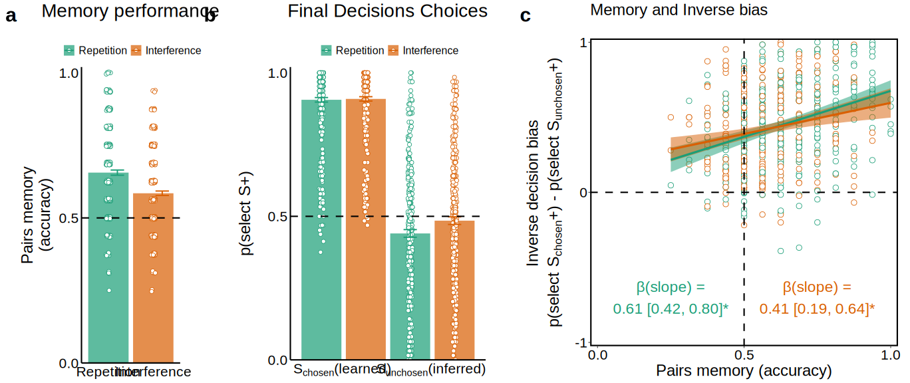
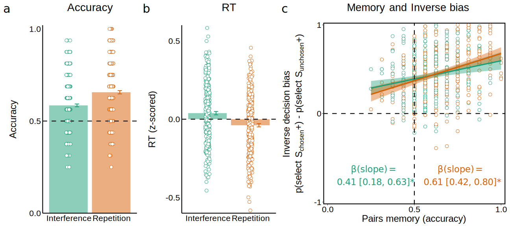

This is an analysis code for a study that assesses the role of memory in the 
inference of value for unchosen options.
The code loads preprocessed data from MTurk experiments, and analyses their results. 
Our analysis includes Bayesian regression models, some of which take several hours to run. Accordingly, here we only load the models which we already ran, but if you wish to run the models, you may define the parameter run_models to be equal to 1. 

 

```{css echo=FALSE}
/* Define a margin before h2 and h3 elements */
h2, h3, h4  {
  margin-top: 2em;
}

``` 

## Setup and load data

```{r setup, echo=T, results='hide', message=FALSE, warning=FALSE}

rm(list=ls(all=TRUE)) 

knitr::opts_chunk$set(echo = TRUE, message=FALSE, warning=FALSE)

# If packages are not installed, install. Then, load libraries. 
list_of_packages <- c("ggplot2", "Rmisc", "cowplot", "reshape2", "gridExtra", "arm", "mosaic", "stringr", "tidyr", "dplyr", "bayesplot", "rstanarm", "latex2exp", "kableExtra")
new_packages <- list_of_packages[!(list_of_packages %in% installed.packages()[,"Package"])]
if(length(new_packages)) install.packages(new_packages)
lapply(list_of_packages, require, character.only = TRUE)

# Load functions
source("Tools/plotting.R")

# Figure parameters
fig_size = c(10,10)
fig_type = "svg"  # "eps" # or png
n_sem <- 1
Save_plots <- 1
point_size <- 4.5
point_stroke <- 0.6
line_size <- 1
color_pallete <- "Dark2"

# Bayesian model params
options(mc.cores = parallel::detectCores())
params <- list()
params$iterations <- 4000
params$chains <- 4
params$warmup <- 2000
params$adapt_delta <- 0.99

# Do you want to run the models or load them?
run_models = 0;

# Load data 
load_data <- function(phase_types, exps){
  all_dfs = list()
  for (phase in 1:length(phase_types)){
    data = c()
    for (exp in 1:length(exps)){
      curr_data <- read.csv(sprintf("../Data/%s/Summary_data/non_outlier_subs/%s.csv",
                              exps[exp],phase_types[phase]))
      if ("version" %in% names(curr_data)) {
        curr_data <- curr_data %>% rename(Exp = version)
      }
      data <- bind_rows(data,curr_data)
    }
    all_dfs[[phase]] <- data
  }
  names(all_dfs) <- phase_types
  return(all_dfs)
}
phase_types = c("ratings","deliberation", "interference", "reward_learning",
                "final_decisions","memory", "outcome_evaluation","debrief",
                "all_data","all_interaction_data")
exps = c("Exp1")
dfs <- load_data(phase_types, exps)

```

## Demographics 

```{r, participants}

# age and gender
demographics <- dfs$debrief %>%
  group_by(Exp) %>%
  dplyr::summarise(n = n(),
                   mean_age = mean(age, na.rm=1),
                   sd_age = sd(age, na.rm=1),
                   n_females = sum(gender=="Female"),
                   n_males = sum(gender=="Male"),
                   n_other = sum(gender=="Other")) %>%
  mutate(age = sprintf("%.2f \u00b1 %.2f", mean_age, sd_age),
         gender = sprintf("%.0f females, %.0f males, %.0f other", n_females, n_males, n_other)) %>%
  dplyr::select(Exp, age, gender)

# outliers
outliers <- all_exps_list$all_data %>% 
  group_by(Exp) %>%
  dplyr::summarize(n_all = length(unique(PID)),
                   n = length(unique(PID[is_outlier==0]))) %>%
  mutate(outliers = n_all - n) %>%
  dplyr::select(Exp, n, outliers)

# bonus earned
bonus <- all_exps_list$all_data %>%
  group_by(Exp, PID) %>%
  dplyr::summarise(total_bonus = sum(total_reward_tally, na.rm=1),
                   deliberation_bonus = sum(deliberation_reward_tally, na.rm=1)) %>%
  group_by(Exp) %>%
  dplyr::summarise(total_bonus_mean = mean(total_bonus),
                   total_bonus_se = sd(total_bonus),
                   `deliberation bonus` = mean(deliberation_bonus)) %>%
  mutate(`total bonus` = sprintf("%.2f \u00b1 %.2f", total_bonus_mean, total_bonus_se)) %>%
  dplyr::select(Exp, `total bonus`, `deliberation bonus`)

# bind all details
demographics_total <- join(join(demographics, outliers, by="Exp"), bonus, by="Exp") %>%
  mutate(Exp = case_when(Exp=="Pilot" ~ "Pilot",
                         Exp=="Exp1" ~ "Experiment 1",
                         Exp=="Exp2" ~ "Experiment 2",
                         Exp=="Exp3" ~ "Experiment 3",
                         Exp=="Exp4" ~ "Experiment 4")) %>%
  mutate(Exp = factor(Exp, levels = c("Pilot", "Experiment 1", "Experiment 2", "Experiment 3", "Experiment 4"))) %>%
  arrange(Exp) 

demographics_total %>% 
  kbl(caption = "Demographic information") %>%
  kable_paper("hover", full_width = F, html_font = "Helvetica", position = "left")

demos <- subset(all_exps_list$demographics, Exp %in% c("Exp1", "Exp2", "Exp3"))
#write.csv(demos, "demographics.csv")
                
```

## Analysis of Experiment 1

### Final Decisions model

```{r}

# Stan parameters
options(mc.cores = parallel::detectCores())

params <- list()
params$iterations <- 4000
params$chains <- 4
params$warmup <- 2000
params$adapt_delta <- 0.99

# Create relevant columns for modeling 
dfs$final_decisions <- dfs$final_decisions %>% 
  mutate(condition_center = ifelse(condition==0, -1, 1),
         choice_center = ifelse(chosen_trial==0, -1, 1))

# Remove Non responses
dfs$final_decisions <- subset(dfs$final_decisions, !is.na(rt))

# ====== choice ======

# Run choice model and save it
M_choice_delta_val <- stan_glmer(data = dfs$final_decisions, 
                                 higher_outcome_chosen ~ condition_center*choice_center*zscored_delta_ratings + (condition_center*choice_center*zscored_delta_ratings | PID),
                                 family = binomial(link="logit"), 
                                 adapt_delta = params$adapt_delta, 
                                 iter = params$iterations, 
                                 chains = params$chains, 
                                 warmup = params$warmup,
                                 seed = 12345)

save(list = "M_choice_delta_val",
     file = "../Data/Exp1/Models/M_choice_delta_val.RData")

# Save posterior draws matrix
M_draws <- as.data.frame(M_choice_delta_val)
write.csv(M_draws,"../Data/Exp1/Models/M_choice_delta_val_draws.csv")

# ====== RT ======

# Run RT model and save it

M_choice_RT <- stan_glmer(data = dfs$final_decisions, 
                             higher_outcome_chosen ~ condition_center*choice_center*zscored_rt + 
                               (condition_center*choice_center*zscored_rt | PID),
                                 family = binomial(link="logit"), 
                                 adapt_delta = params$adapt_delta, 
                                 iter = params$iterations, 
                                 chains = params$chains, 
                                 warmup = params$warmup,
                                 seed = 12345)

save(list = "M_choice_RT",
     file = "../Data/Exp1/Models/M_choice_RT.RData")

# Save posterior draws matrix
M_choice_RT_draws <- as.data.frame(M_choice_RT)
write.csv(M_choice_RT_draws,"../Data/Exp1/Models/M_choice_RT_draws.csv")


```

### Final Decisions phase 
  
Here we present the tendency to select a rewarded item in the Final Decisions phase as a function of pair type (chosen vs. unchosen pairs). We then present the coefficients of a multilevel Bayesian logistic regression estimating the tendency to select a rewarded item as a function of choice type (chosen_trial_centered) and the difference in normalized liking ratings between rewarded and unrewarded items (norm_drate_by_outcome).  


```{r, analysis of final decisions}

# ================================
# Choices in Final Decisions phase 
# ================================

# compute mean probabiltiy to choose gain - for chosen and unchosen alone
p_gain <- dfs$final_decisions %>% 
  mutate(choice = ifelse(chosen_trial==1, "Chosen", "Unchosen"),
         condition = ifelse(condition==1, "Interference", "Repetition")) %>%
  group_by(Exp, PID, choice, condition) %>% 
  dplyr::summarize(p_gain = mean(higher_outcome_chosen, na.rm=1)) 

p_gain_group <- p_gain %>%
  group_by(Exp, choice, condition) %>%
  dplyr::summarize(mean = mean(p_gain, na.rm=1), 
                   se = sd(p_gain, na.rm=1)/sqrt(n())) %>%
  mutate(`p(select rewarded)` = sprintf("%.2f \u00b1 %.2f", mean, se)) %>%
  dplyr::select(Exp, choice, condition, `p(select rewarded)`)

# print table of group means and 1 sem
p_gain_group %>%
  kbl() %>%
  kable_paper("hover", full_width = F, html_font = "Helvetica", position = "left")

# ======================================
# Model choices as a function of ratings  
# ======================================

if (run_models==1){
  
  # Create relevant columns for modeling 
  dfs$final_decisions <- dfs$final_decisions %>% 
    mutate(condition_center = ifelse(condition==0, -1, 1),
           choice_center = ifelse(chosen_trial==0, -1, 1))

  # Remove Non responses
  dfs$final_decisions <- subset(dfs$final_decisions, !is.nan(rt))

  # Run choice model and save it
  M_choice_delta_val <- stan_glmer(data = dfs$final_decisions, 
                                   higher_outcome_chosen ~ 
                                     condition_center*choice_center*zscored_delta_ratings + 
                                     (condition_center*choice_center*zscored_delta_ratings | PID),
                                   family = binomial(link="logit"), 
                                   adapt_delta = params$adapt_delta, 
                                   iter = params$iterations, 
                                   chains = params$chains, 
                                   warmup = params$warmup,
                                   seed = 12345)

  save(list = "M_choice_delta_val",
       file = "../Data/Exp1/Models/M_choice_delta_val.RData")
  
} else {
  load("../Data/Exp1/Models/M_choice_delta_val.RData")
}

# Create coefficients of interest by rearranging model coefs
M_choice_delta_val_draws <- as.data.frame(M_choice_delta_val) %>%
  mutate(intercept_chosen_interference = `(Intercept)` + choice_center + condition_center + `condition_center:choice_center`,
         intercept_chosen_repetition = `(Intercept)` + choice_center - condition_center - `condition_center:choice_center`,
         intercept_chosen_diff = intercept_chosen_interference - intercept_chosen_repetition,
         slope_chosen_interference = zscored_delta_ratings + `choice_center:zscored_delta_ratings` + `condition_center:zscored_delta_ratings` + `condition_center:choice_center:zscored_delta_ratings`,
         slope_chosen_repetition = zscored_delta_ratings + `choice_center:zscored_delta_ratings` - `condition_center:zscored_delta_ratings` - `condition_center:choice_center:zscored_delta_ratings`,
         slope_chosen_diff = slope_chosen_interference - slope_chosen_repetition,
         intercept_unchosen_interference = `(Intercept)` - choice_center + condition_center - `condition_center:choice_center`,
         intercept_unchosen_repetition = `(Intercept)` - choice_center - condition_center + `condition_center:choice_center`,
         intercept_unchosen_diff = intercept_unchosen_interference - intercept_unchosen_repetition,
         slope_unchosen_interference = zscored_delta_ratings - `choice_center:zscored_delta_ratings` + `condition_center:zscored_delta_ratings` - `condition_center:choice_center:zscored_delta_ratings`,
         slope_unchosen_repetition = zscored_delta_ratings - `choice_center:zscored_delta_ratings` - `condition_center:zscored_delta_ratings` + `condition_center:choice_center:zscored_delta_ratings`,
         slope_unchosen_diff = slope_unchosen_interference - slope_unchosen_repetition)

summary_coefs <- as.data.frame(M_choice_delta_val_draws) %>%
  gather(coef, value, colnames(M_choice_delta_val_draws)[!str_detect(colnames(M_choice_delta_val_draws), "PID")]) %>%
  group_by(coef) %>%
  dplyr::summarize(HDI95_low = posterior_interval(as.matrix(value), prob=0.95)[1],
                   HDI95_high = posterior_interval(as.matrix(value), prob=0.95)[2],
                   median = median(value)) %>%
  mutate(sig = ifelse((median>0 & HDI95_low>0 & HDI95_high>0) | (median<0 & HDI95_low<0 & HDI95_high<0),"*",""),
         value = sprintf("%.2f [%.2f, %.2f]%s",median, HDI95_low, HDI95_high, sig)) %>%
  dplyr::select(coef, value) 

# print table of coefs
summary_coefs %>%
  kbl() %>%
  kable_paper("hover", full_width = F, html_font = "Helvetica", position = "left")

```

### RT analysis in Final Decisions phase

#### RT predicting choices
In this anaysis we assess whether RTs relate to choices in the Final Decisions phase. We follow previous research showing that approach toward reward is faster than avoidance from loss, and so we expect participants to be faster when they choose the more valuable painting.  
Here we expect to observe this effect in unchosen pairs for Repeated items and not for Interfered items. 
We will predict the probability to select a rewarded item as a function of condition (Repetition vs. Interference) and reaction times. 
Because there are not enough no-gain choices in the chosen pairs, we will only include the unchosen trials in this analysis.  
We can then rearrange the model coefficients to get an estimate of the effect of RT for the two conditions seperately (the slope term). 
  
  
```{r, rt final decisions}

# =============================
# RT avreages in all pair types 
# =============================

RT_FD <- subset(dfs$final_decisions, !is.na(rt)) %>%
  mutate(Choice = ifelse(chosen_trial==1, "Chosen pairs", "Unchosen pairs"),
         Condition = ifelse(condition==1, "Interference", "Repetition"),
         `Chosen item` = ifelse(higher_outcome_chosen==1, "S+", "S0")) %>%
  group_by(Exp, PID, Choice, Condition, `Chosen item`) %>%
  dplyr::summarise(rt = mean(zscored_rt, na.rm=1)) 

# show group means 
RT_FD_group <- RT_FD %>%
  group_by(Exp, Choice, Condition, `Chosen item`) %>%
  dplyr::summarise(mean = mean(rt, na.rm=1),
                   se = sd(rt)/sqrt(n())) %>%
  mutate(RT = sprintf("%.2f \u00b1 %.2f", mean, se)) %>%
  select(Exp, Choice, Condition, `Chosen item`, RT) 

RT_FD_group %>%
  kbl() %>%
  kable_paper("hover", full_width = F, html_font = "Helvetica", position = "left")

# =================================================
# p(gain) as a function of zscored RT and pair type
# =================================================

# run model 
if (run_models==1){
  
  dfs$final_decisions <- dfs$final_decisions %>% 
    mutate(condition_center = ifelse(condition==0, -1, 1))
  
  # run model and use function to rearrange the coefficients
  M_zscored_RT_FD <- stan_glmer(data=subset(dfs$final_decisions, !is.na(left_chosen) & chosen_trial==0),
                                higher_outcome_chosen ~ condition_center*zscored_rt + 
                                  (condition_center*zscored_rt | PID),
                                family = binomial(link="logit"),
                                adapt_delta = params$adapt_delta,
                                iter = params$iterations,
                                chains = params$chains,
                                warmup = params$warmup,
                                seed = 12345)
  
  save(list = "M_zscored_RT_FD",
       file = "../Data/Exp1/Models/M_zscored_RT_FD.RData")
  
} else {
  load("../Data/Exp1/Models/M_zscored_RT_FD.RData")
}

# compute median and 95% HDIs of coefs
draws_zscored_RT_FD <- as.data.frame(M_zscored_RT_FD) %>%
  mutate(intercept_interference = `(Intercept)` + condition_center,
         slope_interference = zscored_rt + `condition_center:zscored_rt`,
         intercept_repetition = `(Intercept)` - condition_center,
         slope_repetition = zscored_rt - `condition_center:zscored_rt`,
         intercept_diff = intercept_interference - intercept_repetition,
         slope_diff = slope_interference - slope_repetition)

summary_draws_zscored_RT_FD <- draws_zscored_RT_FD[,!str_detect(colnames(draws_zscored_RT_FD),"PID")] %>%
  gather(coef,value) %>%
  group_by(coef) %>%
  dplyr::summarize(HDI95_low = posterior_interval(as.matrix(value), prob=0.95)[1],
                   HDI95_high = posterior_interval(as.matrix(value), prob=0.95)[2],
                   median = median(value)) %>%
  mutate(sig = ifelse((median>0 & HDI95_low>0 & HDI95_high>0) | 
                          (median<0 & HDI95_low<0 & HDI95_high<0),"*",""),
         value = sprintf("%.2f [%.2f, %.2f]%s",median, HDI95_low, HDI95_high, sig)) %>%
  dplyr::select(coef, value)

# print table of coefs
print('Model coefficients in a model including zscored RT')
summary_draws_zscored_RT_FD %>%
  kbl() %>%
  kable_paper("hover", full_width = F, html_font = "Helvetica", position = "left")

```

#### Figure RT

```{r}

# ===============
# panel a - means
# ===============

# RT in chosen and unchosen pairs
p1 <- ggplot(subset(RT_FD, Choice=="Unchosen pairs"), aes(x=`Chosen item`,y=rt, group=Condition)) +
  stat_summary_bin(aes(y=rt, fill=Condition), fun.y="mean", geom="bar", binwidth=0.2,
                   position=position_dodge(width=1), alpha=0.5) +
  #geom_point(aes(color=Condition),position=position_jitterdodge(dodge.width=1, jitter.width=0.1), 
  #           fill="white", shape=21, stroke=point_stroke, size=2, alpha=0.7) +
  #scale_color_manual(values="black") + 
  stat_summary(aes(color=Condition),fun.data=mean_se, fun.args = list(mult=n_sem), geom="errorbar",  
               width=0.2, size=1, position=position_dodge(1)) + 
  #geom_hline(yintercept=0, size=line_size, linetype="dashed") +
  theme + 
  scale_y_continuous(expand=c(0,0)) + #, limits=c(0, max(RT_FD$rt + 0.1))) + 
  theme(aspect.ratio=3/2,
        plot.title = element_text(margin=margin(0,0,30,0))) +
  labs(x = "Selected stimulus", 
       y="Reaction times (z-scored)", 
       title="RT in Unchosen Pairs") +
  scale_fill_brewer(palette=color_pallete) + 
  scale_color_brewer(palette=color_pallete)


# ===============
# panel b - model
# ===============

# we create 1000 fake x values (zscored RTs), and for each we will predict the y values of every draw from the posterior distributions. We do that for every condition (interference vs. repetition pairs) seperately using their rearranged coefs (e.g., the interference intercept and interference slope)

n_fake_samples = 1000
min_x = -5
max_x = 5
model_draws = draws_zscored_RT_FD
conditions = c("interference","repetition")
conditions_col_names = c("condition")
is_logistic = 1
predicted_draws_rt_model <- create_posterior_draws_lines(n_fake_samples, min_x, max_x, model_draws, conditions, conditions_col_names, is_logistic)

# model text
rt_model_text <- summary_draws_zscored_RT_FD[summary_draws_zscored_RT_FD$coef %in% c("slope_interference", "slope_repetition"),] %>%
  mutate(condition = ifelse(coef=="slope_interference", "Interference", "Repetition"),
         x = ifelse(coef=="slope_interference", -2.5, 2.5),
         y = ifelse(coef=="slope_interference", 0.8, 0.2),
         text = sprintf("\u03b2(%s Slope):\n%s",condition, value)) %>%
  select(-c(coef,value))


# model fit
p2 <- ggplot(predicted_draws_rt_model, aes(y=median,x=x)) +
  geom_ribbon(aes(ymin=lower, ymax=upper, fill=condition), color=NA, alpha=0.4) + 
  geom_line(aes(y=median, color=condition), size=line_size*1.5) +  
  geom_hline(yintercept=0.5, size=line_size, linetype="dashed") + 
  geom_vline(xintercept=0, size=line_size, linetype="dashed") +
  scale_y_continuous(expand=c(0,0), breaks=c(0,0.5,1), limits=c(0,1.025)) + 
  scale_x_continuous(expand=c(0,0)) +
  #scale_linetype_manual(values=c("longdash", "solid")) +
  theme + point_plot_theme + 
  theme(legend.position="none",
        plot.title = element_text(margin=margin(0,0,30,0))) + 
  geom_text(rt_model_text,mapping=aes(x=x, y=y, group=condition, label=text), size=7) +
  labs(y="Predicted p(select S+)", 
       x="Reaction times (z-scored)",
       title="Choices and RTs in Final Decisions") +
  scale_fill_brewer(palette=color_pallete) + 
  scale_color_brewer(palette=color_pallete)


p <- plot_grid(p1,p2,
               ncol=2,
               axis="bt",
               align="v", 
               labels=c("a","b"), 
               label_size = 30, 
               label_fontfamily = "Helvetica",
               rel_widths = c(0.8,1))


if (Save_plots == 1) {ggsave(filename=sprintf("Plots/%s.%s","Figure_RT",fig_type), 
                             plot=p, 
                             width=fig_size[1]+4,
                             height=fig_size[2]-2)}

```

### Outcome Estimation phase

Here we present the tendency to estimate items as rewarded ones as a fucntion of choice (chosen vs. unchosen items) and actual given reward (rewarded vs. unrewarded, for unchosen items, this is the outcome of their chosen counterpart).  

```{r, analysis of outcome estimation}

# =======================================
# Estimations in Outcome Estimation phase 
# =======================================

outcome_estimation <- dfs$outcome_evaluation %>%
  mutate(choice = ifelse(stim_type=="chosen", "Chosen", ifelse(stim_type=="unchosen","Unchosen","Novel")),
         reward = ifelse(outcome==1, "Rewarded", "Unrewarded"),
         condition = ifelse(condition==1, "Interference", "Repetition")) %>% 
  group_by(PID, condition, choice, reward) %>%
  dplyr::summarise(gain_eval = mean(outcome_eval_gain, na.rm=1),
                   eval_acc = mean(outcome_eval_acc, na.rm=1),
                   eval_rt = mean(outcome_eval_rt, na.rm=1)) 

outcome_est_group <- outcome_estimation %>%
  group_by(choice, reward, condition) %>%
  dplyr::summarise(mean = mean(gain_eval, na.rm=1),
                   se = sd(gain_eval, na.rm=1)/sqrt(n())) %>%
  mutate(`p(estimate as rewarded)` = sprintf("%.2f \u00b1 %.2f",mean, se)) %>%
  dplyr::select(choice,reward,condition,`p(estimate as rewarded)`)

# print table
outcome_est_group %>%
  kbl() %>%
  kable_paper("hover", full_width = F, html_font = "Helvetica", position = "left")

# ===============================================
# Model estimations as a function of outcome type 
# ===============================================

if (run_models==1){
  dfs$outcome_evaluation <- mutate(dfs$outcome_evaluation,
                                   chosen_obj_centered = ifelse(is_chosen==0,-1,1),
                                   condition_centered = ifelse(condition==1, 1, -1))
  M_outcome_estimation <- stan_glmer(data=subset(dfs$outcome_evaluation, is_novel==0), 
                                     outcome_eval_gain ~ chosen_obj_centered * condition_centered * outcome + 
                                       (chosen_obj_centered * condition_centered * outcome | PID),
                                     family = binomial(link="logit"), 
                                     adapt_delta = params$adapt_delta, 
                                     iter = params$iterations, 
                                     chains = params$chains, 
                                     warmup = params$warmup)
  save(M_outcome_estimation, file = "../Data/Exp1/Models/M_outcome_estimation.RData")
} else {
  load("../Data/Exp1/Models/M_outcome_estimation.RData")
}

# Rearrange model coefficients to get coefficients of interest
model_posterior <- as.data.frame(M_outcome_estimation)
outcome_est_group_fits <- model_posterior[,!str_detect(colnames(model_posterior),"PID")] %>%
  mutate(interference_chosen_rewarded = `(Intercept)` + chosen_obj_centered + outcome + condition_centered + 
           `chosen_obj_centered:condition_centered` + `chosen_obj_centered:outcome` + `condition_centered:outcome` + 
           `chosen_obj_centered:condition_centered:outcome`,
         interference_chosen_unrewarded = `(Intercept)` + chosen_obj_centered - outcome + condition_centered + 
           `chosen_obj_centered:condition_centered` - `chosen_obj_centered:outcome` - `condition_centered:outcome` - 
           `chosen_obj_centered:condition_centered:outcome`,
         interference_unchosen_rewarded = `(Intercept)` - chosen_obj_centered + outcome + condition_centered - 
           `chosen_obj_centered:condition_centered` - `chosen_obj_centered:outcome` + `condition_centered:outcome` - 
           `chosen_obj_centered:condition_centered:outcome`,
         interference_unchosen_unrewarded = `(Intercept)` - chosen_obj_centered - outcome + condition_centered - 
           `chosen_obj_centered:condition_centered` + `chosen_obj_centered:outcome` - `condition_centered:outcome` + 
           `chosen_obj_centered:condition_centered:outcome`,
         repetition_chosen_rewarded = `(Intercept)` + chosen_obj_centered + outcome - condition_centered - 
           `chosen_obj_centered:condition_centered` + `chosen_obj_centered:outcome` - `condition_centered:outcome` - 
           `chosen_obj_centered:condition_centered:outcome`,
         repetition_chosen_unrewarded = `(Intercept)` + chosen_obj_centered - outcome - condition_centered - 
           `chosen_obj_centered:condition_centered` - `chosen_obj_centered:outcome` + `condition_centered:outcome` + 
           `chosen_obj_centered:condition_centered:outcome`,
         repetition_unchosen_rewarded = `(Intercept)` - chosen_obj_centered + outcome - condition_centered + 
           `chosen_obj_centered:condition_centered` - `chosen_obj_centered:outcome` - `condition_centered:outcome` + 
           `chosen_obj_centered:condition_centered:outcome`,
         repetition_unchosen_unrewarded = `(Intercept)` - chosen_obj_centered - outcome - condition_centered + 
           `chosen_obj_centered:condition_centered` + `chosen_obj_centered:outcome` + `condition_centered:outcome` - 
           `chosen_obj_centered:condition_centered:outcome`) %>%
  gather(coef,value) %>%
  group_by(coef) %>%
  dplyr::summarize(HDI95_low = posterior_interval(as.matrix(value), prob=0.95)[1],
                   HDI95_high = posterior_interval(as.matrix(value), prob=0.95)[2],
                   median = median(value)) %>%
  mutate(sig = ifelse((median>0 & HDI95_low>0 & HDI95_high>0) | (median<0 & HDI95_low<0 & HDI95_high<0),"*",""),
         value = sprintf("%.2f [%.2f, %.2f]%s",median, HDI95_low, HDI95_high, sig)) %>%
  dplyr::select(coef, value) 

model_coefs_outcome_estimation <- outcome_est_group_fits[outcome_est_group_fits$coef %in% c("(Intercept)","chosen_obj_centered","condition_centered","outcome", "chosen_obj_centered:condition_centered", "chosen_obj_centered:outcome", "condition_centered:outcome", "chosen_obj_centered:condition_centered:outcome"),]

model_coefs_outcome_estimation %>%
  kbl() %>%
  kable_paper("hover", full_width = F, html_font = "Helvetica", position = "left")

reaaranged_coefs_outcome_estimation <- outcome_est_group_fits[!outcome_est_group_fits$coef %in% c("(Intercept)","chosen_obj_centered","condition_centered","outcome", "chosen_obj_centered:condition_centered", "chosen_obj_centered:outcome", "condition_centered:outcome", "chosen_obj_centered:condition_centered:outcome"),] %>%
  separate(coef, c("Condition","Choice", "Outcome"), sep="_") 

reaaranged_coefs_outcome_estimation %>%
  kbl() %>%
  kable_paper("hover", full_width = F, html_font = "Helvetica", position = "left")

# ==========================================================================
# Relationship between inverse decision bias and inverse estimation of value
# ==========================================================================

inverse_decision_estimation <- outcome_estimation %>% 
  select(-c(eval_acc, eval_rt)) %>%
  spread(reward, gain_eval) %>%
  mutate(reward_diff = Rewarded-Unrewarded) %>%
  merge(p_gain, by=c("PID","choice", "condition")) %>%
  mutate(choice_centered = ifelse(choice=="Chosen", 1, -1),
         condition_centered = ifelse(condition=="Interference", 1, -1),
         p_gain_centered = p_gain - 0.5)

ggplot(inverse_decision_estimation, aes(y=p_gain, x=reward_diff, color=condition)) +
  geom_point() +
  geom_smooth(method=lm) +
  facet_wrap(.~choice) +
  theme + point_plot_theme +
  geom_hline(yintercept=0, size=1, linetype="dashed") +
  geom_vline(xintercept=0, size=1, linetype="dashed")

if (run_models==1){
  M_inverse_decision_estimation <- stan_glm(data = inverse_decision_estimation, 
                                     p_gain_centered ~ choice_centered * reward_diff * condition_centered,
                                     family = gaussian(), 
                                     adapt_delta = params$adapt_delta, 
                                     iter = params$iterations, 
                                     chains = params$chains, 
                                     warmup = params$warmup)
  save(M_inverse_decision_estimation, file = "../Data/Exp1/Models/M_inverse_decision_estimation.RData")
} else {
  load("../Data/Exp1/Models/M_inverse_decision_estimation.RData")
}

draws_inverse_decision_estimation <- as.data.frame(M_inverse_decision_estimation) %>%
  mutate(intercept_chosen_interference = `(Intercept)` + choice_centered + condition_centered + `choice_centered:condition_centered`,
         slope_chosen_interference = reward_diff + `choice_centered:reward_diff` + `reward_diff:condition_centered` + `choice_centered:reward_diff:condition_centered`,
         intercept_unchosen_interference = `(Intercept)` - choice_centered + condition_centered - `choice_centered:condition_centered`,
         slope_unchosen_interference = reward_diff - `choice_centered:reward_diff` + `reward_diff:condition_centered` - `choice_centered:reward_diff:condition_centered`,
         intercept_chosen_repetition = `(Intercept)` + choice_centered - condition_centered - `choice_centered:condition_centered`,
         slope_chosen_repetition = reward_diff + `choice_centered:reward_diff` - `reward_diff:condition_centered` - `choice_centered:reward_diff:condition_centered`,
         intercept_unchosen_repetition= `(Intercept)` - choice_centered - condition_centered + `choice_centered:condition_centered`,
         slope_unchosen_repetition = reward_diff - `choice_centered:reward_diff` - `reward_diff:condition_centered` + `choice_centered:reward_diff:condition_centered`) 

summary_inverse_decision_estimation <- draws_inverse_decision_estimation %>%
  gather(coef,value) %>%
  group_by(coef) %>%
  dplyr::summarize(HDI95_low = posterior_interval(as.matrix(value), prob=0.95)[1],
                   HDI95_high = posterior_interval(as.matrix(value), prob=0.95)[2],
                   median = median(value)) %>%
  mutate(sig = ifelse((median>0 & HDI95_low>0 & HDI95_high>0) | (median<0 & HDI95_low<0 & HDI95_high<0),"*",""),
         value = sprintf("%.2f [%.2f, %.2f]%s",median, HDI95_low, HDI95_high, sig)) %>%
  dplyr::select(coef, value) 

summary_inverse_decision_estimation %>%
  kbl() %>%
  kable_paper("hover", full_width = F, html_font = "Helvetica", position = "left")

```
  
### Figure 2

```{r, figure 2}

# =================================
# Panel a: means for p(choose gain) 
# =================================

bias <- dfs$final_decisions %>%
  mutate(Choice = ifelse(chosen_trial==1, "Chosen", "Unchosen"),
         Condition = ifelse(condition==1, "Interference", "Repetition")) %>%
  group_by(PID, Choice, Condition) %>%
  dplyr::summarize(p_gain = mean(higher_outcome_chosen, na.rm=1))

p1 <- ggplot(bias, aes(x=Choice,y=p_gain,group=Condition)) +
  stat_summary_bin(aes(y=p_gain, fill=Condition), fun.y="mean", geom="bar", binwidth=0.2, position=position_dodge(width=1), alpha=0.5) +
  geom_point(aes(color=Condition), position=position_jitterdodge(dodge.width=1, jitter.width=0.1), 
                   fill="white", shape=21, stroke=point_stroke, size=point_size-2) +
  #scale_color_manual(values="black") + 
  stat_summary(aes(color=Condition),fun.data=mean_se, fun.args = list(mult=n_sem), geom="errorbar", width=0.2, size=0.9, position=position_dodge(1)) + # "turquoise4"
  geom_hline(yintercept=0.5, size=line_size, linetype="dashed") + 
  scale_y_continuous(expand=c(0,0), breaks=c(0,0.5,1), limits=c(0,1.02)) + 
  theme + 
  theme(axis.title.x=element_blank(),  
        aspect.ratio=2.5/2,
        plot.title = element_text(margin=margin(0,0,30,0))) +
  labs(y="p(select S+)", title="Final Decisions Choices") +
  scale_x_discrete(breaks = c("Chosen","Unchosen"), limits=c("Chosen","Unchosen"),
                   # labels = c("1" = expression(atop(S[chosen],paste("(learned)"))),
                   #            "0" = expression(atop(S[unchosen],paste("(inferred)"))))) 
                   labels = c("Chosen" = expression(S[chosen]*" (learned)"),
                              "Unchosen" = expression(S[unchosen]*" (inferred)"))) +
  scale_fill_brewer(palette=color_pallete) + 
  scale_color_brewer(palette=color_pallete)

# ==========================
# Panel b: choice model fits 
# ==========================

n_fake_samples = 1000
min_x = -2
max_x = 2
model_draws = M_choice_delta_val_draws
conditions = c("chosen_interference","chosen_repetition","unchosen_interference","unchosen_repetition")
conditions_col_names = c("choice","condition")
is_logistic = 1
predicted_draws_choice_model <- create_posterior_draws_lines(n_fake_samples, min_x, max_x, model_draws, conditions, conditions_col_names, is_logistic)

# model text
choice_model_text <- subset(summary_coefs, (grepl("intercept_",coef) | grepl("slope_",coef)) & !grepl("_diff",coef)) %>%
  separate(coef, c("coef","choice","condition"), "_") %>%
  mutate(text = sprintf("\u03b2(%s %s) = \n%s", choice,coef, value)) %>%
  mutate(x = ifelse(choice=="unchosen" & condition == "interference", -1, 1),
         y = ifelse(choice=="unchosen" & condition == "repetition", 0.25, 0.75))


# plot fit

p2 <- ggplot(predicted_draws_choice_model, aes(y=median, x=x, linetype=choice, color=condition)) +
  geom_ribbon(aes(ymin=lower, ymax=upper, fill=condition), color=NA,alpha=0.4) + 
  geom_line(aes(y=median, linetype=choice, color=condition), size=line_size*1.5) +  
  geom_hline(yintercept=0.5, size=line_size, linetype="dashed") + 
  geom_vline(xintercept=0, size=line_size, linetype="dashed") +
  scale_y_continuous(expand=c(0,0), breaks=c(0,0.5,1), limits=c(0,1.025)) + 
  scale_x_continuous(expand=c(0,0)) +
  scale_linetype_manual(values=c("longdash","solid","longdash","solid")) +
  theme + point_plot_theme + 
  theme(legend.position="none",
        plot.title = element_text(margin=margin(0,0,30,0))) + 
  geom_text(subset(choice_model_text, coef=="intercept" & choice=="unchosen"), 
                   mapping=aes(x=x, y=y, color=condition, label=text), size=7) +
  labs(y="Predicted p(select S+)", 
       x="Normalized \u0394ratings (S+ - S0)",
       title="Choice model predictions") +
  scale_fill_brewer(palette=color_pallete) + 
  scale_color_brewer(palette=color_pallete)

# p <- plot_grid(p1,p2,
#                ncol=2,
#                axis="bt",
#                align="v",
#                labels=c("a","b"),
#                label_size = 30,
#                label_fontfamily = "Helvetica",
#                rel_widths = c(0.75,1))
#    
# if (Save_plots == 1) {ggsave(filename=sprintf("Plots/%s.%s","Figure2",fig_type), 
#                              plot=p, 
#                              width=fig_size[1]+4,
#                              height=fig_size[2]-3)}
# 

# =================================
# Panel c: Outcome estimation means
# =================================

estimates <- subset(outcome_estimation, choice!="Novel") #%>%
  #mutate(reward = ifelse(reward=="Rewarded", "S+", "S-"))

p3 <- ggplot(estimates, aes(y = gain_eval, x = choice)) +
  stat_summary_bin(aes(y=gain_eval, fill=condition), fun.y="mean", geom="bar", binwidth=0.2,
                   position=position_dodge(width=1), alpha=0.5) +
  geom_point(aes(color=condition, x=choice),
             position=position_jitterdodge(dodge.width=1, jitter.width=0.1, jitter.height=0.01),
             shape=21, stroke=point_stroke, size=2, fill="white") +
  stat_summary(aes(color=condition, x=choice), 
               fun.data=mean_se, fun.args = list(mult=1), 
               geom="errorbar", width=0.2, size=0.9, position=position_dodge(width=1)) + 
  geom_hline(yintercept=0.5, linetype="dashed", size=line_size) + 
  scale_y_continuous(expand=c(0,0), breaks=c(0,0.5,1), limits=c(-0.03,1.05)) + 
  theme + 
  labs(y="p(estimate as S+)", title="Outcome Estimation") +
  facet_wrap(.~reward) +
  scale_x_discrete(breaks = c("Chosen", "Unchosen"),
                   labels = c(expression(S[chosen]), expression(S[unchosen]))) + 
  theme(aspect.ratio=2/1) +
  scale_fill_brewer(palette=color_pallete) + 
  scale_color_brewer(palette=color_pallete)
  

# ===================================================================
# Panel d: Relationship between decision bias and outcome estimations
# ===================================================================

# predict bias for plotting

n_fake_samples = 100
min_x = -1
max_x = 1
model_draws = draws_inverse_decision_estimation
conditions = c("chosen_interference","chosen_repetition","unchosen_interference","unchosen_repetition")
conditions_col_names = c("choice","condition")
is_logistic = 0
predicted_summary_bias_estimations <- create_posterior_draws_lines(n_fake_samples, min_x, max_x, model_draws, conditions, conditions_col_names, is_logistic) %>%
  mutate(reward_diff = x,
         p_gain_centered = median)

inverse_decision_estimation_text <- subset(summary_inverse_decision_estimation, (grepl("intercept_",coef) | grepl("slope_",coef)) & !grepl("_diff",coef)) %>%
  separate(coef, c("coef","choice","condition"), "_") %>%
  mutate(text = sprintf("\u03b2(%s %s) = \n%s", choice,coef, value)) %>%
  mutate(x = ifelse(choice=="unchosen" & condition == "interference", -0.5, 0.5),
         y = ifelse(choice=="unchosen" & condition == "repetition", -0.4, 0.4))

p4 <- ggplot(subset(inverse_decision_estimation, choice=="Unchosen") %>%
               mutate(choice = tolower(choice),
                      condition = tolower(condition)),
             aes(y=p_gain_centered,x=reward_diff, group=condition)) + 
  geom_point(aes(color=condition), size=point_size, fill="white", shape=21, stroke=point_stroke) + 
  theme + 
  point_plot_theme +
  geom_ribbon(data = subset(predicted_summary_bias_estimations,choice=="unchosen"), aes(ymin=lower, ymax=upper, fill=condition), color=NA, alpha=0.5) +
  geom_line(data = subset(predicted_summary_bias_estimations,choice=="unchosen"), aes(y=median, color=condition), size=line_size*1.5) +  
  geom_hline(yintercept=0, size=line_size, linetype="dashed") + 
  geom_vline(xintercept=0, size=line_size,  linetype="dashed") +
  scale_y_continuous(expand=c(0,0),  breaks=c(-0.5,0,0.5), limits=c(-0.55,0.55)) + 
  scale_x_continuous(expand=c(0,0), breaks=c(-1, 0, 1), limits=c(-1.05, 1.05)) +
  theme(legend.position="none", plot.title = element_text(margin=margin(0,0,30,0))) + 
  geom_text(subset(inverse_decision_estimation_text, coef=="slope" & choice=="unchosen"), 
            size=7, 
            mapping=aes(x=x, y=y, label=text, color=condition)) + #, group=choice)) +
  labs(y="p(select S+) - 0.5",
       x="Inverse estimation score",
       title="Decision bias and outcome estimations") +
  scale_fill_brewer(palette=color_pallete) + 
  scale_color_brewer(palette=color_pallete)
 
# p <- plot_grid(p3,p4,
#                ncol=2,
#                axis="bt",
#                align="v",
#                labels=c("a","b"),
#                label_size = 30,
#                label_fontfamily = "Helvetica",
#                rel_widths = c(1,1))
#    
# if (Save_plots == 1) {ggsave(filename=sprintf("Plots/%s.%s","Figure3",fig_type), 
#                              plot=p, 
#                              width=fig_size[1],
#                              height=fig_size[2]-3)}

p <- plot_grid(p1,p2,p3,p4,
               ncol=2,nrow=2,
               axis="bt",
               align="v",
               labels=c("a","b","c","d"),
               label_size = 30,
               label_fontfamily = "Helvetica")

if (Save_plots == 1) {ggsave(filename=sprintf("Plots/%s.%s","Figure2",fig_type),
                             plot=p,
                             width=fig_size[1]+5,
                             height=fig_size[2]+6)}

```

 

### Relationship between associative memory and inverse bias
  
Here we present regression models assessing the relationship between inverse inference of value and associative memory of the deliberation pairs. We analyse these effects both across participants and within participants.  

```{r, memory and inverse bias}

# ==============================
# Pairs memory across conditions
# ==============================

pairs_acc <- dfs$memory %>%
  mutate(Condition = ifelse(condition==1, "Interference", "Repetition")) %>%
  group_by(PID, Condition) %>%
  dplyr::summarise(pairs_acc = mean(pairs_acc, na.rm=1),
                   zscored_rt = mean(zscored_rt_pairs, na.rm=1))

# =======================
# Memory and Inverse bias 
# =======================

# Compute measures of interest
memory_bias <- dfs$final_decisions %>%
  mutate(Choice = ifelse(chosen_trial==1, "Chosen", "Unchosen"),
         Condition = ifelse(condition==1, "Interference", "Repetition")) %>%
  group_by(PID, Choice, Condition) %>%
  dplyr::summarize(p_gain = mean(higher_outcome_chosen, na.rm=1)) %>%
  spread(Choice,p_gain) %>%
  mutate(inverse_bias = Chosen - Unchosen) %>%
  merge(pairs_acc, by=c("PID","Condition"))

# Model inverse decision bias and pairs memory
if (run_models==1){
  
  memory_bias <- memory_bias %>%
    mutate(condition_centered = ifelse(Condition=="Interference", 1, -1))
  
  # run model
  M_memory_bias <- stan_glm(data=memory_bias,
                              inverse_bias ~ pairs_acc*condition_centered,
                              family = gaussian(),
                              adapt_delta = params$adapt_delta,
                              iter = params$iterations,
                              chains = params$chains,
                              warmup = params$warmup,
                              seed = 12345)
  
  save(list = "M_memory_bias",
       file = "../Data/Exp1/Models/M_memory_bias.RData")
} else {
  load("../Data/Exp1/Models/M_memory_bias.RData")
}

# Present model coefs
draws_memory_bias <- as.data.frame(M_memory_bias) %>%
  mutate(intercept_interference = `(Intercept)` + condition_centered,
         slope_interference = pairs_acc + `pairs_acc:condition_centered`,
         intercept_repetition = `(Intercept)` - condition_centered,
         slope_repetition = pairs_acc - `pairs_acc:condition_centered`)
summary_memory_bias <- draws_memory_bias %>%
  gather(coef, value) %>%
  group_by(coef) %>%
  dplyr::summarize(HDI95_low = posterior_interval(as.matrix(value), prob=0.95)[1],
                   HDI95_high = posterior_interval(as.matrix(value), prob=0.95)[2],
                   median = median(value)) %>%
  mutate(sig = ifelse((median>0 & HDI95_low>0 & HDI95_high>0) | 
                          (median<0 & HDI95_low<0 & HDI95_high<0),"*",""),
         value = sprintf("%.2f [%.2f, %.2f]%s",median, HDI95_low, HDI95_high, sig)) %>%
  dplyr::select(coef, value)

summary_memory_bias %>%
  kbl() %>%
  kable_paper("hover", full_width = F, html_font = "Helvetica", position = "left")

```
  
### Figure 3 - memory and bias
  
```{r, figure 3}

p1 <- ggplot(pairs_acc, aes(x=Condition,y=pairs_acc,group=Condition)) +
  stat_summary_bin(aes(y=pairs_acc, fill=Condition), fun.y="mean", geom="bar", binwidth=0.2, position=position_dodge(width=1), alpha=0.5) +
  geom_point(aes(color=Condition), position=position_jitterdodge(dodge.width=1, jitter.width=0.1), 
                   fill="white", shape=21, stroke=point_stroke, size=point_size-1) +
  #scale_color_manual(values="black") + 
  stat_summary(aes(color=Condition),fun.data=mean_se, fun.args = list(mult=n_sem), geom="errorbar", width=0.1, size=0.9, 
               position=position_nudge(0.2)) + # "turquoise4"
  geom_hline(yintercept=0.5, size=line_size, linetype="dashed") + 
  scale_y_continuous(expand=c(0,0), breaks=c(0,0.5,1), limits=c(0,1.02)) + 
  theme + 
  theme(legend.position="none",
        axis.title.x=element_blank(),  
        aspect.ratio=2/1,
        plot.title = element_text(margin=margin(0,0,30,0))) +
  labs(y="Accuracy", title="Accuracy") +
  scale_fill_brewer(palette=color_pallete) + 
  scale_color_brewer(palette=color_pallete)

p2 <- ggplot(pairs_acc, aes(x=Condition,y=zscored_rt,group=Condition)) +
  stat_summary_bin(aes(y=zscored_rt, fill=Condition), fun.y="mean", geom="bar", binwidth=0.2, position=position_dodge(width=1), alpha=0.5) +
  geom_point(aes(color=Condition), position=position_jitterdodge(dodge.width=1, jitter.width=0.1), 
                   fill="white", shape=21, stroke=point_stroke, size=point_size-1) +
  #scale_color_manual(values="black") + 
  stat_summary(aes(color=Condition),fun.data=mean_se, fun.args = list(mult=n_sem), 
               geom="errorbar", width=0.1, size=0.9, position=position_nudge(0.2)) + # "turquoise4"
  geom_hline(yintercept=0, size=line_size, linetype="dashed") + 
  scale_y_continuous(expand=c(0,0), breaks=c(-0.5,0,0.5), limits=c(-0.6, 0.6)) + 
  theme + 
  theme(legend.position="none",
        axis.title.x=element_blank(),  
        aspect.ratio=2/1,
        plot.title = element_text(margin=margin(0,0,30,0))) +
  labs(y="RT (z-scored)", title="RT") +
  scale_fill_brewer(palette=color_pallete) + 
  scale_color_brewer(palette=color_pallete)

# plot inverse bias and pairs memory

n_fake_samples = 1000
min_x = min(memory_bias$pairs_acc)
max_x = max(memory_bias$pairs_acc)
model_draws = draws_memory_bias
conditions = c("interference","repetition")
conditions_col_names = c("condition")
is_logistic = 0
predicted_draws_memory_bias <- create_posterior_draws_lines(n_fake_samples, min_x, max_x, model_draws, conditions, conditions_col_names, is_logistic)
predicted_draws_memory_bias <- predicted_draws_memory_bias %>%
  mutate(inverse_bias = median,
         pairs_acc = x)
# model text
memory_bias_model_text <- subset(summary_memory_bias, grepl("intercept_",coef) | grepl("slope_",coef)) %>%
  separate(coef, c("coef","condition"), "_") %>%
  mutate(text = sprintf("\u03b2(%s) = \n%s", coef, value)) %>%
  mutate(x = ifelse(coef=="slope" & condition == "interference", 0.25, 0.75),
         y = ifelse(coef=="slope" & condition == "repetition", -0.7, -0.7)) %>%
  subset(coef=="slope")

p3 <- ggplot(memory_bias %>% mutate(condition=tolower(Condition)), aes(y=inverse_bias,x=pairs_acc, color=condition)) +
  geom_point(size=point_size-1, fill="white", shape=21, stroke=point_stroke) + 
  theme + 
  point_plot_theme +
  geom_ribbon(data = predicted_draws_memory_bias, 
              aes(ymin=lower, ymax=upper, fill=condition), color=NA, alpha=0.4) + 
  geom_line(data=predicted_draws_memory_bias, aes(y=median, color=condition), size=line_size*1.5) +  
  geom_hline(yintercept=0, size=line_size, linetype="dashed") + 
  geom_vline(xintercept=0.5, size=line_size,  linetype="dashed") +
  scale_y_continuous(expand=c(0,0),  breaks=c(-1,0,1), limits=c(-1.025,1.025)) + 
  scale_x_continuous(expand=c(0,0), breaks=c(0, 0.5, 1), limits=c(-0.025, 1.025)) +
  theme(legend.position="none", plot.title = element_text(margin=margin(0,0,30,0))) + 
  labs(y=expression(atop("Inverse decision bias","p(select "*S[chosen]*"+) - p(select "*S[unchosen]*"+)")),
       x="Pairs memory (accuracy)",
       title="Memory and Inverse bias") +
  geom_text(data=memory_bias_model_text,  mapping=aes(x=x, y=y, label=text, color=condition), size=8) +
  scale_fill_brewer(palette=color_pallete) + 
  scale_color_brewer(palette=color_pallete)


p <- plot_grid(p1,p2,p3,
               ncol=3,
               axis="bt",
               align="v",
               labels=c("a","b","c"),
               label_size = 30,
               label_fontfamily = "Helvetica",
               rel_widths = c(0.6,0.6,1))

if (Save_plots == 1) {ggsave(filename=sprintf("Plots/%s.%s","Figure3",fig_type),
                             plot=p,
                             width=fig_size[1]+8,
                             height=fig_size[2]-2)}

```
  


### Testing whether the results hold when removing explicit strategy participants

```{r, inverse strategy}

# a potential confound of our study is that participants simply inferred that the task design is such that if their choice resulted in a gain, then the unchosen option was probably a loss. In the end of the task we asked participants how they made their choices in unchosen pairs. We now tag the participants who argued for this inference and remove them from analysis to see whetehr the results replicate even without them.

strategy <- clean_data_Exp1$strategies
# These are the people who explictly mentioned an inverse strategy
inverse_strategy <- c("1Yu0G", "3PT1e", "6PhdR", "8mjxB", "9Ai4r", "a5b8U", "ADPTy", "aIvIN", "bI48S", "DAt9p", "diiDU", "fl6Ph", "H3ROo", "JeouF", "mEVNr", "n8kIj", "nYFCE", "OAsQd", "oJGUI", "uzP2b", "xvwYZ", "z9lUP")

```

#### Inverse decision bias

```{r, inverse decision bias}

# =====================
# Inverse decision bias
# =====================

Exp1_FD_no_strategy <- clean_data_Exp1$final_decisions %>%
  mutate(inverse_strategy = ifelse(PID %in% inverse_strategy, 1, 0))

Exp1_FD_no_strategy %>%
  mutate(choice = ifelse(chosen_trial==1, "Chosen", "Unchosen")) %>%
  group_by(PID, inverse_strategy, choice) %>% 
  dplyr::summarize(p_gain = mean(higher_outcome_chosen, na.rm=1)) %>%
  group_by(inverse_strategy, choice) %>%
  dplyr::summarize(mean = mean(p_gain, na.rm=1), 
                   se = sd(p_gain, na.rm=1)/sqrt(n()),
                   n = n(),
                   n_effect = sum(p_gain<0.5),
                   percent = round(sum(p_gain<0.5)/n()*100)) %>%
  mutate(`p(select rewarded)` = sprintf("%.2f \u00b1 %.2f", mean, se),
         n_effect = ifelse(choice=="Chosen", n-n_effect, n_effect),
         `n effect` = sprintf("%d/%d", n_effect, n),
         `% effect` = ifelse(choice=="Chosen", 100-percent, percent),
         `reported strategy` = ifelse(inverse_strategy==1, "Inverse strategy","No inverse strategy")) %>%
  ungroup(inverse_strategy) %>%
  dplyr::select(`reported strategy`, choice, `p(select rewarded)`, `n effect`, `% effect`) %>%
  kbl() %>%
  kable_paper("hover", full_width = F, html_font = "Helvetica", position = "left")

if (run_models==1){
  # run model and use function to rearrange the coefficients
  M_Exp1_choice_ratings_no_strategy <- run_choice_ratings_model(
    subset(Exp1_FD_no_strategy, !is.na(left_chosen) & inverse_strategy==0),c(),params,"Exp1")
  coef_list_Exp1_no_strategy <- create_choice_ratings_coef_list(M_Exp1_choice_ratings_no_strategy, "Exp1", "Pairs")
} else {
  load("../data/Models/Strategy_analysis/coef_list_Exp1_no_strategy.RData")
}

coef_list_Exp1_no_strategy$summary_group_coefs %>%
    mutate(sig = ifelse((Median>0 & low95HDI>0 & high95HDI>0) | 
                          (Median<0 & low95HDI<0 & high95HDI<0),"*",""),
           value = sprintf("%.2f [%.2f, %.2f]%s",Median, low95HDI, high95HDI, sig)) %>%
    dplyr::select(coef, value) %>%
  kbl() %>%
  kable_paper("hover", full_width = F, html_font = "Helvetica", position = "left")

```

#### Outcome Estimation

```{r, outcome estimation}

# ==================
# Outcome Estimation
# ==================

outcome_estimation %>%
  mutate(inverse_strategy = ifelse(PID %in% inverse_strategy, 1, 0)) %>%
  group_by(inverse_strategy, choice, reward) %>%
  dplyr::summarise(mean = mean(gain_eval, na.rm=1),
                   se = sd(gain_eval, na.rm=1)/sqrt(n()),
                   n = n(),
                   n_effect = sum(gain_eval<0.5),
                   percent = round(sum(gain_eval<0.5)/n()*100,1)) %>%
  mutate(`p(estimate as rewarded)` = sprintf("%.2f \u00b1 %.2f",mean, se),
         n_effect = ifelse((reward=="Rewarded" & choice=="Chosen") | (reward=="Unrewarded" & choice=="Unchosen"), 
                           n-n_effect, n_effect),
         `n effect` = sprintf("%d/%d", n_effect, n),
         `% effect` = sprintf("%.f",n_effect/n*100),
          `reported strategy` = ifelse(inverse_strategy==1, "Inverse strategy","No inverse strategy")) %>%
  ungroup(inverse_strategy) %>%
  dplyr::select(`reported strategy`,choice,reward,`p(estimate as rewarded)`,`n effect`,`% effect`) %>%
  kbl() %>%
  kable_paper("hover", full_width = F, html_font = "Helvetica", position = "left")

# ===============================================
# Model estimations as a function of outcome type 
# ===============================================

if (run_models==1){
  clean_data_Exp1$outcome_evaluation <- mutate(clean_data_Exp1$outcome_evaluation,
                                             chosen_obj_centered = ifelse(chosen_obj==0,-1,1),
                                             inverse_strategy = ifelse(PID %in% inverse_strategy, 1, 0))
  
  M_outcome_estimation_no_strategy <- stan_glmer(data = subset(clean_data_Exp1$outcome_evaluation,
                                                               inverse_strategy==0), 
                                     outcome_eval_gain ~ chosen_obj_centered * reward_type + 
                                       (chosen_obj_centered * reward_type | PID),
                                     family = binomial(link="logit"), 
                                     adapt_delta = params$adapt_delta, 
                                     iter = params$iterations, 
                                     chains = params$chains, 
                                     warmup = params$warmup)
  save(M_outcome_estimation_no_strategy, file = "../data/Models/Strategy_analysis/M_outcome_estimation_no_strategy.RData")
} else {
  load("../data/Models/Strategy_analysis/M_outcome_estimation_no_strategy.RData")
}

# Rearrange model coefficients to get coefficients of interest
model_posterior <- as.data.frame(M_outcome_estimation_no_strategy)
model_posterior[,!str_detect(colnames(model_posterior),"PID")] %>%
  mutate(gain_chosen = `(Intercept)` + chosen_obj_centered + reward_type + `chosen_obj_centered:reward_type`,
         no_gain_chosen = `(Intercept)` + chosen_obj_centered - reward_type - `chosen_obj_centered:reward_type`,
         gain_unchosen = `(Intercept)` - chosen_obj_centered + reward_type - `chosen_obj_centered:reward_type`,
         no_gain_unchosen = `(Intercept)` - chosen_obj_centered - reward_type + `chosen_obj_centered:reward_type`) %>%
  gather(coef,value) %>%
  group_by(coef) %>%
  dplyr::summarize(HDI95_low = posterior_interval(as.matrix(value), prob=0.95)[1],
                   HDI95_high = posterior_interval(as.matrix(value), prob=0.95)[2],
                   median = median(value)) %>%
  mutate(value = sprintf("%.2f [%.2f, %.2f]",median, HDI95_low, HDI95_high)) %>%
  dplyr::select(coef, value) %>%
  kbl() %>%
  kable_paper("hover", full_width = F, html_font = "Helvetica", position = "left")

```

#### Relationship between inverse decision bias and inverse estimation of value

```{r, estimation vs decisions}
# ==========================================================================
# Relationship between inverse decision bias and inverse estimation of value
# ==========================================================================

outcome_estimation <- outcome_estimation %>%
  mutate(inverse_strategy = ifelse(PID %in% inverse_strategy, 1, 0))

inverse_decision_estimation_no_strategy <- subset(outcome_estimation,inverse_strategy==0) %>% 
  select(-c(eval_acc, eval_rt)) %>%
  spread(reward, gain_eval) %>%
  mutate(reward_diff = Rewarded-Unrewarded) %>%
  merge(p_gain, by=c("PID","choice")) %>%
  mutate(choice_centered = ifelse(choice=="Chosen", 1, -1),
         p_gain_centered = p_gain - 0.5)

if (run_models==1){
  M_inverse_decision_estimation_no_strategy <- 
    stan_glm(data = inverse_decision_estimation_no_strategy, 
             p_gain_centered ~ choice_centered * reward_diff,
             family = gaussian(), 
             adapt_delta = params$adapt_delta, 
             iter = params$iterations, 
             chains = params$chains, 
             warmup = params$warmup)
  save(M_inverse_decision_estimation_no_strategy, file = "../data/Models/Strategy_analysis/M_inverse_decision_estimation_no_strategy.RData")
} else {
  load("../data/Models/Strategy_analysis/M_inverse_decision_estimation_no_strategy.RData")
}

as.data.frame(M_inverse_decision_estimation_no_strategy) %>%
  mutate(intercept_chosen = `(Intercept)` + choice_centered,
         slope_chosen = reward_diff + `choice_centered:reward_diff`,
         intercept_unchosen = `(Intercept)` - choice_centered,
         slope_unchosen = reward_diff - `choice_centered:reward_diff`) %>%
  gather(coef,value) %>%
  group_by(coef) %>%
  dplyr::summarize(HDI95_low = posterior_interval(as.matrix(value), prob=0.95)[1],
                   HDI95_high = posterior_interval(as.matrix(value), prob=0.95)[2],
                   median = median(value)) %>%
  mutate(value = sprintf("%.2f [%.2f, %.2f]",median, HDI95_low, HDI95_high)) %>%
  dplyr::select(coef, value) %>%
  kbl() %>%
  kable_paper("hover", full_width = F, html_font = "Helvetica", position = "left")

```

#### Relationship between inverse decision bias and associative memory - between participants

```{r, decision bias and memory1}

# ========================================================================================
# Relationship between inverse decision bias and associative memory - between participants
# ========================================================================================

  # Model inverse decision bias and pairs memory
if (run_models==1){
  coefs_pair_acc_bias_Exp1_no_strategy <-
  run_bias_memory_model(subset(Exp1_FD_no_strategy, inverse_strategy==0),
                        "pair_acc",c(),params,"Exp1_no_strategy")
  load("../data/Models/Memory_Bias/Between_subs/Model_objects/M_Exp1_no_strategy_memory_bias.RData")
  } else {
  load("../data/Models/Strategy_analysis/M_Exp1_no_strategy_memory_bias.RData")
  load("../data/Models/Strategy_analysis/coefs_pair_acc_bias_Exp1_no_strategy.RData")
}

# Present model coefs
as.data.frame(M_Exp1_no_strategy_memory_bias) %>%
  gather(coef, value, `(Intercept)`:sigma) %>%
  group_by(coef) %>%
  dplyr::summarize(HDI95_low = posterior_interval(as.matrix(value), prob=0.95)[1],
                   HDI95_high = posterior_interval(as.matrix(value), prob=0.95)[2],
                   median = median(value)) %>%
  mutate(value = sprintf("%.2f [%.2f, %.2f]",median, HDI95_low, HDI95_high)) %>%
  dplyr::select(coef, value) %>%
  kbl() %>%
  kable_paper("hover", full_width = F, html_font = "Helvetica", position = "left")

```

#### Relationship between inverse decision bias and associative memory - within participants

```{r, decision bias and memory2}

# =======================================================================================
# Relationship between inverse decision bias and associative memory - within participants
# =======================================================================================

memory_per_deliberation_subs_no_strategy <- memory_per_deliberation_subs %>%
  mutate(inverse_strategy = ifelse(PID %in% inverse_strategy,"Inverse strategy","No inverse startegy"))

memory_per_deliberation_subs_no_strategy %>%
  group_by(inverse_strategy, pair_type_cond) %>%
  dplyr::summarize(mean = mean(pair_acc),
                   se = sd(pair_acc)/sqrt(n())) %>%
  mutate(`pair memory accuracy` = sprintf("%.2f \u00b1 %.2f",mean, se)) %>%
  dplyr::rename(`condition type` = pair_type_cond,
                `reported strategy` = inverse_strategy) %>%
  dplyr::select(`reported strategy`, `condition type`, `pair memory accuracy`) %>% 
  kbl() %>%
  kable_paper("hover", full_width = F, html_font = "Helvetica", position = "left")

# Model the effect
memory_per_deliberation_no_strategy <- memory_per_deliberation %>%
  mutate(inverse_strategy = ifelse(PID %in% inverse_strategy,1,0))

if (run_models==1){
  M_memory_per_deliberation_Exp1_no_strategy <- stan_glmer(
    data = subset(memory_per_deliberation_no_strategy, inverse_strategy==0),
                          pair_acc ~ pair_type_centered + (pair_type_centered | PID),
                          family = binomial(link="logit"), 
                          adapt_delta = params$adapt_delta, 
                          iter = params$iterations, 
                          chains = params$chains, 
                          warmup = params$warmup)
  save(M_memory_per_deliberation_Exp1_no_strategy, 
       file = "../data/Models/Strategy_analysis/M_memory_per_deliberation_Exp1_no_strategy.RData")
} else {
  load("../data/Models/Strategy_analysis/M_memory_per_deliberation_Exp1_no_strategy.RData")
}

# Present model coefs
as.data.frame(M_memory_per_deliberation_Exp1_no_strategy) %>%
  gather(coef, value, `(Intercept)`:pair_type_centered) %>%
  group_by(coef) %>%
  dplyr::summarize(HDI95_low = posterior_interval(as.matrix(value), prob=0.95)[1],
                   HDI95_high = posterior_interval(as.matrix(value), prob=0.95)[2],
                   median = median(value)) %>%
  mutate(value = sprintf("%.2f [%.2f, %.2f]",median, HDI95_low, HDI95_high)) %>%
  dplyr::select(coef,value) %>%
  kbl() %>%
  kable_paper("hover", full_width = F, html_font = "Helvetica", position = "left")

```

### Figure 4: decision bias and memory correlations in pilot study 
  
```{r, figure 4}

bias_all_exps <- all_exps_list$final_decisions %>%
  mutate(choice = ifelse(chosen_trial==1, "Chosen", "Unchosen")) %>%
  mutate(Exp = factor(Exp, levels = c("Pilot", "Exp1", "Exp2", "Exp3", "Exp4")),
         condition = ifelse(is.na(cond_logical), "None", 
                            ifelse(cond_logical==1, "1", "0"))) %>%
         # condition = ifelse(cond_logical==1 | is.na(cond_logical), "1", "0")) %>%
  group_by(Exp, choice, condition, PID) %>%
  dplyr::summarise(p_gain = mean(higher_outcome_chosen, na.rm=1),
                   pair_acc = mean(pair_acc, na.rm=1)) %>%
  mutate(nudge = ifelse(Exp %in% c("Pilot", "Exp1"), 0.2, 0.125))

bias_all_exps_spread <- bias_all_exps %>%
  spread(choice, p_gain) %>%
  mutate(bias = Chosen - Unchosen) 

# show decision bias for all exps

color1 <- "#3FAFAB"; color2 <- "#DFA214"; color3 <- "black"
fillcolor1 <- "#73D2BC"; fillcolor2 <- "#FFCC33"; fillcolor3 <- "#C1C1C1"

p1 <- ggplot(bias_all_exps, aes(x=choice,y=p_gain,color=condition)) +
  stat_summary_bin(aes(y=p_gain, fill=condition), fun.y="mean", color=NA, 
                   geom="bar", binwidth=0.15, position=position_dodge(width=1)) +
  geom_point(aes(group=condition), position=position_jitterdodge(dodge.width=1, jitter.width=0.1, jitter.height=0), 
                   fill="white", shape=21, stroke=0.4, size=2) +
  scale_color_manual(values=c(color1, color2, color3)) + 
  scale_fill_manual(values=c(fillcolor1, fillcolor2, fillcolor3)) + 
  stat_summary(aes(group=condition, x=as.numeric(as.factor(choice))+nudge), 
               fun.data=mean_se, fun.args = list(mult=n_sem), 
               geom="errorbar", width=0.15, size=0.7, position=position_dodge(width=1)) + 
  geom_hline(yintercept=0.5, size=line_size, linetype="dashed") + 
  scale_y_continuous(expand=c(0,0), breaks=c(0,0.5,1), limits=c(0,1.05)) + 
  theme + 
  theme(legend.position = "none",
        axis.title.x=element_blank(), 
        aspect.ratio=3/2,
        strip.background = element_rect(colour=NA, fill=NA),
        panel.spacing = unit(4, "lines"),
        plot.title = element_text(margin=margin(0,0,30,0), hjust = 0.5, size = 30), 
        text = element_text(size=26,family="Helvetica"),
        axis.title = element_text(size = 24), 
        axis.text = element_text(size = 22, color = "black")) +
  scale_x_discrete(breaks = c("Chosen","Unchosen"), 
                   labels = c("Chosen" = expression(S[chosen]),
                              "Unchosen" = expression(S[unchosen]))) + 
  labs(y="p(select S+)", title="Inverse decision bias") + 
  facet_wrap(.~Exp, 
             ncol=5,
             labeller = labeller(Exp = c(Pilot="Pilot\n", Exp1="Experiment 1\n", Exp2="Experiment 2\n", 
                                         Exp3="Experiment 3\n", Exp4="Experiment 4\n")))

# show memory vs. inverse bias

# load regression coefficients or run the model
if (run_models==1){
  coefs_pair_acc_bias_Pilot <- run_bias_memory_model(subset(clean_data_Pilot$final_decisions, !is.na(left_chosen)),
                                                     "pair_acc",c(),params,"Pilot")
  coefs_pair_acc_bias_Exp1 <- run_bias_memory_model(subset(clean_data_Exp1$final_decisions, !is.na(left_chosen)),
                                                    "pair_acc",c(),params,"Exp1")
  coefs_pair_acc_bias_Exp2 <- run_bias_memory_model(subset(clean_data_Exp2$final_decisions, !is.na(left_chosen)),
                                                    "pair_acc","repeat_cond_centered",params,"Exp2")
  coefs_pair_acc_bias_Exp3 <- run_bias_memory_model(subset(clean_data_Exp3$final_decisions, !is.na(left_chosen)),
                                                    "pair_acc","reward_cond",params,"Exp3")
  coefs_pair_acc_bias_Exp4 <- run_bias_memory_model(subset(clean_data_Exp4$final_decisions,!is.na(left_chosen)),
                                                    "pair_acc","same_painter_centered",params,"Exp4")
} else {
  load("../data/Models/Memory_Bias/Between_subs/Coef_lists/coefs_pair_acc_bias_Pilot.RData")
  load("../data/Models/Memory_Bias/Between_subs/Coef_lists/coefs_pair_acc_bias_Exp1.RData")
  load("../data/Models/Memory_Bias/Between_subs/Coef_lists/coefs_pair_acc_bias_Exp2.RData")
  load("../data/Models/Memory_Bias/Between_subs/Coef_lists/coefs_pair_acc_bias_Exp3.RData")
  load("../data/Models/Memory_Bias/Between_subs/Coef_lists/coefs_pair_acc_bias_Exp4.RData")
}

arrange_predicted_fits <- function(coef_list, Exp_name){
  if (length(colnames(coef_list$predicted_summary_list[[1]]))>5){
    pred_summary <- bind_rows(coef_list$predicted_summary_list[[1]],coef_list$predicted_summary_list[[2]])
    colnames(pred_summary)[5] <- "condition";
  } else {
    pred_summary <- coef_list$predicted_summary_list[[1]]
  }
  pred_summary <- bind_cols(data.frame(Exp=rep(Exp_name,1,nrow(pred_summary))),pred_summary)
  return(pred_summary)
}
memory_predicted_fits <- bind_rows(arrange_predicted_fits(coefs_pair_acc_bias_Pilot, "Pilot"),
                            arrange_predicted_fits(coefs_pair_acc_bias_Exp1, "Exp1"), 
                            arrange_predicted_fits(coefs_pair_acc_bias_Exp2, "Exp2"),
                            arrange_predicted_fits(coefs_pair_acc_bias_Exp3, "Exp3"),
                            arrange_predicted_fits(coefs_pair_acc_bias_Exp4, "Exp4")) %>%
  mutate(condition = ifelse(is.na(condition), "None", ifelse(condition==1, "1", "0")),
         Exp = factor(Exp, levels = c("Pilot", "Exp1", "Exp2", "Exp3", "Exp4")))

arrange_memory_group_fits <- function(coef_list, Exp_name){
  post_draws <- coef_list$posterior_draws 
  if (ncol(post_draws) > 3) { # for Experiments 2-4
    post_draws <- post_draws %>%
      mutate(`1` = post_draws[,2] + post_draws[,4],
             `0` = post_draws[,2] - post_draws[,4],
             Experiment = Exp_name) %>%
      dplyr::select(Experiment,`1`,`0`) %>%
      gather(condition, value, `1`:`0`)
  } else {
    post_draws <- post_draws %>%
      dplyr::rename(None = pair_acc) %>%
      mutate(Experiment = Exp_name) %>%
      dplyr::select(Experiment, None) %>%
      gather(condition, value, None)
  }
  return(post_draws)
}

memory_group_fits_text <- bind_rows(arrange_memory_group_fits(coefs_pair_acc_bias_Pilot, "Pilot"),
                            arrange_memory_group_fits(coefs_pair_acc_bias_Exp1, "Exp1"), 
                            arrange_memory_group_fits(coefs_pair_acc_bias_Exp2, "Exp2"),
                            arrange_memory_group_fits(coefs_pair_acc_bias_Exp3, "Exp3"),
                            arrange_memory_group_fits(coefs_pair_acc_bias_Exp4, "Exp4")) %>%
    group_by(Experiment, condition) %>%
    dplyr::summarize(Median=median(value), low95=quantile(value, 0.025), high95=quantile(value, 0.975)) %>%
    mutate(sig = ifelse((low95>0 & high95>0) | (low95<0 & high95<0),"*",""),
           text = sprintf("%.2f [%.2f, %.2f]%s",Median, low95, high95, sig),
           x = 0.45,
           y = ifelse(condition=="0", -0.5, -0.75)) %>%
  mutate(Exp = factor(Experiment, levels = c("Pilot", "Exp1", "Exp2", "Exp3", "Exp4"))) %>%
  arrange(Exp) 

p2 <- ggplot(bias_all_exps_spread, aes(y=bias, x=pair_acc)) + 
  geom_hline(yintercept=0, size=line_size, linetype="dashed") + 
  geom_vline(xintercept=0.5, size=line_size, linetype="dashed") +
  geom_point(size=point_size-2.5, shape=21, fill="white", stroke=point_stroke, aes(color=condition)) + 
  theme + point_plot_theme +
  geom_ribbon(data = mutate(memory_predicted_fits, bias=median), 
              aes(ymin=lower, ymax=upper, fill=condition)) + 
  geom_line(aes(y=median,color=condition), data=memory_predicted_fits, size=line_size*1.5) +  
  scale_color_manual(values=c(color1, color2, color3)) + 
  scale_fill_manual(values=c(fillcolor1, fillcolor2, fillcolor3)) + 
  scale_y_continuous(expand=c(0,0), breaks=c(-1,0,1), limits=c(-1.025,1.025)) + 
  scale_x_continuous(expand=c(0,0), breaks=c(0, 0.5, 1), limits=c(-0.025, 1.025)) +
  theme(legend.position = "none",
        plot.title = element_text(margin=margin(0,0,30,0), hjust = 0.5, size = 28), 
        text = element_text(size=26,family="Helvetica"),
        axis.title = element_text(size = 24), 
        axis.text = element_text(size = 20, color = "black")) +
  labs(y="Inverse decision bias", 
       x="Pairs memory",
       title="Associative memory and inverse decision bias") +
  geom_text(data=memory_group_fits_text, mapping=aes(x=x, y=y, label=text, color=condition),size=7) + 
  facet_wrap(.~Exp, 
             ncol=5,
             labeller = labeller(Exp = c(Pilot="Pilot\n", Exp1="Experiment 1\n", Exp2="Experiment 2\n", 
                                         Exp3="Experiment 3\n", Exp4="Experiment 4\n")))

p <- plot_grid(p1, p2, 
               nrow=2, 
               axis="bt",
               labels=c("a","b"), 
               label_size = 30,
               label_fontfamily = "Helvetica")

if (Save_plots == 1) {ggsave(filename=sprintf("../results/Plots/%s.%s","Figure4",fig_type), 
                             plot=p, 
                             width=fig_size[1]+10,
                             height=fig_size[2]+2)}

```
  


### Power analysis for Experiment 1 based on Pilot study 

```{r}

library("pwr")
library("lme4")
library("lsr")

# ========================================================
# run simple logistic regressions to predict decision bias
# ========================================================

final_decisions_pilot <- subset(clean_data_Pilot$final_decisions, !is.na(left_chosen)) 

# run logistic fits for each subject and detect their unchosen intercept
subs <- unique(final_decisions_pilot$PID)
subs_coefs <- data.frame()
for (i in 1:length(subs)){
  sub_data <- subset(final_decisions_pilot, PID == subs[i])
  m_sub <- glm(data = sub_data, 
                higher_outcome_chosen ~ chosen_trial_centered * norm_drate_by_outcome, 
                family = binomial(link = "logit"))
  subs_coefs[i,1] <- subs[i]
  subs_coefs[i,c(2:5)] <- m_sub$coefficients
}
colnames(subs_coefs) <- c("PID",rownames(as.data.frame(m_sub$coefficients)))

# compute unchosen intercept (intercept coef - chosen_trial coef)
subs_coefs <- mutate(subs_coefs, unchosen_intercept = `(Intercept)` - chosen_trial_centered)

# compute power
compute_power <- function(desired_power,desired_sig_level,data,coef,null_point){
  t_stats <- data %>%
  dplyr::summarize(
    t_value = as.numeric(t.test(!!sym(coef), rep(null_point, n()), paired=TRUE)["statistic"]),
    p_value = as.numeric(t.test(!!sym(coef), rep(null_point, n()), paired=TRUE)["p.value"]),
    cohens_d = cohensD(x=!!sym(coef),y=rep(null_point, n()),method="paired"), 
    power = as.numeric(pwr.t.test(n = n(), d = cohens_d, sig.level = desired_sig_level, 
                       type = c("paired"))["power"]),
    desired_sample = as.numeric(pwr.t.test(power = desired_power, d = cohens_d, 
                                sig.level = desired_sig_level, type = c("paired"))["n"]))
  return(t_stats)
}
power_pilot <- compute_power(0.99, 0.05, subs_coefs, "unchosen_intercept",0)
colnames(power_pilot) <- c("t value", "p value", "Cohen's d", "power in pilot study", "desired sample to get 99% power")

power_pilot %>%
  kbl() %>%
  kable_paper("hover", full_width = F, html_font = "Helvetica", position = "left")

```

### Consistency in Deliberation phase

```{r}

clean_data_Exp1$deliberation %>%
  mutate(choice_consistency = choice_consistency + 1) %>% # we add 1 because we computed how many times the same decision was made before the last block, but a better measure is how many times the decision was repeated (so we need to add the last block to the computation)
  group_by(PID) %>%
  dplyr::summarise(cons_mean = mean(choice_consistency, na.rm=1)) %>%
  dplyr::summarise(mean = mean(cons_mean, na.rm=1),
                   sd = sd(cons_mean, na.rm=1),
                   se = sd(cons_mean, na.rm=1)/sqrt(n()))

```

## Supplementary Material analyses
  
### Supplementary Figure 1

  
  

### Supplementary Figure 2


  
### Supplementary Tablels

#### Tables with data from Experiments 2 to 4

Here we present tabels with behavioral data as well as regression cofficients of several models across all our experiments.  

```{r, supplementary text 2 - tables}

# Show decision bias and memory performance for each experiment 

# ========================
# Means of behavioral data 
# ========================

means_all_exps <- all_exps_list$final_decisions %>% 
  dplyr::rename(Condition = "cond_name") %>%
  mutate(Choice = ifelse(chosen_trial==1, "Chosen", "Unchosen"),
         Exp = case_when(Exp=="Pilot" ~ "Pilot",
                         Exp=="Exp1" ~ "Experiment 1",
                         Exp=="Exp2" ~ "Experiment 2",
                         Exp=="Exp3" ~ "Experiment 3",
                         Exp=="Exp4" ~ "Experiment 4"),
         Condition = ifelse(Condition=="High repetition", "More repetitions", 
                            ifelse(Condition=="Low repetition", "Less repetitions", Condition))) %>%
  mutate(Exp = factor(Exp, levels = c("Pilot", "Experiment 1", "Experiment 2", "Experiment 3", "Experiment 4"))) %>%
  group_by(Exp, PID, Choice, Condition) %>% 
  dplyr::summarize(p_gain = mean(higher_outcome_chosen, na.rm=1),
                   pair_acc = mean(pair_acc, na.rm=1),
                   choice_acc = mean(choice_acc, na.rm=1)) 

group_means_all_exps <- means_all_exps %>%
  group_by(Exp, Choice, Condition) %>%
  dplyr::summarize(mean_p_gain = mean(p_gain, na.rm=1), se_p_gain = sd(p_gain, na.rm=1)/sqrt(n()),
                   mean_pair_acc = mean(pair_acc, na.rm=1), se_pair_acc = sd(pair_acc, na.rm=1)/sqrt(n()),
                   mean_choice_acc = mean(choice_acc, na.rm=1), se_choice_acc = sd(choice_acc, na.rm=1)/sqrt(n())) %>%
  mutate(p_gain = sprintf("%.2f \u00b1 %.2f",mean_p_gain, se_p_gain),
         pair_acc = sprintf("%.2f \u00b1 %.2f",mean_pair_acc, se_pair_acc),
         choice_acc = sprintf("%.2f \u00b1 %.2f",mean_choice_acc, se_choice_acc)) %>%
  dplyr::select(Exp, Choice, Condition, p_gain, pair_acc, choice_acc) %>%
  spread(Choice, p_gain) %>%
  dplyr::select(Exp, Condition, Chosen, Unchosen, pair_acc, choice_acc) %>%
  dplyr::rename(`S+ selection (Chosen pairs)` = Chosen, `S+ selection (Unchosen pairs)` = Unchosen, `Pairs memory` = pair_acc, `Choice memory` = choice_acc)

group_means_all_exps %>%
  kbl(caption = "Supplementary Table 1. Behavioral performance in all experiments") %>%
  kable_paper("hover", full_width = F, html_font = "Helvetica", position = "left")

# ========================
# Choice and ratings model
# ========================

if (run_models==1){
  # run models for all experiments (but exp1)
  M_Pilot_choice_ratings <- run_choice_ratings_model(
    subset(clean_data_Pilot$final_decisions, !is.na(left_chosen)),c(),params,"Pilot")
  M_Exp1_choice_ratings <- run_choice_ratings_model(
    subset(clean_data_Exp1$final_decisions, !is.na(left_chosen)),c(),params,"Exp1")
  M_Exp2_choice_ratings <- run_choice_ratings_model(
    subset(clean_data_Exp2$final_decisions, !is.na(left_chosen)),"repeat_cond_centered",params,"Exp2")
  M_Exp3_choice_ratings <- run_choice_ratings_model(
    subset(clean_data_Exp3$final_decisions, !is.na(left_chosen)),"reward_cond",params,"Exp3")
  M_Exp4_choice_ratings <- run_choice_ratings_model(
    subset(clean_data_Exp4$final_decisions, !is.na(left_chosen)),"same_painter_centered",params,"Exp4")
  # create coef list
  coef_list_Pilot <- create_choice_ratings_coef_list(M_Pilot_choice_ratings, "Pilot", "Pairs")
  coef_list_Exp1 <- create_choice_ratings_coef_list(M_Exp1_choice_ratings, "Exp1", "Pairs")
  coef_list_Exp2 <- create_choice_ratings_coef_list(M_Exp2_choice_ratings, "Exp2", c("HighRepeat", "LowRepeat"))
  coef_list_Exp3 <- create_choice_ratings_coef_list(M_Exp3_choice_ratings, "Exp3", c("HighReward", "LowReward"))
  coef_list_Exp4 <- create_choice_ratings_coef_list(M_Exp4_choice_ratings, "Exp4", c("Same", "Diff"))
} else {
  load("../data/Models/Choice_Ratings_models/Coef_lists/coef_list_Pilot.RData")
  load("../data/Models/Choice_Ratings_models/Coef_lists/coef_list_Exp1.RData")
  load("../data/Models/Choice_Ratings_models/Coef_lists/coef_list_Exp2.RData")
  load("../data/Models/Choice_Ratings_models/Coef_lists/coef_list_Exp3.RData")
  load("../data/Models/Choice_Ratings_models/Coef_lists/coef_list_Exp4.RData")
}

# =================================================
# Present choice and ratings model fits: full model
# =================================================

# Concatenate model fits of all experiments 
arrange_fits_full <- function(coef_list, Exp_name){
  coefs <- coef_list$summary_group_coefs
  if(nrow(coefs) > 8){
    coefs <- coefs[c(1:8),]; coefs$coef <- c("Intercept", "Choice", "Condition", "Choice:Condition", "Ratings", 
                                             "Choice:Ratings", "Ratings:Condition", "Choice:Ratings:Condition")
  } else {
    coefs <- coefs[c(1:4),]; coefs$coef <- c("Intercept", "Choice", "Ratings", "Choice:Ratings")
  }
  coefs <- coefs %>%
    mutate(Exp = Exp_name, 
           sig = ifelse((low95HDI>0 & high95HDI>0) | (low95HDI<0 & high95HDI<0),"*",""),
           value = sprintf("%.2f [%.2f %.2f]%s",Median, low95HDI, high95HDI, sig)) %>%
    dplyr::select(Exp, coef, value) %>%
    spread(coef, value) 
  return(coefs)
}

choice_ratings_fits_full <- bind_rows(arrange_fits_full(coef_list_Pilot, "Pilot"),
                                      arrange_fits_full(coef_list_Exp1, "Exp. 1"), 
                                      arrange_fits_full(coef_list_Exp2, "Exp. 2"),
                                      arrange_fits_full(coef_list_Exp3, "Exp. 3"),
                                      arrange_fits_full(coef_list_Exp4, "Exp. 4")) %>%
  dplyr::select(Exp, Intercept, Choice, Ratings, `Choice:Ratings`, Condition, `Choice:Condition`, 
                `Ratings:Condition`, `Choice:Ratings:Condition`)

choice_ratings_fits_full %>%
  kbl(caption = "Supplementary Table 2. Regression coefficients in the Final Decision phase") %>%
  kable_paper("hover", full_width = F, html_font = "Helvetica", position = "left") 

# ===========================================================
# Present choice and ratings model fits: slope and intercepts
# ===========================================================

arrange_fits <- function(coef_list, Exp_name){
  coefs <- subset(coef_list$summary_group_coefs, grepl(c("Intercept_"),coef) | grepl(c("Slope_"),coef)) %>%
    mutate(Exp = Exp_name, 
           sig = ifelse((Median>0 & low95HDI>0 & high95HDI>0) | (Median<0 & low95HDI<0 & high95HDI<0),"*",""),
           value = sprintf("%.2f [%.2f %.2f]%s",Median, low95HDI, high95HDI,sig)) %>%
    dplyr::select(Exp, coef, value) %>%
    separate(coef, c("coef","choice","condition"), "_") %>%
    spread(coef, value) %>%
    dplyr::rename(Choice = "choice", Condition = "condition")
  return(coefs)}

choice_ratings_fits <- bind_rows(arrange_fits(coef_list_Pilot, "Pilot"),
                                 arrange_fits(coef_list_Exp1, "Experiment 1"), 
                                 arrange_fits(coef_list_Exp2, "Experiment 2"),
                                 arrange_fits(coef_list_Exp3, "Experiment 3"),
                                 arrange_fits(coef_list_Exp4, "Experiment 4")) 

slopes <- choice_ratings_fits %>% 
  dplyr::select(Exp, Choice, Condition, Slope) %>% 
  spread(Choice, Slope) %>% 
  dplyr::rename(`Slope (Chosen pairs)` = "Chosen", `Slope (Unchosen pairs)` = "Unchosen")
intercepts <- choice_ratings_fits %>% 
  dplyr::select(Exp, Choice, Condition, Intercept) %>% 
  spread(Choice, Intercept) %>% 
  dplyr::rename(`Intercept (Chosen pairs)` = "Chosen", `Intercept (Unchosen pairs)` = "Unchosen")
fits_table <- merge(intercepts, slopes, by=c("Exp", "Condition")) %>%
  mutate(Condition = case_when(Condition=="HighRepeat" ~ "More repetitions",
                               Condition=="LowRepeat" ~ "Less repetitions",
                               Condition=="HighReward" ~ "High reward",
                               Condition=="LowReward" ~ "Low reward",
                               Condition=="Same" ~ "Same painter",
                               Condition=="Diff" ~ "Different painter",
                               Condition=="Pairs" ~ ""),
        Experiment = factor(Exp, levels=c("Pilot", "Experiment 1", "Experiment 2", "Experiment 3", "Experiment 4"))) %>%
  arrange(Experiment) %>%
  dplyr::select(Experiment, Condition, `Intercept (Chosen pairs)`, `Slope (Chosen pairs)`,
                `Intercept (Unchosen pairs)`, `Slope (Unchosen pairs)`)

fits_table %>%
  kbl(caption = "Supplementary Table 3. Coefficients of interest for chosen and unchosen pairs.") %>%
  kable_paper("hover", full_width = F, html_font = "Helvetica", position = "left") 

# ========================================================
# Present choice and ratings model fits: across conditions
# ========================================================

choice_ratings_fits_across_conds <- function(coef_list, Exp_name){
  coefs <- coef_list$posterior_group_coefs %>%
    mutate(Experiment = Exp_name,
           Chosen_Intercept = `(Intercept)` + chosen_trial_centered,
           Unchosen_Intercept = `(Intercept)` - chosen_trial_centered,
           Chosen_Slope = norm_drate_by_outcome + `chosen_trial_centered:norm_drate_by_outcome`,
           Unchosen_Slope = norm_drate_by_outcome - `chosen_trial_centered:norm_drate_by_outcome`) %>%
    dplyr::select(c(Experiment,Chosen_Intercept,Unchosen_Intercept,Chosen_Slope,Unchosen_Slope)) %>%
    gather(coef, value,Chosen_Intercept:Unchosen_Slope) %>%
    separate(coef, c("choice","coef"), "_") %>%
    group_by(Experiment,choice,coef) %>%
    dplyr::summarise(HDI95_low = posterior_interval(as.matrix(value), prob=0.95)[1],
                     HDI95_high = posterior_interval(as.matrix(value), prob=0.95)[2],
                     median = median(value)) %>%
    mutate(sig = ifelse((median>0 & HDI95_low>0 & HDI95_high>0) | (median<0 & HDI95_low<0 & HDI95_high<0),"*",""),
           value = sprintf("%.2f [%.2f %.2f]%s",median, HDI95_low, HDI95_high,sig)) %>%
    dplyr::select(c(Experiment, choice, coef, value)) %>%
    spread(coef, value) %>%
    dplyr::rename(Choice = "choice")
  return(coefs)
}

fits_across_conds <- bind_rows(choice_ratings_fits_across_conds(coef_list_Exp2, "Experiment 2"),
                               choice_ratings_fits_across_conds(coef_list_Exp3, "Experiment 3"),
                               choice_ratings_fits_across_conds(coef_list_Exp4, "Experiment 4"))

slopes_across_conds <- fits_across_conds %>% 
  dplyr::select(Experiment, Choice, Slope) %>% 
  spread(Choice, Slope) %>% 
  dplyr::rename(`Slope (Chosen pairs)` = "Chosen", `Slope (Unchosen pairs)` = "Unchosen")
intercepts_across_conds <- fits_across_conds %>% 
  dplyr::select(Experiment, Choice, Intercept) %>% 
  spread(Choice, Intercept) %>% 
  dplyr::rename(`Intercept (Chosen pairs)` = "Chosen", `Intercept (Unchosen pairs)` = "Unchosen")
fits_table_across_conds <- merge(intercepts_across_conds, slopes_across_conds, by=c("Experiment")) %>%
  dplyr::select(Experiment, `Intercept (Chosen pairs)`, `Slope (Chosen pairs)`,
                `Intercept (Unchosen pairs)`, `Slope (Unchosen pairs)`)

fits_table_across_conds %>%
  kbl(caption = "Supplementary Table 4. Coefficients of interest for chosen and unchosen pairs across conditions") %>%
  kable_paper("hover", full_width = F, html_font = "Helvetica", position = "left") 

# =========================================
# Present model fits: pairs memory and bias 
# =========================================

if (run_models==1){
  coefs_pair_acc_bias_Pilot <- run_bias_memory_model(subset(clean_data_Pilot$final_decisions, !is.na(left_chosen)),
                                                     "pair_acc",c(),params,"Pilot")
  coefs_pair_acc_bias_Exp1 <- run_bias_memory_model(subset(clean_data_Exp1$final_decisions, !is.na(left_chosen)),
                                                    "pair_acc",c(),params,"Exp1")
  coefs_pair_acc_bias_Exp2 <- run_bias_memory_model(subset(clean_data_Exp2$final_decisions, !is.na(left_chosen)),
                                                    "pair_acc","repeat_cond_centered",params,"Exp2")
  coefs_pair_acc_bias_Exp3 <- run_bias_memory_model(subset(clean_data_Exp3$final_decisions, !is.na(left_chosen)),
                                                    "pair_acc","reward_cond",params,"Exp3")
  coefs_pair_acc_bias_Exp4 <- run_bias_memory_model(subset(clean_data_Exp4$final_decisions,!is.na(left_chosen)),
                                                    "pair_acc","same_painter_centered",params,"Exp4")
} else {
  load("../data/Models/Memory_Bias/Between_subs/Coef_lists/coefs_pair_acc_bias_Pilot.RData")
  load("../data/Models/Memory_Bias/Between_subs/Coef_lists/coefs_pair_acc_bias_Exp1.RData")
  load("../data/Models/Memory_Bias/Between_subs/Coef_lists/coefs_pair_acc_bias_Exp2.RData")
  load("../data/Models/Memory_Bias/Between_subs/Coef_lists/coefs_pair_acc_bias_Exp3.RData")
  load("../data/Models/Memory_Bias/Between_subs/Coef_lists/coefs_pair_acc_bias_Exp4.RData")
}

memory_fits <- function(coef_list, Exp_name){
  post_draws <- coef_list$posterior_draws 
  if (ncol(post_draws) > 3) {
    post_draws <- post_draws %>%
      mutate(Slope_cond1 = post_draws[,2] + post_draws[,4],
             Slope_cond0 = post_draws[,2] - post_draws[,4])
    colnames <- c("Intercept", "Memory", "Condition", "Memory:Condition", "Sigma", 
                  "Memory (Condition1)", "Memory (Condition2)")
  } else {
    colnames <- c("Intercept", "Memory", "Sigma")
  }
  colnames(post_draws) <- colnames
  summary_draws <- post_draws %>%
    gather(coef, value) %>% 
    group_by(coef) %>%
    dplyr::summarize(Median=median(value), low95=quantile(value, 0.025), high95=quantile(value, 0.975)) %>%
    mutate(sig = ifelse((low95>0 & high95>0) | (low95<0 & high95<0),"*",""),
             value = sprintf("%.2f [%.2f, %.2f]%s",Median, low95, high95, sig),
             Exp = Exp_name) %>%
    dplyr::select(Exp, coef, value) %>%
    spread(coef,value) %>%
    dplyr::select("Exp", colnames, -"Sigma")
  return(summary_draws)
}

pair_acc_fits <- bind_rows(memory_fits(coefs_pair_acc_bias_Pilot, "Pilot"),
                          memory_fits(coefs_pair_acc_bias_Exp1, "Exp1"), 
                          memory_fits(coefs_pair_acc_bias_Exp2, "Exp2"),
                          memory_fits(coefs_pair_acc_bias_Exp3, "Exp3"),
                          memory_fits(coefs_pair_acc_bias_Exp4, "Exp4"))

pair_acc_fits %>%
  kbl(caption = "Supplementary Table 5. Pairs memory and decision bias model regression coefficients") %>%
  kable_paper("hover", full_width = F, html_font = "Helvetica", position = "left") 


# ==========================================
# Present model fits: choice memory and bias 
# ==========================================

if (run_models==1){
  coefs_choice_acc_bias_Pilot <- run_bias_memory_model(subset(clean_data_Pilot$final_decisions, !is.na(left_chosen)),
                                                     "choice_acc",c(),params,"Pilot")
  coefs_choice_acc_bias_Exp1 <- run_bias_memory_model(subset(clean_data_Exp1$final_decisions, !is.na(left_chosen)),
                                                    "choice_acc",c(),params,"Exp1")
  coefs_choice_acc_bias_Exp2 <- run_bias_memory_model(subset(clean_data_Exp2$final_decisions, !is.na(left_chosen)),
                                                    "choice_acc","repeat_cond_centered",params,"Exp2")
  coefs_choice_acc_bias_Exp3 <- run_bias_memory_model(subset(clean_data_Exp3$final_decisions, !is.na(left_chosen)),
                                                    "choice_acc","reward_cond",params,"Exp3")
  coefs_choice_acc_bias_Exp4 <- run_bias_memory_model(subset(clean_data_Exp4$final_decisions,!is.na(left_chosen)),
                                                    "choice_acc","same_painter_centered",params,"Exp4")
} else {
  load("../data/Models/Memory_Bias/Between_subs/Coef_lists/coefs_choice_acc_bias_Pilot.RData")
  load("../data/Models/Memory_Bias/Between_subs/Coef_lists/coefs_choice_acc_bias_Exp1.RData")
  load("../data/Models/Memory_Bias/Between_subs/Coef_lists/coefs_choice_acc_bias_Exp2.RData")
  load("../data/Models/Memory_Bias/Between_subs/Coef_lists/coefs_choice_acc_bias_Exp3.RData")
  load("../data/Models/Memory_Bias/Between_subs/Coef_lists/coefs_choice_acc_bias_Exp4.RData")
}


choice_acc_fits <- bind_rows(memory_fits(coefs_choice_acc_bias_Pilot, "Pilot"),
                            memory_fits(coefs_choice_acc_bias_Exp1, "Exp1"), 
                            memory_fits(coefs_choice_acc_bias_Exp2, "Exp2"),
                            memory_fits(coefs_choice_acc_bias_Exp3, "Exp3"),
                            memory_fits(coefs_choice_acc_bias_Exp4, "Exp4"))

choice_acc_fits %>%
  kbl(caption = "Supplementary Table 6. Choice memory and decision bias model regression coefficients") %>%
  kable_paper("hover", full_width = F, html_font = "Helvetica", position = "left") 


```

### Supplementary Text 2 - surprise memory test

```{r}

# pairs memory across experiments
memory_all_exps <- all_exps_list$memory %>%
  group_by(PID) %>%
  dplyr::summarise(pairs_acc = mean(pair_acc, na.rm=1),
                   choice_acc = mean(choice_acc, na.rm=1)) %>%
  dplyr::summarise(pairs_acc_mean = mean(pairs_acc, na.rm=1),
                   choice_acc_mean = mean(choice_acc, na.rm=1),
                   pairs_acc_se = sd(pairs_acc, na.rm=1)/sqrt(n()),
                   choice_acc_se = sd(choice_acc, na.rm=1)/sqrt(n())) %>%
  mutate(`Pairs memory` = sprintf("%.2f \u00b1 %.2f",pairs_acc_mean, pairs_acc_se),
         `Choice memory` = sprintf("%.2f \u00b1 %.2f",choice_acc_mean, choice_acc_se)) %>%
  select(`Pairs memory`,`Choice memory`)


memory_all_exps %>%
  kbl() %>%
  kable_paper("hover", full_width = F, html_font = "Helvetica", position = "left")

```

### Supplementary Text 3

#### Analyzing Experiment 2 (low vs. high repetition of deliberation pairs)

```{r, supplementary text 2 - experiment 2}

# ====================================================================
# Memory difference between conditions (to assess memory manipulation)
# ====================================================================

# Run model
if (run_models == 1) {
  memory_Exp2 <- clean_data_Exp2$memory %>%
    mutate(repeat_cond_centered = ifelse(repeat_cond==1,1,-1))
  M_memory_diff_Exp2 <- stan_glmer(data = memory_Exp2, 
                              pair_acc ~ repeat_cond_centered + (repeat_cond_centered | PID),
                              family = binomial(link="logit"), 
                              adapt_delta = params$adapt_delta, 
                              iter = params$iterations, 
                              chains = params$chains, 
                              warmup = params$warmup)
  save(M_memory_diff_Exp2, file = "../data/Models/Supplementary_analyses/Memory_differences/M_memory_diff_Exp2.RData")
} else {
  load("../data/Models/Supplementary_analyses/Memory_differences/M_memory_diff_Exp2.RData")
}

# Present coefs
sims_M_memory_diff_Exp2 <- as.data.frame(M_memory_diff_Exp2)
coef_memory_diff_Exp2 <- sims_M_memory_diff_Exp2[, c("(Intercept)", "repeat_cond_centered")]  %>%
  gather(coef,value) %>%
  group_by(coef) %>%
  dplyr::summarise(HDI95_low = posterior_interval(as.matrix(value), prob=0.95)[1],
                   HDI95_high = posterior_interval(as.matrix(value), prob=0.95)[2],
                   median = median(value)) %>%
  mutate(value = sprintf("%.2f [%.2f, %.2f]",median, HDI95_low, HDI95_high),
         coef = ifelse(coef=="repeat_cond_centered", "condition slope (repeatition type)", coef)) %>%
  dplyr::select(coef,value)

coef_memory_diff_Exp2 %>%
  kbl() %>%
  kable_paper("hover", full_width = F, html_font = "Helvetica", position = "left")

# ===========================================
# Decision bias difference between conditions
# ===========================================

# Choices in Final Decisions phase
conds_diff_Exp2 <- clean_data_Exp2$final_decisions %>%
  mutate(choice = ifelse(chosen_trial==1, "Chosen", "Unchosen")) %>%
  group_by(PID, cond_logical, choice) %>%
  dplyr::summarize(p_gain = mean(higher_outcome_chosen, na.rm=1)) %>%
  spread(cond_logical, p_gain) %>%
  mutate(cond_diff = `0` - `1`) %>%
  group_by(choice) %>%
  dplyr::summarise(mean = mean(cond_diff),
                   se = sd(cond_diff)/sqrt(n())) %>%
  mutate(`p(select S+) difference between conditions`= sprintf("%.2f \u00b1 %.2f",mean, se)) %>%
  dplyr::select(choice, `p(select S+) difference between conditions`)

conds_diff_Exp2 %>%
  kbl() %>%
  kable_paper("hover", full_width = F, html_font = "Helvetica", position = "left")

# Model coefficient (we rearrange the coefs to get the difference score)
unchosen_intercept_diffs_Exp2 <- data.frame(coef=coef_list_Exp2$posterior_group_coefs$Intercept_Unchosen_LowRepeat - 
  coef_list_Exp2$posterior_group_coefs$Intercept_Unchosen_HighRepeat) %>%
  dplyr::summarise(HDI95_low = posterior_interval(as.matrix(coef), prob=0.95)[1],
                   HDI95_high = posterior_interval(as.matrix(coef), prob=0.95)[2],
                   median = median(coef)) %>%
  mutate(`unchosen intercept difference between conditions` = sprintf("%.2f [%.2f, %.2f]",median, HDI95_low, HDI95_high))

unchosen_intercept_diffs_Exp2 %>%
  dplyr::select(`unchosen intercept difference between conditions`) %>%
  kbl() %>%
  kable_paper("hover", full_width = F, html_font = "Helvetica", position = "left")

```

#### Analyzing Experiment 3 (low vs. high reward)

```{r, supplementary text 2 - experiment 3}

# ========================================================================================
# Chosen pairs intercept difference between conditions (to assess motivation manipulation)
# ========================================================================================

chosen_intercept_diffs_Exp3 <- data.frame(coef=coef_list_Exp3$posterior_group_coefs$Intercept_Chosen_HighReward - 
             coef_list_Exp3$posterior_group_coefs$Intercept_Chosen_LowReward) %>%
  dplyr::summarise(HDI95_low = posterior_interval(as.matrix(coef), prob=0.95)[1],
                   HDI95_high = posterior_interval(as.matrix(coef), prob=0.95)[2],
                   median = median(coef)) %>%
  mutate(`chosen intercept difference between conditions` = sprintf("%.2f [%.2f, %.2f]",median, HDI95_low, HDI95_high))

chosen_intercept_diffs_Exp3 %>%
  dplyr::select(`chosen intercept difference between conditions`) %>%
  kbl() %>%
  kable_paper("hover", full_width = F, html_font = "Helvetica", position = "left")

# ===================================================================================
# Memory difference between conditions (to assess whether motivation impacted memory)
# ===================================================================================

memory_Exp3 <- clean_data_Exp3$memory 
if (run_models == 1) {
  M_memory_diff_Exp3 <- stan_glmer(data = memory_Exp3, 
                              pair_acc ~ reward_cond + (reward_cond | PID),
                              family = binomial(link="logit"), 
                              adapt_delta = params$adapt_delta, 
                              iter = params$iterations, 
                              chains = params$chains, 
                              warmup = params$warmup)
save(M_memory_diff_Exp3,
     file = "../data/Models/Supplementary_analyses/Memory_differences/M_memory_diff_Exp3.RData")
} else {
  load("../data/Models/Supplementary_analyses/Memory_differences/M_memory_diff_Exp3.RData")
}

sims_M_memory_diff_Exp3 <- as.data.frame(M_memory_diff_Exp3)
coef_memory_diff_Exp3 <- sims_M_memory_diff_Exp3[, c("(Intercept)", "reward_cond")]  %>%
  gather(coef,value) %>%
  group_by(coef) %>%
  dplyr::summarise(HDI95_low = posterior_interval(as.matrix(value), prob=0.95)[1],
                   HDI95_high = posterior_interval(as.matrix(value), prob=0.95)[2],
                   median = median(value)) %>%
  mutate(value = sprintf("%.2f [%.2f, %.2f]",median, HDI95_low, HDI95_high),
         coef = ifelse(coef=="reward_cond", "condition slope (reward type)", coef)) %>%
  dplyr::select(coef, value)

coef_memory_diff_Exp3 %>%
  kbl() %>%
  kable_paper("hover", full_width = F, html_font = "Helvetica", position = "left")


# ===========================================
# Decision bias difference between conditions
# ===========================================

# Choices in Final Decisions phase
conds_diff_Exp3 <- clean_data_Exp3$final_decisions %>%
  mutate(choice = ifelse(chosen_trial==1, "Chosen", "Unchosen")) %>%
  group_by(PID, cond_logical, choice) %>%
  dplyr::summarize(p_gain = mean(higher_outcome_chosen, na.rm=1)) %>%
  spread(cond_logical, p_gain) %>%
  mutate(cond_diff = `0` - `1`) %>%
  group_by(choice) %>%
  dplyr::summarise(mean = mean(cond_diff),
                   se = sd(cond_diff)/sqrt(n())) %>%
  mutate(`p(select S+) difference between conditions`= sprintf("%.2f \u00b1 %.2f",mean, se)) %>%
  dplyr::select(choice, `p(select S+) difference between conditions`)

conds_diff_Exp3 %>%
  kbl() %>%
  kable_paper("hover", full_width = F, html_font = "Helvetica", position = "left")

# Model coefficient (we rearrange the coefs to get the difference score)

unchosen_intercept_diffs_Exp3 <- data.frame(coef=coef_list_Exp3$posterior_group_coefs$Intercept_Unchosen_LowReward - 
             coef_list_Exp3$posterior_group_coefs$Intercept_Unchosen_HighReward) %>%
  dplyr::summarise(HDI95_low = posterior_interval(as.matrix(coef), prob=0.95)[1],
                   HDI95_high = posterior_interval(as.matrix(coef), prob=0.95)[2],
                   median = median(coef)) %>%
  mutate(`unchosen intercept difference between conditions` = sprintf("%.2f [%.2f, %.2f]",median, HDI95_low, HDI95_high))

unchosen_intercept_diffs_Exp3 %>%
  dplyr::select(`unchosen intercept difference between conditions`) %>%
  kbl() %>%
  kable_paper("hover", full_width = F, html_font = "Helvetica", position = "left")

```

#### Analyzing Experiment 4 (same vs. different painter)

```{r, supplementary text 2 - experiment 4}

# =============================================================================================
# Memory difference between conditions (to assess whether binding manipulation impacted memory)
# =============================================================================================

# Run model
if (run_models == 1) {
  memory_Exp4 <- clean_data_Exp4$memory %>%
  mutate(painter_centered = ifelse(del_same_painter==1,1,-1))
  M_memory_diff_Exp4 <- stan_glmer(data = memory_Exp4, 
                              pair_acc ~ painter_centered + (painter_centered | PID),
                              family = binomial(link="logit"), 
                              adapt_delta = params$adapt_delta, 
                              iter = params$iterations, 
                              chains = params$chains, 
                              warmup = params$warmup)
save(M_memory_diff_Exp4,
     file = "../data/Models/Supplementary_analyses/Memory_differences/M_memory_diff_Exp4.RData")
} else {
  load("../data/Models/Supplementary_analyses/Memory_differences/M_memory_diff_Exp4.RData")
}

# Present model coefs
sims_M_memory_diff_Exp4 <- as.data.frame(M_memory_diff_Exp4)
coef_memory_diff_Exp4 <- 
  sims_M_memory_diff_Exp4[, c("(Intercept)", "painter_centered")]  %>%
  gather(coef,value) %>%
  group_by(coef) %>%
  dplyr::summarise(HDI95_low = posterior_interval(as.matrix(value), prob=0.95)[1],
                   HDI95_high = posterior_interval(as.matrix(value), prob=0.95)[2],
                   median = median(value)) %>%
  mutate(value = sprintf("%.2f [%.2f, %.2f]",median, HDI95_low, HDI95_high),
         coef = ifelse(coef=="painter_centered", "condition slope (painter type)", coef)) %>%
  dplyr::select(coef,value)

coef_memory_diff_Exp4 %>%
  kbl() %>%
  kable_paper("hover", full_width = F, html_font = "Helvetica", position = "left")

# ================================================================================================
# Difference in memory slope in Memory - Bias model (condition modulated memory-bias relationship)
# ================================================================================================

memory_bias_diff_conds_Exp4 <- 
  data.frame(coef=coefs_pair_acc_bias_Exp4$posterior_draws_per_cond$cond1$Slope - 
             coefs_pair_acc_bias_Exp4$posterior_draws_per_cond$cond0$Slope) %>%
  dplyr::summarise(HDI95_low = posterior_interval(as.matrix(coef), prob=0.95)[1],
                   HDI95_high = posterior_interval(as.matrix(coef), prob=0.95)[2],
                   median = median(coef)) %>%
  mutate(`memory slope difference between conditions` = sprintf("%.2f [%.2f, %.2f]",median, HDI95_low, HDI95_high))

memory_bias_diff_conds_Exp4 %>%
  dplyr::select(`memory slope difference between conditions`) %>%
  kbl() %>%
  kable_paper("hover", full_width = F, html_font = "Helvetica", position = "left")


# ===========================================
# Decision bias difference between conditions
# ===========================================

# Choices in Final Decisions phase
conds_diff_Exp4 <- clean_data_Exp4$final_decisions %>%
  mutate(choice = ifelse(chosen_trial==1, "Chosen", "Unchosen")) %>%
  group_by(PID, cond_logical, choice) %>%
  dplyr::summarize(p_gain = mean(higher_outcome_chosen, na.rm=1)) %>%
  spread(cond_logical, p_gain) %>%
  mutate(cond_diff = `0` - `1`) %>%
  group_by(choice) %>%
  dplyr::summarise(mean = mean(cond_diff),
                   se = sd(cond_diff)/sqrt(n())) %>%
  mutate(`p(select S+) difference between conditions`= sprintf("%.2f \u00b1 %.2f",mean, se)) %>%
  dplyr::select(choice, `p(select S+) difference between conditions`)

conds_diff_Exp4 %>%
  kbl() %>%
  kable_paper("hover", full_width = F, html_font = "Helvetica", position = "left")

# Model coefficient
unchosen_intercept_diffs_Exp4 <- 
  data.frame(coef=coef_list_Exp4$posterior_group_coefs$Intercept_Unchosen_Diff - 
               coef_list_Exp4$posterior_group_coefs$Intercept_Unchosen_Same) %>%
  dplyr::summarise(HDI95_low = posterior_interval(as.matrix(coef), prob=0.95)[1],
                   HDI95_high = posterior_interval(as.matrix(coef), prob=0.95)[2],
                   median = median(coef)) %>%
  mutate(`unchosen intercept difference between conditions` = sprintf("%.2f [%.2f, %.2f]",median, HDI95_low, HDI95_high))

unchosen_intercept_diffs_Exp4 %>%
  dplyr::select(`unchosen intercept difference between conditions`) %>%
  kbl() %>%
  kable_paper("hover", full_width = F, html_font = "Helvetica", position = "left")

```

# Prepare source data file (data points to create the figures)

```{r}

# Figure 2

fig2a <- clean_data_Exp1$final_decisions %>%
  mutate(`pair type` = ifelse(chosen_trial==1, "Chosen", "Unchosen")) %>%
  group_by(PID,`pair type`) %>%
  dplyr::summarise(`p(select S+)` = mean(higher_outcome_chosen, na.rm=1)) 

fig2b <- predicted_draws_choice_model %>%
  rename(`normalized delta ratings` = x,
         `pair type` = choice) %>%
  mutate(`predicted p(select S+)` = median)

fig2c <- estimates %>%
  select(c(PID, choice, reward, gain_eval)) %>%
  rename(`p(estimate as S+)` = gain_eval,
         `actual reward` = reward,
         `pair type` = choice)

fig2d_points <- inverse_decision_estimation %>%
  subset(choice=="Unchosen") %>%
  select(PID, reward_diff, p_gain_centered) %>%
  rename(`inverse estimation score` = reward_diff,
         `p(select S+) - 0.5` = p_gain_centered)

fig2d_fit <- predicted_summary_bias_estimations %>%
  subset(choice=="Unchosen") %>%
  select(-c(choice, choice_centered)) %>%
  rename(`inverse estimation score` = reward_diff,
         `p(select S+) - 0.5` = p_gain_centered)
  
# Figure 3

fig3a_points <- memory_bias %>%
  select(PID, pair_acc, inverse_bias) %>%
  rename(`pairs memory` = pair_acc,
         `inverse decision bias` = inverse_bias)

fig3a_fit <- coefs_pair_acc_bias_Exp1$predicted_summary_list[[1]] %>%
  rename(`pairs memory` = pair_acc) %>%
  mutate(`inverse decision bias` = median)

fig3b <- memory_per_deliberation_subs %>%
  select(-condition) %>%
  rename(`deliberation pair` = pair_type_cond,
         `pairs memory` = pair_acc)

# Figure 4

fig4a <- bias_all_exps %>%
  select(-nudge) %>%
  rename(`p(select S+)` = p_gain,
         `pair type` = choice,
         `pairs memory` = pair_acc) %>%
  subset(select = c(Exp, PID, `pair type`, condition, `p(select S+)`,`pairs memory`)) %>%
  mutate(`condition description` = case_when(
    Exp %in% c("Pilot","Exp1") ~ "None",
    Exp == "Exp2" & condition==1 ~ "more repetitions",
    Exp == "Exp2" & condition==0 ~ "less repetitions",
    Exp == "Exp3" & condition==1 ~ "high reward",
    Exp == "Exp3" & condition==0 ~ "low reward",
    Exp == "Exp4" & condition==1 ~ "same painter",
    Exp == "Exp4" & condition==0 ~ "different painter"))

fig4b_points <- bias_all_exps_spread %>%
  select(Exp, PID, condition, pair_acc, bias) %>%
  rename(`pairs memory` = pair_acc,
         `inverse decision bias` = bias) %>%
  mutate(`condition description` = case_when(
    Exp %in% c("Pilot","Exp1") ~ "None",
    Exp == "Exp2" & condition==1 ~ "more repetitions",
    Exp == "Exp2" & condition==0 ~ "less repetitions",
    Exp == "Exp3" & condition==1 ~ "high reward",
    Exp == "Exp3" & condition==0 ~ "low reward",
    Exp == "Exp4" & condition==1 ~ "same painter",
    Exp == "Exp4" & condition==0 ~ "different painter"))

fig4b_fit <- memory_predicted_fits %>%
  rename(`pairs memory` = pair_acc) %>%
  mutate(`inverse decision bias` = median,
         `condition description` = case_when(
           Exp %in% c("Pilot","Exp1") ~ "None",
           Exp == "Exp2" & condition==1 ~ "more repetitions",
           Exp == "Exp2" & condition==0 ~ "less repetitions",
           Exp == "Exp3" & condition==1 ~ "high reward",
           Exp == "Exp3" & condition==0 ~ "low reward",
           Exp == "Exp4" & condition==1 ~ "same painter",
           Exp == "Exp4" & condition==0 ~ "different painter"))

  
# Supplementary Figure 1

supp_fig1a <- RT_FD %>%
  rename(`pair type` = `Pair type`)

supp_fig1b <- predicted_draws_rt_model %>%
  rename(`zscored rt` = x,
         `pair type` = choice) %>%
  mutate(`predicted p(select S+)` = median)

# Supplementary Table 1

table1 <- means_all_exps %>%
  rename(`p(select S+)` = p_gain,
         `Pairs Memory` = pair_acc,
         `Choice Memory` = choice_acc,
         `Pair Type` = Choice,
         `Experiment` = Exp) %>%
  mutate(Condition = ifelse(is.na(Condition),"None",Condition))

# Supplementary Table 2

table2_fits <- function(coef_list, Exp_name){
  coefs <- bind_cols(data.frame(Experiment=rep(Exp_name,nrow(coef_list$posterior_group_coefs))), coef_list$posterior_group_coefs)
  if(ncol(coefs) > 9){
    coefs <- coefs[,c(1:9)]; colnames(coefs) <- c("Experiment","Intercept", "Choice", "Condition", "Choice:Condition", "Ratings",
                                                  "Choice:Ratings", "Ratings:Condition", "Choice:Ratings:Condition")
  } else {
    coefs <- coefs[,c(1:5)]; colnames(coefs) <- c("Experiment","Intercept", "Choice", "Ratings", "Choice:Ratings")
  }
  return(coefs)
}

table2 <- bind_rows(table2_fits(coef_list_Pilot, "Pilot"),
                    table2_fits(coef_list_Exp1, "Experiment 1"), 
                    table2_fits(coef_list_Exp2, "Experiment 2"),
                    table2_fits(coef_list_Exp3, "Experiment 3"),
                    table2_fits(coef_list_Exp4, "Experiment 4")) 

# Supplementary Table 3

table3_fits <- function(coef_list, Exp_name){
  relevant_cols <- grepl(c("Intercept_"),colnames(coef_list$posterior_group_coefs)) | 
    grepl(c("Slope_"),colnames(coef_list$posterior_group_coefs)) 
  coefs <- coef_list$posterior_group_coefs[, relevant_cols] %>%
    gather("coef", "value") %>%
    separate(coef, c("coef","Choice","Condition"), "_") %>%
    mutate(Experiment = Exp_name)
  chosen <- coefs %>% subset(Choice=="Chosen") %>% 
    group_by(coef) %>% mutate(obs = 1:n()) %>% spread(coef, value) %>% rename(`Chosen Intercept` = "Intercept", `Chosen Slope` = "Slope") %>% select(-c(Choice))
  unchosen <- coefs %>% subset(Choice=="Unchosen") %>% 
    group_by(coef) %>% mutate(obs = 1:n()) %>% spread(coef, value) %>% rename(`Unchosen Intercept` = "Intercept", `Unchosen Slope` = "Slope") %>% select(-c(Choice))
  all_coefs <- chosen %>% merge(unchosen, by=c("Experiment", "Condition", "obs")) %>% arrange(obs) %>% select(-obs)
  return(all_coefs)
}

table3 <- bind_rows(table3_fits(coef_list_Pilot, "Pilot"),
                    table3_fits(coef_list_Exp1, "Experiment 1"), 
                    table3_fits(coef_list_Exp2, "Experiment 2"),
                    table3_fits(coef_list_Exp3, "Experiment 3"),
                    table3_fits(coef_list_Exp4, "Experiment 4")) %>% 
  mutate(Condition = case_when(
         Condition=="Pairs" ~ "None",
         Condition=="HighRepeat" ~ "more repetitions",
         Condition=="LowRepeat"  ~ "less repetitions",
         Condition=="HighReward" ~ "high reward",
         Condition=="LowReward" ~ "low reward",
         Condition=="Same" ~ "same painter",
         Condition=="Diff" ~ "different painter")) 

# Supplementary Table 4

table4_fits <- function(coef_list, Exp_name){
  coefs <- coef_list$posterior_group_coefs %>%
    mutate(Experiment = Exp_name,
           Chosen_Intercept = `(Intercept)` + chosen_trial_centered,
           Unchosen_Intercept = `(Intercept)` - chosen_trial_centered,
           Chosen_Slope = norm_drate_by_outcome + `chosen_trial_centered:norm_drate_by_outcome`,
           Unchosen_Slope = norm_drate_by_outcome - `chosen_trial_centered:norm_drate_by_outcome`) %>%
    dplyr::select(c(Experiment,Chosen_Intercept,Unchosen_Intercept,Chosen_Slope,Unchosen_Slope)) %>%
    gather(coef, value,Chosen_Intercept:Unchosen_Slope) %>%
    separate(coef, c("choice","coef"), "_") 
    chosen <- coefs %>% subset(choice=="Chosen") %>% group_by(coef) %>% 
      mutate(obs = 1:n()) %>% spread(coef, value) %>% 
      rename(`chosen intercept` = "Intercept", `chosen slope` = "Slope") %>% select(-c(choice))
    unchosen <- coefs %>% subset(choice=="Unchosen") %>% 
      group_by(coef) %>% mutate(obs = 1:n()) %>% spread(coef, value) %>% 
      rename(`unchosen intercept` = "Intercept", `unchosen slope` = "Slope") %>% select(-c(choice))
  all_coefs <- chosen %>% merge(unchosen, by=c("Experiment", "obs")) %>% arrange(obs) %>% select(-obs)
  return(all_coefs)
}

table4 <- bind_rows(table4_fits(coef_list_Exp2, "Experiment 2"),
                    table4_fits(coef_list_Exp3, "Experiment 3"),
                    table4_fits(coef_list_Exp4, "Experiment 4"))

# Supplementary Table 5

table5_fits <- function(coef_list, Exp_name){
  coefs <- bind_cols(data.frame(Experiment=rep(Exp_name,nrow(coef_list$posterior_draws))),
                     coef_list$posterior_draws)
  if (ncol(coefs) > 4) {
    coefs <- coefs %>%
      mutate(Slope_cond1 = coefs[,3] + coefs[,5],
             Slope_cond0 = coefs[,3] - coefs[,5])
    colnames <- c("Experiment","Intercept", "Memory", "Condition", "Memory:Condition", "Sigma", 
                  "Memory (Condition1)", "Memory (Condition2)")
  } else {
    colnames <- c("Experiment","Intercept", "Memory", "Sigma")
  }
  colnames(coefs) <- colnames
  coefs <- coefs %>% select(-Sigma)
  return(coefs)
}

table5 <- bind_rows(table5_fits(coefs_pair_acc_bias_Pilot, "Pilot"),
                    table5_fits(coefs_pair_acc_bias_Exp1, "Experiment 1"), 
                    table5_fits(coefs_pair_acc_bias_Exp2, "Experiment 2"),
                    table5_fits(coefs_pair_acc_bias_Exp3, "Experiment 3"),
                    table5_fits(coefs_pair_acc_bias_Exp4, "Experiment 4"))


# Supplementary Table 6

table6 <- bind_rows(table5_fits(coefs_choice_acc_bias_Pilot, "Pilot"),
                    table5_fits(coefs_choice_acc_bias_Exp1, "Experiment 1"), 
                    table5_fits(coefs_choice_acc_bias_Exp2, "Experiment 2"),
                    table5_fits(coefs_choice_acc_bias_Exp3, "Experiment 3"),
                    table5_fits(coefs_choice_acc_bias_Exp4, "Experiment 4"))


# Save it all into one excel file with different sheets
library(openxlsx)
sheets_list <- list("fig2a" = fig2a, 
                    "fig2b" = fig2b, 
                    "fig2c" = fig2c, 
                    "fig2d_points" = fig2d_points, 
                    "fig2d_fit" = fig2d_fit, 
                    "fig3a_points" = fig3a_points, 
                    "fig3a_fit" = fig3a_fit, 
                    "fig3b" = fig3b, 
                    "fig4a" = fig4a, 
                    "fig4b_points" = fig4b_points, 
                    "fig4b_fit" = fig4b_fit, 
                    "supp_fig1a" = supp_fig1a, 
                    "supp_fig1b" = supp_fig1b,
                    "table1" = table1,
                    "table2" = table2,
                    "table3" = table3,
                    "table4" = table4,
                    "table5" = table5,
                    "table6" = table6) 
write.xlsx(sheets_list, "../results/Source_Data.xlsx")

```

```{r}

age <- clean_data_Exp1$demographics %>% select("PID","age") %>% 
  mutate(age_group = ifelse(age > 17 & age < 22, "18-21",
                            ifelse(age > 21 & age < 26, "22-25",
                                   ifelse(age > 25 & age < 30, "26-29", "30-36"))))
memory_bias_age <- merge(memory_bias, age, by="PID") 

p1 <- ggplot(memory_bias_age, aes(y=inverse_bias,x=pair_acc,color=age_group)) + 
  geom_point(size=point_size-1, fill="white", shape=21, stroke=point_stroke) + 
  theme + 
  point_plot_theme +
  geom_smooth(method = "lm", se=FALSE) + 
  geom_hline(yintercept=0, size=line_size, linetype="dashed") + 
  geom_vline(xintercept=0.5, size=line_size,  linetype="dashed") +
  scale_y_continuous(expand=c(0,0),  breaks=c(-1,0,1), limits=c(-1.025,1.025)) + 
  scale_x_continuous(expand=c(0,0), breaks=c(0, 0.5, 1), limits=c(-0.025, 1.025)) +
  theme(plot.title = element_text(margin=margin(0,0,30,0))) + 
  labs(y=expression(atop("Inverse decision bias","p(select "*S[chosen]*"+) - p(select "*S[unchosen]*"+)")),
       x="Pairs memory (accuracy)",
       title="Between participants")

bias_age <- merge(bias, age, by="PID") 

p2 <- ggplot(bias_age, aes(x=factor(chosen_trial),y=p_gain, color=age_group, fill=age_group)) +
  stat_summary_bin(aes(y=p_gain), fun.y="mean", geom="bar", binwidth=0.2, 
                   position=position_dodge(width=1)) +
  geom_point(position=position_jitterdodge(dodge.width=1, jitter.width=0.1), 
                   fill="white", shape=21, stroke=point_stroke, size=point_size) +
  #scale_color_manual(values="black") + 
  stat_summary(fun.data=mean_se, fun.args = list(mult=n_sem), geom="errorbar", width=0.1, size=0.9, 
               position=position_nudge(0.2)) + # "turquoise4"
  geom_hline(yintercept=0.5, size=line_size, linetype="dashed") + 
  scale_y_continuous(expand=c(0,0), breaks=c(0,0.5,1), limits=c(0,1.02)) + 
  theme + 
  theme(axis.title.x=element_blank(),
        aspect.ratio=2.5/2,
        plot.title = element_text(margin=margin(0,0,30,0))) +
  labs(y="p(select S+)", title="Final Decisions Choices") +
  scale_x_discrete(breaks = c("1","0"), limits=c("1","0"),
                   # labels = c("1" = expression(atop(S[chosen],paste("(learned)"))),
                   #            "0" = expression(atop(S[unchosen],paste("(inferred)"))))) 
                   labels = c("1" = expression(S[chosen]*" (learned)"),
                              "0" = expression(S[unchosen]*" (inferred)"))) 


```
