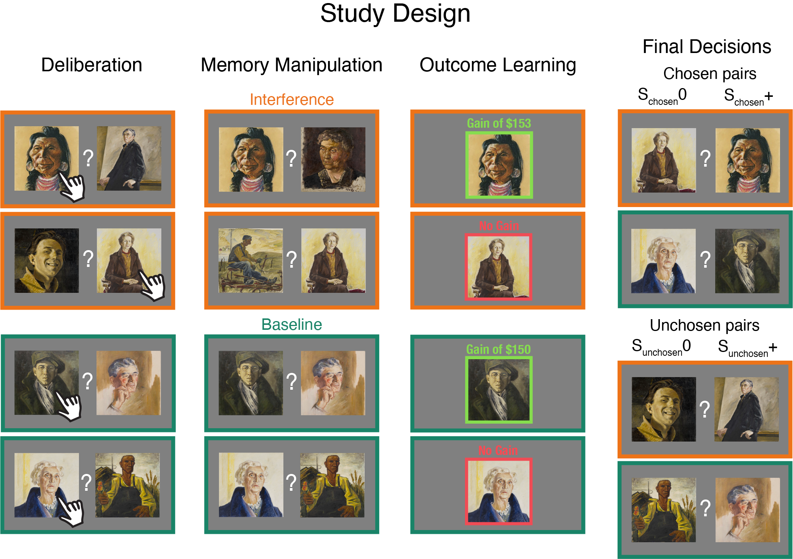

 <h3>The Role of Memory in Counterfactual Valuation</h3> 

 <h4>Natalie Biderman, Sam Gershman, & Daphna Shohamy, December 2022
 </h4>
  
  

The repository accompanies our manuscript and includes codes to implement our memory-based policy gradient model, as well as to analyze data from a large scale Mechanical Turk experiment assessing the effects of memory of counterfactual valuation (see figure below).  
All codes were written by Natalie Biderman (*natalie.biderman@columbia.edu*).  

  

\

The repository includes three main folders: (1) Data, (2) Analysis, and (3) Policy_gradient_model.

  
  
### Data

Data collected from the main experiment (Exp1) and the pilot study appear in csv files in the corresponding **Summary_data** folder. The folder includes data from all participants, including those that did not pass our exclusion criteria (all_subs subfolder), and from those who did (non_outlier_subs subfolder).  
For each experiment, we added three types of data: (1) raw csv files that include all experimental data (all_data.csv), (2) a record of participants' interactions with their computer which we use to measure their attention throughout the task (all_interaction_data.csv), and (3) experimental data separated into the different phases of the experiment, to ease interpretability of the data frame (e.g., deliberation.csv).  
Lastly, each experiment should also include (but doesn't currently include, see below) a **Models** folder with all the pre-trained Bayesian regression models, in the form of RStanArm objects which include samples from the posterior over model parameters.  
  

  
  
### Analysis 

All the results and figures reported in our manuscript are described in Analysis_code.html. All plots generated in the analysis code are situated in the **Plots** subfolder.  
We fit hierarchical Bayesian regression models via the RStanArm package, which under the hood runs multiple independent chains of Hamiltonian Monte Carlo, and logs samples from the posterior distribution over the model parameters. These models may take a few hours to run and their size is considerabely large (>2gb). We therefore saved our fitted models in the form of RStanArm objects in the Open Science Framework page of our preregistered study (https://osf.io/qad57/). To reproduce our Bayesian analyses, you may (1) download the folder, unzip it, create a "Models" directory inside each experiment in the Data folder, and insert the corresponding models to each experiment (e.g., Data/Exp1/Models/M_choice_delta_val_Exp1.RData), (2) run the models yourself by setting the parameter run_models=TRUE in our analysis code.  
Analysis folder also includes a **Tools** subfolder, including a python script with data pre-processing functions and a Jupyter notebook that reads the functions and executes data pre-processing and outlier exclusion.  

 
  
### Policy_gradient_model

The folder includes matlab scripts that read experimental data, fit our three policy-gradient models and run quantitative model comparison. The models can be fit using run_model.m script.  

 

# The_role_of_memory_in_counterfactual_valuation2
